# Polyglot Codebase Knowledge Graph

> Generated offline by **readmenator**. 12 files, 709 symbols, 158 imports. Supports C, C++, Python, Go, Rust, JS/TS, Java, C#, Shell, PHP, Dart, GDScript, Nim, ASM, Ruby, Swift, Kotlin, Scala, Lua, Elixir.
> No LLMs. No tokens. Pure static analysis. See more [here](https://github.com/grisuno/ReadMenator)

**Start here:** Statistics Dashboard for scope, God Nodes for blast radius, Architecture Reference for per-file API. Agents: prefer `readmenator-agent/INDEX.md` + `SYMBOLS.md`.

**Total Files Parsed:** 12 | **Total Symbols Extracted:** 709 | **Total Imports:** 158
 | **Resolved Imports:** 2

<!-- ranking_model: v1.0 | weights: {ppr:0.45,auth:0.2,test:0.15,doc:0.1,fresh:0.1} | alpha:0.85 | commit:b3ca3bb | date:2026-07-18 -->


## Table of Contents

1. [Statistics Dashboard](#statistics-dashboard)
2. [Architectural Layers](#architectural-layers)
3. [Ranked Context](#ranked-context)
4. [God Nodes](#god-nodes)
5. [Community Analysis](#community-analysis)
6. [Suggested Questions](#suggested-questions)
7. [Hotspot Analysis](#hotspot-analysis)
8. [Change Impact Analysis](#change-impact-analysis)
9. [Suggested Linting Rules](#suggested-linting-rules)
10. [Orphans](#orphans)
11. [Query Recipes](#query-recipes)
12. [Structural Knowledge Map](#structural-knowledge-map)
13. [UML Class Diagram](#uml-class-diagram)
14. [Code Property Graph](#code-property-graph)
15. [Architecture Reference](#architecture-reference)
    - [PY (11 files)](#py-11-files)
    - [SH (1 files)](#sh-1-files)

---

## Statistics Dashboard

| Metric | Value |
|--------|-------|
| Total Files | 12 |
| Total Symbols | 709 |
| Total Imports | 158 |
| Call Edges | 4899 |
| Inheritance Edges | 109 |
| Languages | 2 |
| Avg Symbols/File | 59.1 |
| Avg Imports/File | 13.2 |
| Resolved Imports | 2 |

### Top Files by Import Count (Fan-Out)

| File | Imports | Symbols | Language |
|------|---------|---------|----------|
| `seed_miner.py` | 23 | 77 | py |
| `complex_leibler_transformer.py` | 20 | 131 | py |
| `superconducting_transformer.py` | 20 | 138 | py |
| `superconducting_transformer2.py` | 20 | 137 | py |
| `tran2.py` | 16 | 46 | py |
| `laderman_batch_prospection.py` | 13 | 18 | py |
| `laderman_crystallization.py` | 13 | 86 | py |
| `llm_kappa_miner.py` | 13 | 19 | py |
| `kappa_miner.py` | 11 | 21 | py |
| `tran5.py` | 9 | 36 | py |

---

## Architectural Layers

Auto-detected from path patterns, naming conventions, and imported frameworks.

| Layer | Files |
|-------|-------|
| utility | 7 |
| data_access | 4 |
| testing | 1 |

### utility

- `app.py` (py, 0 symbols)
- `install.sh` (sh, 0 symbols)
- `kappa_miner.py` (py, 21 symbols)
- `laderman_crystallization.py` (py, 86 symbols)
- `llm_kappa_miner.py` (py, 19 symbols)
- `tran2.py` (py, 46 symbols)
- `tran5.py` (py, 36 symbols)

### data_access

- `complex_leibler_transformer.py` (py, 131 symbols)
- `seed_miner.py` (py, 77 symbols)
- `superconducting_transformer.py` (py, 138 symbols)
- `superconducting_transformer2.py` (py, 137 symbols)

### testing

- `laderman_batch_prospection.py` (py, 18 symbols)

---

## Ranked Context

Files ranked by composite score for the current query context. The ranking combines Personalized PageRank (query relevance), global authority, test coverage, documentation coverage, and code freshness. Model: v1.0.

| Rank | File | Composite | PPR | Authority | Test | Doc |
|------|------|-----------|-----|-----------|------|-----|
| 1 | `tran5.py` | 0.5025 | 0.6491 | 0.6491 | 0.00 | 0.81 |
| 2 | `seed_miner.py` | 0.2294 | 0.3509 | 0.3509 | 0.00 | 0.01 |
| 3 | `app.py` | 0.1000 | 0.0000 | 0.0000 | 0.00 | 1.00 |
| 4 | `llm_kappa_miner.py` | 0.0737 | 0.0000 | 0.0000 | 0.00 | 0.74 |
| 5 | `kappa_miner.py` | 0.0714 | 0.0000 | 0.0000 | 0.00 | 0.71 |
| 6 | `laderman_batch_prospection.py` | 0.0556 | 0.0000 | 0.0000 | 0.00 | 0.56 |
| 7 | `tran2.py` | 0.0457 | 0.0000 | 0.0000 | 0.00 | 0.46 |
| 8 | `laderman_crystallization.py` | 0.0186 | 0.0000 | 0.0000 | 0.00 | 0.19 |
| 9 | `complex_leibler_transformer.py` | 0.0000 | 0.0000 | 0.0000 | 0.00 | 0.00 |
| 10 | `install.sh` | 0.0000 | 0.0000 | 0.0000 | 0.00 | 0.00 |

---

## God Nodes

Most architecturally central files ranked by combined import/export degree and symbol richness.

| File | Score | Connections | PageRank |
|------|-------|-------------|----------|
| `superconducting_transformer.py` | 13.8 | | 0.0000 |
| `superconducting_transformer2.py` | 13.7 | | 0.0000 |
| `complex_leibler_transformer.py` | 13.1 | | 0.0000 |
| `seed_miner.py` | 9.7 | | 0.3509 |
| `laderman_crystallization.py` | 8.6 | | 0.0000 |
| `tran5.py` | 5.6 | | 0.6491 |
| `tran2.py` | 4.6 | | 0.0000 |
| `kappa_miner.py` | 2.1 | | 0.0000 |
| `llm_kappa_miner.py` | 1.9 | | 0.0000 |
| `laderman_batch_prospection.py` | 1.8 | | 0.0000 |

---

## Community Analysis

Files grouped by import-based community detection. Cohesion measures how tightly connected each community is internally.

### root (Cohesion: 1.00)

**2 files** in this community:

- `seed_miner.py` (py, 77 symbols)
- `tran5.py` (py, 36 symbols)

---

## Suggested Questions

Auto-generated exploration prompts based on graph structure:

- What does superconducting_transformer.py depend on, and what depends on it? (0 connections)
- What does superconducting_transformer2.py depend on, and what depends on it? (0 connections)
- What does complex_leibler_transformer.py depend on, and what depends on it? (0 connections)
- What is ExecutionMode in complex_leibler_transformer.py and how is it used?
- What is KappaConfig in kappa_miner.py and how is it used?

---

## Hotspot Analysis

Files ranked by combined complexity (symbol count) and centrality (connection count). High-scoring files are architecturally critical and may need refactoring attention.

| File | Complexity | Centrality | Combined | Symbols | Connections |
|------|-----------|------------|----------|---------|-------------|
| `tran5.py` | 0.261 | 0.440 | 0.368 | 36 | 11 |
| `seed_miner.py` | 0.558 | 1.000 | 0.823 | 77 | 25 |
| `app.py` | 0.000 | 0.000 | 0.000 | 0 | 0 |
| `llm_kappa_miner.py` | 0.138 | 0.520 | 0.367 | 19 | 13 |
| `kappa_miner.py` | 0.152 | 0.440 | 0.325 | 21 | 11 |
| `laderman_batch_prospection.py` | 0.130 | 0.520 | 0.364 | 18 | 13 |
| `tran2.py` | 0.333 | 0.640 | 0.517 | 46 | 16 |
| `laderman_crystallization.py` | 0.623 | 0.520 | 0.561 | 86 | 13 |
| `complex_leibler_transformer.py` | 0.949 | 0.800 | 0.860 | 131 | 20 |
| `install.sh` | 0.000 | 0.000 | 0.000 | 0 | 0 |
| `superconducting_transformer.py` | 1.000 | 0.800 | 0.880 | 138 | 20 |
| `superconducting_transformer2.py` | 0.993 | 0.800 | 0.877 | 137 | 20 |

---

## Change Impact Analysis

Files sorted by how many other files would be affected if they changed. High-impact files should be changed with caution.

| File | Direct Dependents | Transitive Dependents | Total Impact |
|------|------------------|----------------------|--------------|
| `tran5.py` | 1 | 0 | 1 |
| `app.py` | 0 | 0 | 0 |
| `complex_leibler_transformer.py` | 0 | 0 | 0 |
| `install.sh` | 0 | 0 | 0 |
| `kappa_miner.py` | 0 | 0 | 0 |
| `laderman_batch_prospection.py` | 0 | 0 | 0 |
| `laderman_crystallization.py` | 0 | 0 | 0 |
| `llm_kappa_miner.py` | 0 | 0 | 0 |
| `seed_miner.py` | 0 | 0 | 0 |
| `superconducting_transformer.py` | 0 | 0 | 0 |
| `superconducting_transformer2.py` | 0 | 0 | 0 |
| `tran2.py` | 0 | 0 | 0 |

---

## Suggested Linting Rules

Automatically suggested linting and security rules based on patterns detected in the codebase. These can be exported as Semgrep rules using the `--export-rules` flag.

| Rule ID | Severity | Description | Language | Matches |
|---------|----------|-------------|----------|---------|
| `RM002` | warning | Bare except clause catches all exceptions including SystemExit | python | 5 |
| `RM001` | info | Large number of functions in py: 519 total | py | 519 |
| `RM003` | info | Print statement found (consider logging instead) | python | 691 |

---

## Orphans

Files with no documentation or low connectivity. These are candidates for documentation investment or cleanup.

- `complex_leibler_transformer.py` (131 symbols, no doc)
- `install.sh` (0 symbols, no doc)
- `superconducting_transformer.py` (138 symbols, no doc)
- `superconducting_transformer2.py` (137 symbols, no doc)

---

## Query Recipes

Example queries you can run against this knowledge base using the ranking engine:

```
# Find files most relevant to a concept
readmenator query "Where is the import resolver implemented?"

# Rank files by relevance to a topic
readmenator query "How does documentation generation work?"

# Explain why a file ranks highly
readmenator query "explain readmenator/_documentation.py"

# Trace dependency paths with ranked context
readmenator query "path from CLI to exporter"
```

The ranking model uses the following signals:

- **Personalized PageRank** (45% weight): query-specific relevance via seed propagation
- **Global Authority** (20% weight): structural importance via standard PageRank
- **Test Coverage** (15% weight): fraction of symbols referenced in test files
- **Doc Coverage** (10% weight): presence of docstrings and file-level docs
- **Freshness** (10% weight): recent modification activity

Results include score decomposition and justification paths for each ranked item.

---

## Structural Knowledge Map

```mermaid
graph TD
    classDef mod fill:#1e1e1e,stroke:#ff6666,stroke-width:2px,color:#fff;
    classDef cls fill:#2d2d2d,stroke:#4ec9b0,stroke-width:2px,color:#fff;
    classDef fn fill:#333,stroke:#dcdcaa,stroke-width:1px,color:#dcdcaa;
    classDef ext fill:#111,stroke:#666,stroke-dasharray:5 5,color:#aaa;
    subgraph community_0 ["root"]
    seed_miner_py["seed_miner.py (py)"]
    class seed_miner_py mod;
    seed_miner_py_ExecutionMode["ExecutionMode"]
    class seed_miner_py_ExecutionMode cls;
    seed_miner_py --> seed_miner_py_ExecutionMode
    seed_miner_py_ProspectorConfig["ProspectorConfig"]
    class seed_miner_py_ProspectorConfig cls;
    seed_miner_py --> seed_miner_py_ProspectorConfig
    seed_miner_py_IMetricCalculator["IMetricCalculator"]
    class seed_miner_py_IMetricCalculator cls;
    seed_miner_py --> seed_miner_py_IMetricCalculator
    seed_miner_py_ILossComponent["ILossComponent"]
    class seed_miner_py_ILossComponent cls;
    seed_miner_py --> seed_miner_py_ILossComponent
    seed_miner_py_ICheckpointManager["ICheckpointManager"]
    class seed_miner_py_ICheckpointManager cls;
    seed_miner_py --> seed_miner_py_ICheckpointManager
    superconducting_transformer_py["superconducting_transformer.py (py)"]
    class superconducting_transformer_py mod;
    superconducting_transformer2_py["superconducting_transformer2.py (py)"]
    class superconducting_transformer2_py mod;
    complex_leibler_transformer_py["complex_leibler_transformer.py (py)"]
    class complex_leibler_transformer_py mod;
    tran2_py["tran2.py (py)"]
    class tran2_py mod;
    laderman_crystallization_py["laderman_crystallization.py (py)"]
    class laderman_crystallization_py mod;
    llm_kappa_miner_py["llm_kappa_miner.py (py)"]
    class llm_kappa_miner_py mod;
    laderman_batch_prospection_py["laderman_batch_prospection.py (py)"]
    class laderman_batch_prospection_py mod;
    kappa_miner_py["kappa_miner.py (py)"]
    class kappa_miner_py mod;
    tran5_py["tran5.py (py)"]
    class tran5_py mod;
    app_py["app.py (py)"]
    class app_py mod;
    install_sh["install.sh (sh)"]
    class install_sh mod;
    end
    seed_miner_py -- resolved_imports --> tran5_py
    seed_miner_py -- resolved_imports --> tran5_py
    ext_argparse["argparse"]
    class ext_argparse ext;
    complex_leibler_transformer_py -.->|imports| ext_argparse
    ext_torch["torch"]
    class ext_torch ext;
    complex_leibler_transformer_py -.->|imports| ext_torch
    ext_torch_nn["torch.nn"]
    class ext_torch_nn ext;
    complex_leibler_transformer_py -.->|imports| ext_torch_nn
    ext_torch_nn_functional["torch.nn.functional"]
    class ext_torch_nn_functional ext;
    complex_leibler_transformer_py -.->|imports| ext_torch_nn_functional
    ext_torch_optim["torch.optim"]
    class ext_torch_optim ext;
    complex_leibler_transformer_py -.->|imports| ext_torch_optim
    ext_numpy["numpy"]
    class ext_numpy ext;
    complex_leibler_transformer_py -.->|imports| ext_numpy
    ext_json["json"]
    class ext_json ext;
    complex_leibler_transformer_py -.->|imports| ext_json
    ext_os["os"]
    class ext_os ext;
    complex_leibler_transformer_py -.->|imports| ext_os
    ext_sys["sys"]
    class ext_sys ext;
    complex_leibler_transformer_py -.->|imports| ext_sys
    ext_math["math"]
    class ext_math ext;
    complex_leibler_transformer_py -.->|imports| ext_math
    ext_time["time"]
    class ext_time ext;
    complex_leibler_transformer_py -.->|imports| ext_time
    ext_signal["signal"]
    class ext_signal ext;
    complex_leibler_transformer_py -.->|imports| ext_signal
    ext_warnings["warnings"]
    class ext_warnings ext;
    complex_leibler_transformer_py -.->|imports| ext_warnings
    ext_pathlib["pathlib"]
    class ext_pathlib ext;
    complex_leibler_transformer_py -.->|imports| ext_pathlib
    ext_dataclasses["dataclasses"]
    class ext_dataclasses ext;
    complex_leibler_transformer_py -.->|imports| ext_dataclasses
    ext_typing["typing"]
    class ext_typing ext;
    complex_leibler_transformer_py -.->|imports| ext_typing
    ext_abc["abc"]
    class ext_abc ext;
    complex_leibler_transformer_py -.->|imports| ext_abc
    ext_collections["collections"]
    class ext_collections ext;
    complex_leibler_transformer_py -.->|imports| ext_collections
    ext_datetime["datetime"]
    class ext_datetime ext;
    complex_leibler_transformer_py -.->|imports| ext_datetime
    ext_enum["enum"]
    class ext_enum ext;
    complex_leibler_transformer_py -.->|imports| ext_enum
    kappa_miner_py -.->|imports| ext_torch
    kappa_miner_py -.->|imports| ext_torch_nn
    kappa_miner_py -.->|imports| ext_torch_nn_functional
    kappa_miner_py -.->|imports| ext_numpy
    kappa_miner_py -.->|imports| ext_json
    kappa_miner_py -.->|imports| ext_math
    kappa_miner_py -.->|imports| ext_dataclasses
    kappa_miner_py -.->|imports| ext_typing
    kappa_miner_py -.->|imports| ext_pathlib
    kappa_miner_py -.->|imports| ext_datetime
    kappa_miner_py -.->|imports| ext_warnings
    laderman_batch_prospection_py -.->|imports| ext_torch
    laderman_batch_prospection_py -.->|imports| ext_torch_nn
    laderman_batch_prospection_py -.->|imports| ext_torch_nn_functional
    ext_torch_utils_data["torch.utils.data"]
    class ext_torch_utils_data ext;
    laderman_batch_prospection_py -.->|imports| ext_torch_utils_data
    laderman_batch_prospection_py -.->|imports| ext_numpy
    laderman_batch_prospection_py -.->|imports| ext_json
    laderman_batch_prospection_py -.->|imports| ext_time
    laderman_batch_prospection_py -.->|imports| ext_math
    laderman_batch_prospection_py -.->|imports| ext_dataclasses
    laderman_batch_prospection_py -.->|imports| ext_pathlib
    laderman_batch_prospection_py -.->|imports| ext_typing
    laderman_batch_prospection_py -.->|imports| ext_collections
    ext_tqdm_auto["tqdm.auto"]
    class ext_tqdm_auto ext;
    laderman_batch_prospection_py -.->|imports| ext_tqdm_auto
    laderman_crystallization_py -.->|imports| ext_torch
    laderman_crystallization_py -.->|imports| ext_torch_nn
    laderman_crystallization_py -.->|imports| ext_torch_nn_functional
    laderman_crystallization_py -.->|imports| ext_torch_utils_data
    laderman_crystallization_py -.->|imports| ext_numpy
    laderman_crystallization_py -.->|imports| ext_time
    laderman_crystallization_py -.->|imports| ext_math
    laderman_crystallization_py -.->|imports| ext_typing
    laderman_crystallization_py -.->|imports| ext_dataclasses
    laderman_crystallization_py -.->|imports| ext_abc
    laderman_crystallization_py -.->|imports| ext_pathlib
    laderman_crystallization_py -.->|imports| ext_collections
    laderman_crystallization_py -.->|imports| ext_tqdm_auto
    llm_kappa_miner_py -.->|imports| ext_torch
    llm_kappa_miner_py -.->|imports| ext_torch_nn
    llm_kappa_miner_py -.->|imports| ext_torch_nn_functional
    llm_kappa_miner_py -.->|imports| ext_numpy
    llm_kappa_miner_py -.->|imports| ext_argparse
    llm_kappa_miner_py -.->|imports| ext_json
    llm_kappa_miner_py -.->|imports| ext_dataclasses
    llm_kappa_miner_py -.->|imports| ext_typing
    llm_kappa_miner_py -.->|imports| ext_datetime
    llm_kappa_miner_py -.->|imports| ext_pathlib
    ext_transformers["transformers"]
    class ext_transformers ext;
    llm_kappa_miner_py -.->|imports| ext_transformers
    ext_transformers_modeling_outputs["transformers.modeling_outputs"]
    class ext_transformers_modeling_outputs ext;
    llm_kappa_miner_py -.->|imports| ext_transformers_modeling_outputs
    llm_kappa_miner_py -.->|imports| ext_warnings
    seed_miner_py -.->|imports| ext_argparse
    seed_miner_py -.->|imports| ext_torch
    seed_miner_py -.->|imports| ext_torch_nn
    seed_miner_py -.->|imports| ext_torch_nn_functional
    seed_miner_py -.->|imports| ext_torch_optim
    seed_miner_py -.->|imports| ext_numpy
    seed_miner_py -.->|imports| ext_json
    seed_miner_py -.->|imports| ext_os
    seed_miner_py -.->|imports| ext_sys
    seed_miner_py -.->|imports| ext_math
    seed_miner_py -.->|imports| ext_time
    seed_miner_py -.->|imports| ext_signal
    seed_miner_py -.->|imports| ext_pathlib
    seed_miner_py -.->|imports| ext_dataclasses
    seed_miner_py -.->|imports| ext_typing
    seed_miner_py -.->|imports| ext_abc
    seed_miner_py -.->|imports| ext_collections
    seed_miner_py -.->|imports| ext_datetime
    seed_miner_py -.->|imports| ext_enum
    seed_miner_py -.->|imports| ext_warnings
    ext_tran5["tran5"]
    class ext_tran5 ext;
    seed_miner_py -.->|imports| ext_tran5
    seed_miner_py -.->|imports| ext_tran5
    seed_miner_py -.->|imports| ext_dataclasses
    superconducting_transformer_py -.->|imports| ext_argparse
    superconducting_transformer_py -.->|imports| ext_torch
    superconducting_transformer_py -.->|imports| ext_torch_nn
    superconducting_transformer_py -.->|imports| ext_torch_nn_functional
    superconducting_transformer_py -.->|imports| ext_torch_optim
    superconducting_transformer_py -.->|imports| ext_numpy
    superconducting_transformer_py -.->|imports| ext_json
    superconducting_transformer_py -.->|imports| ext_os
    superconducting_transformer_py -.->|imports| ext_sys
    superconducting_transformer_py -.->|imports| ext_math
    superconducting_transformer_py -.->|imports| ext_time
    superconducting_transformer_py -.->|imports| ext_signal
    superconducting_transformer_py -.->|imports| ext_warnings
    superconducting_transformer_py -.->|imports| ext_pathlib
    superconducting_transformer_py -.->|imports| ext_dataclasses
    superconducting_transformer_py -.->|imports| ext_typing
    superconducting_transformer_py -.->|imports| ext_abc
    superconducting_transformer_py -.->|imports| ext_collections
    superconducting_transformer_py -.->|imports| ext_datetime
    superconducting_transformer_py -.->|imports| ext_enum
    superconducting_transformer2_py -.->|imports| ext_argparse
    superconducting_transformer2_py -.->|imports| ext_torch
    superconducting_transformer2_py -.->|imports| ext_torch_nn
    superconducting_transformer2_py -.->|imports| ext_torch_nn_functional
    superconducting_transformer2_py -.->|imports| ext_torch_optim
    superconducting_transformer2_py -.->|imports| ext_numpy
    superconducting_transformer2_py -.->|imports| ext_json
    superconducting_transformer2_py -.->|imports| ext_os
    superconducting_transformer2_py -.->|imports| ext_sys
    superconducting_transformer2_py -.->|imports| ext_math
    superconducting_transformer2_py -.->|imports| ext_time
    superconducting_transformer2_py -.->|imports| ext_signal
    superconducting_transformer2_py -.->|imports| ext_warnings
    superconducting_transformer2_py -.->|imports| ext_pathlib
    superconducting_transformer2_py -.->|imports| ext_dataclasses
    superconducting_transformer2_py -.->|imports| ext_typing
    superconducting_transformer2_py -.->|imports| ext_abc
    superconducting_transformer2_py -.->|imports| ext_collections
    superconducting_transformer2_py -.->|imports| ext_datetime
    superconducting_transformer2_py -.->|imports| ext_enum
    tran2_py -.->|imports| ext_torch
    tran2_py -.->|imports| ext_torch_nn
    tran2_py -.->|imports| ext_torch_nn_functional
    tran2_py -.->|imports| ext_torch_utils_data
    tran2_py -.->|imports| ext_numpy
    tran2_py -.->|imports| ext_json
    tran2_py -.->|imports| ext_os
    tran2_py -.->|imports| ext_time
    tran2_py -.->|imports| ext_math
    tran2_py -.->|imports| ext_warnings
    tran2_py -.->|imports| ext_typing
    tran2_py -.->|imports| ext_dataclasses
    tran2_py -.->|imports| ext_abc
    tran2_py -.->|imports| ext_pathlib
    tran2_py -.->|imports| ext_collections
    tran2_py -.->|imports| ext_tqdm_auto
    tran5_py -.->|imports| ext_torch
    tran5_py -.->|imports| ext_torch_nn
    tran5_py -.->|imports| ext_torch_nn_functional
    tran5_py -.->|imports| ext_numpy
    tran5_py -.->|imports| ext_dataclasses
    tran5_py -.->|imports| ext_typing
    ext_tqdm["tqdm"]
    class ext_tqdm ext;
    tran5_py -.->|imports| ext_tqdm
    tran5_py -.->|imports| ext_argparse
    tran5_py -.->|imports| ext_datetime
```



---

## UML Class Diagram

Auto-generated Mermaid class diagram from parsed class-level symbols. Shows classes, structs, interfaces, traits, and their methods with inheritance and dependency relationships.

```mermaid
classDiagram
  class complex_leibler_transformer_py_ExecutionMode {
    <<class>>
    +main()
    +calculate(self)
    +compute(self, model, loss_ce, epoch)
    +save(self, state, path)
    +load(self, path)
    +should_checkpoint(self)
    +execute(self, model)
    +detect(self, metrics)
    +should_stop(self, epoch, metrics)
    +update(self, metrics)
  }
  class complex_leibler_transformer_py_ProspectorConfig {
    <<class>>
    +main()
    +calculate(self)
    +compute(self, model, loss_ce, epoch)
    +save(self, state, path)
    +load(self, path)
    +should_checkpoint(self)
    +execute(self, model)
    +detect(self, metrics)
    +should_stop(self, epoch, metrics)
    +update(self, metrics)
  }
  class complex_leibler_transformer_py_IMetricCalculator {
    <<class>>
    +main()
    +calculate(self)
    +compute(self, model, loss_ce, epoch)
    +save(self, state, path)
    +load(self, path)
    +should_checkpoint(self)
    +execute(self, model)
    +detect(self, metrics)
    +should_stop(self, epoch, metrics)
    +update(self, metrics)
  }
  class complex_leibler_transformer_py_ILossComponent {
    <<class>>
    +main()
    +calculate(self)
    +compute(self, model, loss_ce, epoch)
    +save(self, state, path)
    +load(self, path)
    +should_checkpoint(self)
    +execute(self, model)
    +detect(self, metrics)
    +should_stop(self, epoch, metrics)
    +update(self, metrics)
  }
  class complex_leibler_transformer_py_ICheckpointManager {
    <<class>>
    +main()
    +calculate(self)
    +compute(self, model, loss_ce, epoch)
    +save(self, state, path)
    +load(self, path)
    +should_checkpoint(self)
    +execute(self, model)
    +detect(self, metrics)
    +should_stop(self, epoch, metrics)
    +update(self, metrics)
  }
  class complex_leibler_transformer_py_ITrainingPhase {
    <<class>>
    +main()
    +calculate(self)
    +compute(self, model, loss_ce, epoch)
    +save(self, state, path)
    +load(self, path)
    +should_checkpoint(self)
    +execute(self, model)
    +detect(self, metrics)
    +should_stop(self, epoch, metrics)
    +update(self, metrics)
  }
  class complex_leibler_transformer_py_IPhaseDetector {
    <<class>>
    +main()
    +calculate(self)
    +compute(self, model, loss_ce, epoch)
    +save(self, state, path)
    +load(self, path)
    +should_checkpoint(self)
    +execute(self, model)
    +detect(self, metrics)
    +should_stop(self, epoch, metrics)
    +update(self, metrics)
  }
  class complex_leibler_transformer_py_IGlassDetector {
    <<class>>
    +main()
    +calculate(self)
    +compute(self, model, loss_ce, epoch)
    +save(self, state, path)
    +load(self, path)
    +should_checkpoint(self)
    +execute(self, model)
    +detect(self, metrics)
    +should_stop(self, epoch, metrics)
    +update(self, metrics)
  }
  class complex_leibler_transformer_py_IGrokkinDetector {
    <<class>>
    +main()
    +calculate(self)
    +compute(self, model, loss_ce, epoch)
    +save(self, state, path)
    +load(self, path)
    +should_checkpoint(self)
    +execute(self, model)
    +detect(self, metrics)
    +should_stop(self, epoch, metrics)
    +update(self, metrics)
  }
  class complex_leibler_transformer_py_SeedManager {
    <<class>>
    +main()
    +calculate(self)
    +compute(self, model, loss_ce, epoch)
    +save(self, state, path)
    +load(self, path)
    +should_checkpoint(self)
    +execute(self, model)
    +detect(self, metrics)
    +should_stop(self, epoch, metrics)
    +update(self, metrics)
  }
  class complex_leibler_transformer_py_ComplexOperations {
    <<class>>
    +main()
    +calculate(self)
    +compute(self, model, loss_ce, epoch)
    +save(self, state, path)
    +load(self, path)
    +should_checkpoint(self)
    +execute(self, model)
    +detect(self, metrics)
    +should_stop(self, epoch, metrics)
    +update(self, metrics)
  }
  class complex_leibler_transformer_py_ComplexLinear {
    <<class>>
    +main()
    +calculate(self)
    +compute(self, model, loss_ce, epoch)
    +save(self, state, path)
    +load(self, path)
    +should_checkpoint(self)
    +execute(self, model)
    +detect(self, metrics)
    +should_stop(self, epoch, metrics)
    +update(self, metrics)
  }
  class complex_leibler_transformer_py_ComplexLayerNorm {
    <<class>>
    +main()
    +calculate(self)
    +compute(self, model, loss_ce, epoch)
    +save(self, state, path)
    +load(self, path)
    +should_checkpoint(self)
    +execute(self, model)
    +detect(self, metrics)
    +should_stop(self, epoch, metrics)
    +update(self, metrics)
  }
  class complex_leibler_transformer_py_ComplexLeiblerAttention {
    <<class>>
    +main()
    +calculate(self)
    +compute(self, model, loss_ce, epoch)
    +save(self, state, path)
    +load(self, path)
    +should_checkpoint(self)
    +execute(self, model)
    +detect(self, metrics)
    +should_stop(self, epoch, metrics)
    +update(self, metrics)
  }
  class complex_leibler_transformer_py_ComplexLeiblerTransformerLayer {
    <<class>>
    +main()
    +calculate(self)
    +compute(self, model, loss_ce, epoch)
    +save(self, state, path)
    +load(self, path)
    +should_checkpoint(self)
    +execute(self, model)
    +detect(self, metrics)
    +should_stop(self, epoch, metrics)
    +update(self, metrics)
  }
  class complex_leibler_transformer_py_ComplexLeiblerTransformer {
    <<class>>
    +main()
    +calculate(self)
    +compute(self, model, loss_ce, epoch)
    +save(self, state, path)
    +load(self, path)
    +should_checkpoint(self)
    +execute(self, model)
    +detect(self, metrics)
    +should_stop(self, epoch, metrics)
    +update(self, metrics)
  }
  class complex_leibler_transformer_py_ModularAdditionDatasetFactory {
    <<class>>
    +main()
    +calculate(self)
    +compute(self, model, loss_ce, epoch)
    +save(self, state, path)
    +load(self, path)
    +should_checkpoint(self)
    +execute(self, model)
    +detect(self, metrics)
    +should_stop(self, epoch, metrics)
    +update(self, metrics)
  }
  class complex_leibler_transformer_py_TrainingPrimitives {
    <<class>>
    +main()
    +calculate(self)
    +compute(self, model, loss_ce, epoch)
    +save(self, state, path)
    +load(self, path)
    +should_checkpoint(self)
    +execute(self, model)
    +detect(self, metrics)
    +should_stop(self, epoch, metrics)
    +update(self, metrics)
  }
  class complex_leibler_transformer_py_DeltaCalculator {
    <<class>>
    +main()
    +calculate(self)
    +compute(self, model, loss_ce, epoch)
    +save(self, state, path)
    +load(self, path)
    +should_checkpoint(self)
    +execute(self, model)
    +detect(self, metrics)
    +should_stop(self, epoch, metrics)
    +update(self, metrics)
  }
  class complex_leibler_transformer_py_KappaCalculator {
    <<class>>
    +main()
    +calculate(self)
    +compute(self, model, loss_ce, epoch)
    +save(self, state, path)
    +load(self, path)
    +should_checkpoint(self)
    +execute(self, model)
    +detect(self, metrics)
    +should_stop(self, epoch, metrics)
    +update(self, metrics)
  }
  class complex_leibler_transformer_py_ThermodynamicMetricsCalculator {
    <<class>>
    +main()
    +calculate(self)
    +compute(self, model, loss_ce, epoch)
    +save(self, state, path)
    +load(self, path)
    +should_checkpoint(self)
    +execute(self, model)
    +detect(self, metrics)
    +should_stop(self, epoch, metrics)
    +update(self, metrics)
  }
  class complex_leibler_transformer_py_LocalComplexityCalculator {
    <<class>>
    +main()
    +calculate(self)
    +compute(self, model, loss_ce, epoch)
    +save(self, state, path)
    +load(self, path)
    +should_checkpoint(self)
    +execute(self, model)
    +detect(self, metrics)
    +should_stop(self, epoch, metrics)
    +update(self, metrics)
  }
  class complex_leibler_transformer_py_SuperpositionCalculator {
    <<class>>
    +main()
    +calculate(self)
    +compute(self, model, loss_ce, epoch)
    +save(self, state, path)
    +load(self, path)
    +should_checkpoint(self)
    +execute(self, model)
    +detect(self, metrics)
    +should_stop(self, epoch, metrics)
    +update(self, metrics)
  }
  class complex_leibler_transformer_py_GravitationalConstantCalculator {
    <<class>>
    +main()
    +calculate(self)
    +compute(self, model, loss_ce, epoch)
    +save(self, state, path)
    +load(self, path)
    +should_checkpoint(self)
    +execute(self, model)
    +detect(self, metrics)
    +should_stop(self, epoch, metrics)
    +update(self, metrics)
  }
  class complex_leibler_transformer_py_ComplexPhaseMetricsCalculator {
    <<class>>
    +main()
    +calculate(self)
    +compute(self, model, loss_ce, epoch)
    +save(self, state, path)
    +load(self, path)
    +should_checkpoint(self)
    +execute(self, model)
    +detect(self, metrics)
    +should_stop(self, epoch, metrics)
    +update(self, metrics)
  }
  class complex_leibler_transformer_py_PhaseDetector {
    <<class>>
    +main()
    +calculate(self)
    +compute(self, model, loss_ce, epoch)
    +save(self, state, path)
    +load(self, path)
    +should_checkpoint(self)
    +execute(self, model)
    +detect(self, metrics)
    +should_stop(self, epoch, metrics)
    +update(self, metrics)
  }
  class complex_leibler_transformer_py_AdaptiveAnnealingScheduler {
    <<class>>
    +main()
    +calculate(self)
    +compute(self, model, loss_ce, epoch)
    +save(self, state, path)
    +load(self, path)
    +should_checkpoint(self)
    +execute(self, model)
    +detect(self, metrics)
    +should_stop(self, epoch, metrics)
    +update(self, metrics)
  }
  class complex_leibler_transformer_py_GlassDetector {
    <<class>>
    +main()
    +calculate(self)
    +compute(self, model, loss_ce, epoch)
    +save(self, state, path)
    +load(self, path)
    +should_checkpoint(self)
    +execute(self, model)
    +detect(self, metrics)
    +should_stop(self, epoch, metrics)
    +update(self, metrics)
  }
  class complex_leibler_transformer_py_GrokkinDetector {
    <<class>>
    +main()
    +calculate(self)
    +compute(self, model, loss_ce, epoch)
    +save(self, state, path)
    +load(self, path)
    +should_checkpoint(self)
    +execute(self, model)
    +detect(self, metrics)
    +should_stop(self, epoch, metrics)
    +update(self, metrics)
  }
  class complex_leibler_transformer_py_CheckpointManager {
    <<class>>
    +main()
    +calculate(self)
    +compute(self, model, loss_ce, epoch)
    +save(self, state, path)
    +load(self, path)
    +should_checkpoint(self)
    +execute(self, model)
    +detect(self, metrics)
    +should_stop(self, epoch, metrics)
    +update(self, metrics)
  }
  class complex_leibler_transformer_py_ModelPruner {
    <<class>>
    +main()
    +calculate(self)
    +compute(self, model, loss_ce, epoch)
    +save(self, state, path)
    +load(self, path)
    +should_checkpoint(self)
    +execute(self, model)
    +detect(self, metrics)
    +should_stop(self, epoch, metrics)
    +update(self, metrics)
  }
  class complex_leibler_transformer_py_ModelDiscretizer {
    <<class>>
    +main()
    +calculate(self)
    +compute(self, model, loss_ce, epoch)
    +save(self, state, path)
    +load(self, path)
    +should_checkpoint(self)
    +execute(self, model)
    +detect(self, metrics)
    +should_stop(self, epoch, metrics)
    +update(self, metrics)
  }
  class complex_leibler_transformer_py_ComplexPhaseLoss {
    <<class>>
    +main()
    +calculate(self)
    +compute(self, model, loss_ce, epoch)
    +save(self, state, path)
    +load(self, path)
    +should_checkpoint(self)
    +execute(self, model)
    +detect(self, metrics)
    +should_stop(self, epoch, metrics)
    +update(self, metrics)
  }
  class complex_leibler_transformer_py_ComprehensiveMetricsAggregator {
    <<class>>
    +main()
    +calculate(self)
    +compute(self, model, loss_ce, epoch)
    +save(self, state, path)
    +load(self, path)
    +should_checkpoint(self)
    +execute(self, model)
    +detect(self, metrics)
    +should_stop(self, epoch, metrics)
    +update(self, metrics)
  }
  class complex_leibler_transformer_py_DisplayFormatter {
    <<class>>
    +main()
    +calculate(self)
    +compute(self, model, loss_ce, epoch)
    +save(self, state, path)
    +load(self, path)
    +should_checkpoint(self)
    +execute(self, model)
    +detect(self, metrics)
    +should_stop(self, epoch, metrics)
    +update(self, metrics)
  }
  class complex_leibler_transformer_py_ProspectorPhase {
    <<class>>
    +main()
    +calculate(self)
    +compute(self, model, loss_ce, epoch)
    +save(self, state, path)
    +load(self, path)
    +should_checkpoint(self)
    +execute(self, model)
    +detect(self, metrics)
    +should_stop(self, epoch, metrics)
    +update(self, metrics)
  }
  class complex_leibler_transformer_py_LongTrainingPhase {
    <<class>>
    +main()
    +calculate(self)
    +compute(self, model, loss_ce, epoch)
    +save(self, state, path)
    +load(self, path)
    +should_checkpoint(self)
    +execute(self, model)
    +detect(self, metrics)
    +should_stop(self, epoch, metrics)
    +update(self, metrics)
  }
  class complex_leibler_transformer_py_SeedProspector {
    <<class>>
    +main()
    +calculate(self)
    +compute(self, model, loss_ce, epoch)
    +save(self, state, path)
    +load(self, path)
    +should_checkpoint(self)
    +execute(self, model)
    +detect(self, metrics)
    +should_stop(self, epoch, metrics)
    +update(self, metrics)
  }
  class complex_leibler_transformer_py_LongTrainingPipeline {
    <<class>>
    +main()
    +calculate(self)
    +compute(self, model, loss_ce, epoch)
    +save(self, state, path)
    +load(self, path)
    +should_checkpoint(self)
    +execute(self, model)
    +detect(self, metrics)
    +should_stop(self, epoch, metrics)
    +update(self, metrics)
  }
  class complex_leibler_transformer_py_Application {
    <<class>>
    +main()
    +calculate(self)
    +compute(self, model, loss_ce, epoch)
    +save(self, state, path)
    +load(self, path)
    +should_checkpoint(self)
    +execute(self, model)
    +detect(self, metrics)
    +should_stop(self, epoch, metrics)
    +update(self, metrics)
  }
  class kappa_miner_py_KappaConfig {
    <<class>>
    +__init__(self, config)
    +compute_kappa(self, model, loss_fn, data_generator, n_samples, batch_size)
    +predict_grokking(self, kappa)
    +__init__(self, max_digits, operations, tokenizer_vocab)
    +generate_batch(self, batch_size, operation)
    +_encode_number(self, n)
    +__init__(self, vocab_size, d_model, n_heads, n_layers, d_ff, max_seq_len, dropout)
    +_init_weights(self)
    +forward(self, x)
    +__init__(self, model, task, config)
  }
  class kappa_miner_py_KappaMeter {
    <<class>>
    +__init__(self, config)
    +compute_kappa(self, model, loss_fn, data_generator, n_samples, batch_size)
    +predict_grokking(self, kappa)
    +__init__(self, max_digits, operations, tokenizer_vocab)
    +generate_batch(self, batch_size, operation)
    +_encode_number(self, n)
    +__init__(self, vocab_size, d_model, n_heads, n_layers, d_ff, max_seq_len, dropout)
    +_init_weights(self)
    +forward(self, x)
    +__init__(self, model, task, config)
  }
  class kappa_miner_py_ArithmeticTask {
    <<class>>
    +__init__(self, config)
    +compute_kappa(self, model, loss_fn, data_generator, n_samples, batch_size)
    +predict_grokking(self, kappa)
    +__init__(self, max_digits, operations, tokenizer_vocab)
    +generate_batch(self, batch_size, operation)
    +_encode_number(self, n)
    +__init__(self, vocab_size, d_model, n_heads, n_layers, d_ff, max_seq_len, dropout)
    +_init_weights(self)
    +forward(self, x)
    +__init__(self, model, task, config)
  }
  class kappa_miner_py_MinimalTransformer {
    <<class>>
    +__init__(self, config)
    +compute_kappa(self, model, loss_fn, data_generator, n_samples, batch_size)
    +predict_grokking(self, kappa)
    +__init__(self, max_digits, operations, tokenizer_vocab)
    +generate_batch(self, batch_size, operation)
    +_encode_number(self, n)
    +__init__(self, vocab_size, d_model, n_heads, n_layers, d_ff, max_seq_len, dropout)
    +_init_weights(self)
    +forward(self, x)
    +__init__(self, model, task, config)
  }
  class kappa_miner_py_KappaMiner {
    <<class>>
    +__init__(self, config)
    +compute_kappa(self, model, loss_fn, data_generator, n_samples, batch_size)
    +predict_grokking(self, kappa)
    +__init__(self, max_digits, operations, tokenizer_vocab)
    +generate_batch(self, batch_size, operation)
    +_encode_number(self, n)
    +__init__(self, vocab_size, d_model, n_heads, n_layers, d_ff, max_seq_len, dropout)
    +_init_weights(self)
    +forward(self, x)
    +__init__(self, model, task, config)
  }
  class kappa_miner_py_BatchProspector {
    <<class>>
    +__init__(self, config)
    +compute_kappa(self, model, loss_fn, data_generator, n_samples, batch_size)
    +predict_grokking(self, kappa)
    +__init__(self, max_digits, operations, tokenizer_vocab)
    +generate_batch(self, batch_size, operation)
    +_encode_number(self, n)
    +__init__(self, vocab_size, d_model, n_heads, n_layers, d_ff, max_seq_len, dropout)
    +_init_weights(self)
    +forward(self, x)
    +__init__(self, model, task, config)
  }
  class laderman_batch_prospection_py_ProspectionConfig {
    <<class>>
    +compute_kappa(model, batch, num_samples)
    +compute_local_complexity(model)
    +compute_effective_temperature(model, batch, num_samples)
    +compute_entropy(model, batch, num_samples)
    +train_prospection_run(config, batch_size)
    +analyze_results(results, config)
    +run_prospection(config)
    +__post_init__(self)
    +__init__(self, matrix_size, num_samples, seed)
    +__len__(self)
  }
  class laderman_batch_prospection_py_MatrixMultiplicationDataset {
    <<class>>
    +compute_kappa(model, batch, num_samples)
    +compute_local_complexity(model)
    +compute_effective_temperature(model, batch, num_samples)
    +compute_entropy(model, batch, num_samples)
    +train_prospection_run(config, batch_size)
    +analyze_results(results, config)
    +run_prospection(config)
    +__post_init__(self)
    +__init__(self, matrix_size, num_samples, seed)
    +__len__(self)
  }
  class laderman_batch_prospection_py_BilinearModel {
    <<class>>
    +compute_kappa(model, batch, num_samples)
    +compute_local_complexity(model)
    +compute_effective_temperature(model, batch, num_samples)
    +compute_entropy(model, batch, num_samples)
    +train_prospection_run(config, batch_size)
    +analyze_results(results, config)
    +run_prospection(config)
    +__post_init__(self)
    +__init__(self, matrix_size, num_samples, seed)
    +__len__(self)
  }
  class laderman_crystallization_py_LadermanConfig {
    <<class>>
    +run_laderman_experiment(config)
    +__post_init__(self)
    +_validate_parameters(self)
    +_ensure_directories(self)
    +to_dict(self)
    +to_dict(self)
    +compute(self, model, batch)
    +__init__(self, num_samples)
    +compute(self, model, batch)
    +_collect_gradients(self, model, input_a, input_b, target)
  }
```

---

## Code Property Graph

Machine-readable Code Property Graph (CPG) in JSON-LD format. This block allows AI agents to parse the full structural graph without additional file reads. Compatible with GraphRAG pipelines.

```json
{"@context": "https://schema.org", "analysis": {"communities": [{"cohesion": 1.0, "id": 0, "label": "root", "size": 2}], "god_nodes": [{"node_id": "superconducting_transformer.py", "score": 13.8}, {"node_id": "superconducting_transformer2.py", "score": 13.7}, {"node_id": "complex_leibler_transformer.py", "score": 13.1}, {"node_id": "seed_miner.py", "score": 9.7}, {"node_id": "laderman_crystallization.py", "score": 8.6}, {"node_id": "tran5.py", "score": 5.6}, {"node_id": "tran2.py", "score": 4.6}, {"node_id": "kappa_miner.py", "score": 2.1}, {"node_id": "llm_kappa_miner.py", "score": 1.9}, {"node_id": "laderman_batch_prospection.py", "score": 1.8}], "surprising_connections": []}, "edges": [{"confidence": "EXTRACTED", "relation": "imports", "source": "complex_leibler_transformer.py", "target": "argparse"}, {"confidence": "EXTRACTED", "relation": "imports", "source": "complex_leibler_transformer.py", "target": "torch"}, {"confidence": "EXTRACTED", "relation": "imports", "source": "complex_leibler_transformer.py", "target": "torch.nn"}, {"confidence": "EXTRACTED", "relation": "imports", "source": "complex_leibler_transformer.py", "target": "torch.nn.functional"}, {"confidence": "EXTRACTED", "relation": "imports", "source": "complex_leibler_transformer.py", "target": "torch.optim"}, {"confidence": "EXTRACTED", "relation": "imports", "source": "complex_leibler_transformer.py", "target": "numpy"}, {"confidence": "EXTRACTED", "relation": "imports", "source": "complex_leibler_transformer.py", "target": "json"}, {"confidence": "EXTRACTED", "relation": "imports", "source": "complex_leibler_transformer.py", "target": "os"}, {"confidence": "EXTRACTED", "relation": "imports", "source": "complex_leibler_transformer.py", "target": "sys"}, {"confidence": "EXTRACTED", "relation": "imports", "source": "complex_leibler_transformer.py", "target": "math"}, {"confidence": "EXTRACTED", "relation": "imports", "source": "complex_leibler_transformer.py", "target": "time"}, {"confidence": "EXTRACTED", "relation": "imports", "source": "complex_leibler_transformer.py", "target": "signal"}, {"confidence": "EXTRACTED", "relation": "imports", "source": "complex_leibler_transformer.py", "target": "warnings"}, {"confidence": "EXTRACTED", "relation": "imports", "source": "complex_leibler_transformer.py", "target": "pathlib"}, {"confidence": "EXTRACTED", "relation": "imports", "source": "complex_leibler_transformer.py", "target": "dataclasses"}, {"confidence": "EXTRACTED", "relation": "imports", "source": "complex_leibler_transformer.py", "target": "typing"}, {"confidence": "EXTRACTED", "relation": "imports", "source": "complex_leibler_transformer.py", "target": "abc"}, {"confidence": "EXTRACTED", "relation": "imports", "source": "complex_leibler_transformer.py", "target": "collections"}, {"confidence": "EXTRACTED", "relation": "imports", "source": "complex_leibler_transformer.py", "target": "datetime"}, {"confidence": "EXTRACTED", "relation": "imports", "source": "complex_leibler_transformer.py", "target": "enum"}, {"confidence": "EXTRACTED", "relation": "imports", "source": "kappa_miner.py", "target": "torch"}, {"confidence": "EXTRACTED", "relation": "imports", "source": "kappa_miner.py", "target": "torch.nn"}, {"confidence": "EXTRACTED", "relation": "imports", "source": "kappa_miner.py", "target": "torch.nn.functional"}, {"confidence": "EXTRACTED", "relation": "imports", "source": "kappa_miner.py", "target": "numpy"}, {"confidence": "EXTRACTED", "relation": "imports", "source": "kappa_miner.py", "target": "json"}, {"confidence": "EXTRACTED", "relation": "imports", "source": "kappa_miner.py", "target": "math"}, {"confidence": "EXTRACTED", "relation": "imports", "source": "kappa_miner.py", "target": "dataclasses"}, {"confidence": "EXTRACTED", "relation": "imports", "source": "kappa_miner.py", "target": "typing"}, {"confidence": "EXTRACTED", "relation": "imports", "source": "kappa_miner.py", "target": "pathlib"}, {"confidence": "EXTRACTED", "relation": "imports", "source": "kappa_miner.py", "target": "datetime"}, {"confidence": "EXTRACTED", "relation": "imports", "source": "kappa_miner.py", "target": "warnings"}, {"confidence": "EXTRACTED", "relation": "imports", "source": "laderman_batch_prospection.py", "target": "torch"}, {"confidence": "EXTRACTED", "relation": "imports", "source": "laderman_batch_prospection.py", "target": "torch.nn"}, {"confidence": "EXTRACTED", "relation": "imports", "source": "laderman_batch_prospection.py", "target": "torch.nn.functional"}, {"confidence": "EXTRACTED", "relation": "imports", "source": "laderman_batch_prospection.py", "target": "torch.utils.data"}, {"confidence": "EXTRACTED", "relation": "imports", "source": "laderman_batch_prospection.py", "target": "numpy"}, {"confidence": "EXTRACTED", "relation": "imports", "source": "laderman_batch_prospection.py", "target": "json"}, {"confidence": "EXTRACTED", "relation": "imports", "source": "laderman_batch_prospection.py", "target": "time"}, {"confidence": "EXTRACTED", "relation": "imports", "source": "laderman_batch_prospection.py", "target": "math"}, {"confidence": "EXTRACTED", "relation": "imports", "source": "laderman_batch_prospection.py", "target": "dataclasses"}, {"confidence": "EXTRACTED", "relation": "imports", "source": "laderman_batch_prospection.py", "target": "pathlib"}, {"confidence": "EXTRACTED", "relation": "imports", "source": "laderman_batch_prospection.py", "target": "typing"}, {"confidence": "EXTRACTED", "relation": "imports", "source": "laderman_batch_prospection.py", "target": "collections"}, {"confidence": "EXTRACTED", "relation": "imports", "source": "laderman_batch_prospection.py", "target": "tqdm.auto"}, {"confidence": "EXTRACTED", "relation": "imports", "source": "laderman_crystallization.py", "target": "torch"}, {"confidence": "EXTRACTED", "relation": "imports", "source": "laderman_crystallization.py", "target": "torch.nn"}, {"confidence": "EXTRACTED", "relation": "imports", "source": "laderman_crystallization.py", "target": "torch.nn.functional"}, {"confidence": "EXTRACTED", "relation": "imports", "source": "laderman_crystallization.py", "target": "torch.utils.data"}, {"confidence": "EXTRACTED", "relation": "imports", "source": "laderman_crystallization.py", "target": "numpy"}, {"confidence": "EXTRACTED", "relation": "imports", "source": "laderman_crystallization.py", "target": "time"}, {"confidence": "EXTRACTED", "relation": "imports", "source": "laderman_crystallization.py", "target": "math"}, {"confidence": "EXTRACTED", "relation": "imports", "source": "laderman_crystallization.py", "target": "typing"}, {"confidence": "EXTRACTED", "relation": "imports", "source": "laderman_crystallization.py", "target": "dataclasses"}, {"confidence": "EXTRACTED", "relation": "imports", "source": "laderman_crystallization.py", "target": "abc"}, {"confidence": "EXTRACTED", "relation": "imports", "source": "laderman_crystallization.py", "target": "pathlib"}, {"confidence": "EXTRACTED", "relation": "imports", "source": "laderman_crystallization.py", "target": "collections"}, {"confidence": "EXTRACTED", "relation": "imports", "source": "laderman_crystallization.py", "target": "tqdm.auto"}, {"confidence": "EXTRACTED", "relation": "imports", "source": "llm_kappa_miner.py", "target": "torch"}, {"confidence": "EXTRACTED", "relation": "imports", "source": "llm_kappa_miner.py", "target": "torch.nn"}, {"confidence": "EXTRACTED", "relation": "imports", "source": "llm_kappa_miner.py", "target": "torch.nn.functional"}, {"confidence": "EXTRACTED", "relation": "imports", "source": "llm_kappa_miner.py", "target": "numpy"}, {"confidence": "EXTRACTED", "relation": "imports", "source": "llm_kappa_miner.py", "target": "argparse"}, {"confidence": "EXTRACTED", "relation": "imports", "source": "llm_kappa_miner.py", "target": "json"}, {"confidence": "EXTRACTED", "relation": "imports", "source": "llm_kappa_miner.py", "target": "dataclasses"}, {"confidence": "EXTRACTED", "relation": "imports", "source": "llm_kappa_miner.py", "target": "typing"}, {"confidence": "EXTRACTED", "relation": "imports", "source": "llm_kappa_miner.py", "target": "datetime"}, {"confidence": "EXTRACTED", "relation": "imports", "source": "llm_kappa_miner.py", "target": "pathlib"}, {"confidence": "EXTRACTED", "relation": "imports", "source": "llm_kappa_miner.py", "target": "transformers"}, {"confidence": "EXTRACTED", "relation": "imports", "source": "llm_kappa_miner.py", "target": "transformers.modeling_outputs"}, {"confidence": "EXTRACTED", "relation": "imports", "source": "llm_kappa_miner.py", "target": "warnings"}, {"confidence": "EXTRACTED", "relation": "imports", "source": "seed_miner.py", "target": "argparse"}, {"confidence": "EXTRACTED", "relation": "imports", "source": "seed_miner.py", "target": "torch"}, {"confidence": "EXTRACTED", "relation": "imports", "source": "seed_miner.py", "target": "torch.nn"}, {"confidence": "EXTRACTED", "relation": "imports", "source": "seed_miner.py", "target": "torch.nn.functional"}, {"confidence": "EXTRACTED", "relation": "imports", "source": "seed_miner.py", "target": "torch.optim"}, {"confidence": "EXTRACTED", "relation": "imports", "source": "seed_miner.py", "target": "numpy"}, {"confidence": "EXTRACTED", "relation": "imports", "source": "seed_miner.py", "target": "json"}, {"confidence": "EXTRACTED", "relation": "imports", "source": "seed_miner.py", "target": "os"}, {"confidence": "EXTRACTED", "relation": "imports", "source": "seed_miner.py", "target": "sys"}, {"confidence": "EXTRACTED", "relation": "imports", "source": "seed_miner.py", "target": "math"}, {"confidence": "EXTRACTED", "relation": "imports", "source": "seed_miner.py", "target": "time"}, {"confidence": "EXTRACTED", "relation": "imports", "source": "seed_miner.py", "target": "signal"}, {"confidence": "EXTRACTED", "relation": "imports", "source": "seed_miner.py", "target": "pathlib"}, {"confidence": "EXTRACTED", "relation": "imports", "source": "seed_miner.py", "target": "dataclasses"}, {"confidence": "EXTRACTED", "relation": "imports", "source": "seed_miner.py", "target": "typing"}, {"confidence": "EXTRACTED", "relation": "imports", "source": "seed_miner.py", "target": "abc"}, {"confidence": "EXTRACTED", "relation": "imports", "source": "seed_miner.py", "target": "collections"}, {"confidence": "EXTRACTED", "relation": "imports", "source": "seed_miner.py", "target": "datetime"}, {"confidence": "EXTRACTED", "relation": "imports", "source": "seed_miner.py", "target": "enum"}, {"confidence": "EXTRACTED", "relation": "imports", "source": "seed_miner.py", "target": "warnings"}, {"confidence": "EXTRACTED", "relation": "imports", "source": "seed_miner.py", "target": "tran5"}, {"confidence": "EXTRACTED", "relation": "imports", "source": "seed_miner.py", "target": "tran5"}, {"confidence": "EXTRACTED", "relation": "imports", "source": "seed_miner.py", "target": "dataclasses"}, {"confidence": "EXTRACTED", "relation": "imports", "source": "superconducting_transformer.py", "target": "argparse"}, {"confidence": "EXTRACTED", "relation": "imports", "source": "superconducting_transformer.py", "target": "torch"}, {"confidence": "EXTRACTED", "relation": "imports", "source": "superconducting_transformer.py", "target": "torch.nn"}, {"confidence": "EXTRACTED", "relation": "imports", "source": "superconducting_transformer.py", "target": "torch.nn.functional"}, {"confidence": "EXTRACTED", "relation": "imports", "source": "superconducting_transformer.py", "target": "torch.optim"}, {"confidence": "EXTRACTED", "relation": "imports", "source": "superconducting_transformer.py", "target": "numpy"}, {"confidence": "EXTRACTED", "relation": "imports", "source": "superconducting_transformer.py", "target": "json"}, {"confidence": "EXTRACTED", "relation": "imports", "source": "superconducting_transformer.py", "target": "os"}, {"confidence": "EXTRACTED", "relation": "imports", "source": "superconducting_transformer.py", "target": "sys"}, {"confidence": "EXTRACTED", "relation": "imports", "source": "superconducting_transformer.py", "target": "math"}, {"confidence": "EXTRACTED", "relation": "imports", "source": "superconducting_transformer.py", "target": "time"}, {"confidence": "EXTRACTED", "relation": "imports", "source": "superconducting_transformer.py", "target": "signal"}, {"confidence": "EXTRACTED", "relation": "imports", "source": "superconducting_transformer.py", "target": "warnings"}, {"confidence": "EXTRACTED", "relation": "imports", "source": "superconducting_transformer.py", "target": "pathlib"}, {"confidence": "EXTRACTED", "relation": "imports", "source": "superconducting_transformer.py", "target": "dataclasses"}, {"confidence": "EXTRACTED", "relation": "imports", "source": "superconducting_transformer.py", "target": "typing"}, {"confidence": "EXTRACTED", "relation": "imports", "source": "superconducting_transformer.py", "target": "abc"}, {"confidence": "EXTRACTED", "relation": "imports", "source": "superconducting_transformer.py", "target": "collections"}, {"confidence": "EXTRACTED", "relation": "imports", "source": "superconducting_transformer.py", "target": "datetime"}, {"confidence": "EXTRACTED", "relation": "imports", "source": "superconducting_transformer.py", "target": "enum"}, {"confidence": "EXTRACTED", "relation": "imports", "source": "superconducting_transformer2.py", "target": "argparse"}, {"confidence": "EXTRACTED", "relation": "imports", "source": "superconducting_transformer2.py", "target": "torch"}, {"confidence": "EXTRACTED", "relation": "imports", "source": "superconducting_transformer2.py", "target": "torch.nn"}, {"confidence": "EXTRACTED", "relation": "imports", "source": "superconducting_transformer2.py", "target": "torch.nn.functional"}, {"confidence": "EXTRACTED", "relation": "imports", "source": "superconducting_transformer2.py", "target": "torch.optim"}, {"confidence": "EXTRACTED", "relation": "imports", "source": "superconducting_transformer2.py", "target": "numpy"}, {"confidence": "EXTRACTED", "relation": "imports", "source": "superconducting_transformer2.py", "target": "json"}, {"confidence": "EXTRACTED", "relation": "imports", "source": "superconducting_transformer2.py", "target": "os"}, {"confidence": "EXTRACTED", "relation": "imports", "source": "superconducting_transformer2.py", "target": "sys"}, {"confidence": "EXTRACTED", "relation": "imports", "source": "superconducting_transformer2.py", "target": "math"}, {"confidence": "EXTRACTED", "relation": "imports", "source": "superconducting_transformer2.py", "target": "time"}, {"confidence": "EXTRACTED", "relation": "imports", "source": "superconducting_transformer2.py", "target": "signal"}, {"confidence": "EXTRACTED", "relation": "imports", "source": "superconducting_transformer2.py", "target": "warnings"}, {"confidence": "EXTRACTED", "relation": "imports", "source": "superconducting_transformer2.py", "target": "pathlib"}, {"confidence": "EXTRACTED", "relation": "imports", "source": "superconducting_transformer2.py", "target": "dataclasses"}, {"confidence": "EXTRACTED", "relation": "imports", "source": "superconducting_transformer2.py", "target": "typing"}, {"confidence": "EXTRACTED", "relation": "imports", "source": "superconducting_transformer2.py", "target": "abc"}, {"confidence": "EXTRACTED", "relation": "imports", "source": "superconducting_transformer2.py", "target": "collections"}, {"confidence": "EXTRACTED", "relation": "imports", "source": "superconducting_transformer2.py", "target": "datetime"}, {"confidence": "EXTRACTED", "relation": "imports", "source": "superconducting_transformer2.py", "target": "enum"}, {"confidence": "EXTRACTED", "relation": "imports", "source": "tran2.py", "target": "torch"}, {"confidence": "EXTRACTED", "relation": "imports", "source": "tran2.py", "target": "torch.nn"}, {"confidence": "EXTRACTED", "relation": "imports", "source": "tran2.py", "target": "torch.nn.functional"}, {"confidence": "EXTRACTED", "relation": "imports", "source": "tran2.py", "target": "torch.utils.data"}, {"confidence": "EXTRACTED", "relation": "imports", "source": "tran2.py", "target": "numpy"}, {"confidence": "EXTRACTED", "relation": "imports", "source": "tran2.py", "target": "json"}, {"confidence": "EXTRACTED", "relation": "imports", "source": "tran2.py", "target": "os"}, {"confidence": "EXTRACTED", "relation": "imports", "source": "tran2.py", "target": "time"}, {"confidence": "EXTRACTED", "relation": "imports", "source": "tran2.py", "target": "math"}, {"confidence": "EXTRACTED", "relation": "imports", "source": "tran2.py", "target": "warnings"}, {"confidence": "EXTRACTED", "relation": "imports", "source": "tran2.py", "target": "typing"}, {"confidence": "EXTRACTED", "relation": "imports", "source": "tran2.py", "target": "dataclasses"}, {"confidence": "EXTRACTED", "relation": "imports", "source": "tran2.py", "target": "abc"}, {"confidence": "EXTRACTED", "relation": "imports", "source": "tran2.py", "target": "pathlib"}, {"confidence": "EXTRACTED", "relation": "imports", "source": "tran2.py", "target": "collections"}, {"confidence": "EXTRACTED", "relation": "imports", "source": "tran2.py", "target": "tqdm.auto"}, {"confidence": "EXTRACTED", "relation": "imports", "source": "tran5.py", "target": "torch"}, {"confidence": "EXTRACTED", "relation": "imports", "source": "tran5.py", "target": "torch.nn"}, {"confidence": "EXTRACTED", "relation": "imports", "source": "tran5.py", "target": "torch.nn.functional"}, {"confidence": "EXTRACTED", "relation": "imports", "source": "tran5.py", "target": "numpy"}, {"confidence": "EXTRACTED", "relation": "imports", "source": "tran5.py", "target": "dataclasses"}, {"confidence": "EXTRACTED", "relation": "imports", "source": "tran5.py", "target": "typing"}, {"confidence": "EXTRACTED", "relation": "imports", "source": "tran5.py", "target": "tqdm"}, {"confidence": "EXTRACTED", "relation": "imports", "source": "tran5.py", "target": "argparse"}, {"confidence": "EXTRACTED", "relation": "imports", "source": "tran5.py", "target": "datetime"}, {"confidence": "EXTRACTED", "relation": "resolved_imports", "source": "seed_miner.py", "target": "tran5.py"}, {"confidence": "EXTRACTED", "relation": "resolved_imports", "source": "seed_miner.py", "target": "tran5.py"}], "generator": "readmenator", "metadata": {"edge_count": 5168, "file_count": 12, "language_count": 2, "symbol_count": 709}, "nodes": [{"doc": "_*_ coding: utf8 _*_", "id": "app.py", "kind": "module", "label": "app.py", "language": "py", "sha256": "57b21bdb023585b8", "symbol_count": 0, "symbols": []}, {"id": "complex_leibler_transformer.py", "kind": "module", "label": "complex_leibler_transformer.py", "language": "py", "sha256": "db2747ad9c99c95d", "symbol_count": 131, "symbols": [{"kind": "class", "line": 59, "name": "ExecutionMode", "signature": "class ExecutionMode(Enum)"}, {"kind": "class", "line": 69, "name": "ProspectorConfig", "signature": "class ProspectorConfig"}, {"kind": "class", "line": 197, "name": "IMetricCalculator", "signature": "class IMetricCalculator(ABC)"}, {"kind": "class", "line": 203, "name": "ILossComponent", "signature": "class ILossComponent(ABC)"}, {"kind": "class", "line": 210, "name": "ICheckpointManager", "signature": "class ICheckpointManager(ABC)"}, {"kind": "class", "line": 224, "name": "ITrainingPhase", "signature": "class ITrainingPhase(ABC)"}, {"kind": "class", "line": 230, "name": "IPhaseDetector", "signature": "class IPhaseDetector(ABC)"}, {"kind": "class", "line": 236, "name": "IGlassDetector", "signature": "class IGlassDetector(ABC)"}, {"kind": "class", "line": 242, "name": "IGrokkinDetector", "signature": "class IGrokkinDetector(ABC)"}, {"kind": "class", "line": 252, "name": "SeedManager", "signature": "class SeedManager"}, {"kind": "class", "line": 268, "name": "ComplexOperations", "signature": "class ComplexOperations"}, {"kind": "class", "line": 337, "name": "ComplexLinear", "signature": "class ComplexLinear(Module)"}, {"kind": "class", "line": 364, "name": "ComplexLayerNorm", "signature": "class ComplexLayerNorm(Module)"}, {"kind": "class", "line": 379, "name": "ComplexLeiblerAttention", "signature": "class ComplexLeiblerAttention(Module)"}, {"kind": "class", "line": 485, "name": "ComplexLeiblerTransformerLayer", "signature": "class ComplexLeiblerTransformerLayer(Module)"}, {"kind": "class", "line": 529, "name": "ComplexLeiblerTransformer", "signature": "class ComplexLeiblerTransformer(Module)"}, {"kind": "class", "line": 653, "name": "ModularAdditionDatasetFactory", "signature": "class ModularAdditionDatasetFactory"}, {"kind": "class", "line": 688, "name": "TrainingPrimitives", "signature": "class TrainingPrimitives"}, {"kind": "class", "line": 754, "name": "DeltaCalculator", "signature": "class DeltaCalculator(IMetricCalculator)"}, {"kind": "class", "line": 772, "name": "KappaCalculator", "signature": "class KappaCalculator"}, {"kind": "class", "line": 841, "name": "ThermodynamicMetricsCalculator", "signature": "class ThermodynamicMetricsCalculator(IMetricCalculator)"}, {"kind": "class", "line": 894, "name": "LocalComplexityCalculator", "signature": "class LocalComplexityCalculator(IMetricCalculator)"}, {"kind": "class", "line": 949, "name": "SuperpositionCalculator", "signature": "class SuperpositionCalculator(IMetricCalculator)"}, {"kind": "class", "line": 988, "name": "GravitationalConstantCalculator", "signature": "class GravitationalConstantCalculator(IMetricCalculator)"}, {"kind": "class", "line": 1003, "name": "ComplexPhaseMetricsCalculator", "signature": "class ComplexPhaseMetricsCalculator(IMetricCalculator)"}, {"kind": "class", "line": 1015, "name": "PhaseDetector", "signature": "class PhaseDetector(IPhaseDetector)"}, {"kind": "class", "line": 1058, "name": "AdaptiveAnnealingScheduler", "signature": "class AdaptiveAnnealingScheduler"}, {"kind": "class", "line": 1130, "name": "GlassDetector", "signature": "class GlassDetector(IGlassDetector)"}, {"kind": "class", "line": 1169, "name": "GrokkinDetector", "signature": "class GrokkinDetector(IGrokkinDetector)"}, {"kind": "class", "line": 1205, "name": "CheckpointManager", "signature": "class CheckpointManager(ICheckpointManager)"}, {"kind": "class", "line": 1241, "name": "ModelPruner", "signature": "class ModelPruner"}, {"kind": "class", "line": 1261, "name": "ModelDiscretizer", "signature": "class ModelDiscretizer"}, {"kind": "class", "line": 1296, "name": "ComplexPhaseLoss", "signature": "class ComplexPhaseLoss(ILossComponent)"}, {"kind": "class", "line": 1335, "name": "ComprehensiveMetricsAggregator", "signature": "class ComprehensiveMetricsAggregator"}, {"kind": "class", "line": 1444, "name": "DisplayFormatter", "signature": "class DisplayFormatter"}, {"kind": "class", "line": 1464, "name": "ProspectorPhase", "signature": "class ProspectorPhase(ITrainingPhase)"}, {"kind": "class", "line": 1651, "name": "LongTrainingPhase", "signature": "class LongTrainingPhase(ITrainingPhase)"}, {"kind": "class", "line": 1877, "name": "SeedProspector", "signature": "class SeedProspector"}, {"kind": "class", "line": 2020, "name": "LongTrainingPipeline", "signature": "class LongTrainingPipeline"}, {"kind": "class", "line": 2151, "name": "Application", "signature": "class Application"}, {"kind": "method", "line": 2238, "name": "main", "signature": "def main()"}, {"kind": "method", "line": 199, "name": "calculate", "signature": "def calculate(self)"}, {"kind": "method", "line": 205, "name": "compute", "signature": "def compute(self, model, loss_ce, epoch)"}, {"kind": "method", "line": 212, "name": "save", "signature": "def save(self, state, path)"}, {"kind": "method", "line": 216, "name": "load", "signature": "def load(self, path)"}, {"kind": "method", "line": 220, "name": "should_checkpoint", "signature": "def should_checkpoint(self)"}, {"kind": "method", "line": 226, "name": "execute", "signature": "def execute(self, model)"}, {"kind": "method", "line": 232, "name": "detect", "signature": "def detect(self, metrics)"}, {"kind": "method", "line": 238, "name": "should_stop", "signature": "def should_stop(self, epoch, metrics)"}, {"kind": "method", "line": 244, "name": "update", "signature": "def update(self, metrics)"}, {"kind": "method", "line": 254, "name": "set_seed", "signature": "def set_seed(seed, device)"}, {"kind": "method", "line": 271, "name": "complex_linear", "signature": "def complex_linear(input_real, input_imag, weight_real, weight_imag, bias_real, bias_imag)"}, {"kind": "method", "line": 288, "name": "complex_gelu", "signature": "def complex_gelu(real, imag)"}, {"kind": "method", "line": 295, "name": "complex_layer_norm", "signature": "def complex_layer_norm(real, imag, weight, bias, eps)"}, {"kind": "method", "line": 311, "name": "compute_phase", "signature": "def compute_phase(real, imag)"}, {"kind": "method", "line": 315, "name": "compute_magnitude", "signature": "def compute_magnitude(real, imag)"}, {"kind": "method", "line": 319, "name": "complex_softmax", "signature": "def complex_softmax(real, imag, temperature, dim)"}, {"kind": "method", "line": 338, "name": "__init__", "signature": "def __init__(self, in_features, out_features, bias, init_std)"}, {"kind": "method", "line": 352, "name": "forward", "signature": "def forward(self, real, imag)"}, {"kind": "method", "line": 365, "name": "__init__", "signature": "def __init__(self, normalized_shape, eps)"}, {"kind": "method", "line": 371, "name": "forward", "signature": "def forward(self, real, imag)"}, {"kind": "method", "line": 380, "name": "__init__", "signature": "def __init__(self, config)"}, {"kind": "method", "line": 404, "name": "forward", "signature": "def forward(self, real, imag, mask)"}, {"kind": "method", "line": 450, "name": "_update_thermodynamic_state", "signature": "def _update_thermodynamic_state(self, attn_real, attn_imag)"}, {"kind": "method", "line": 486, "name": "__init__", "signature": "def __init__(self, config)"}, {"kind": "method", "line": 498, "name": "forward", "signature": "def forward(self, real, imag, mask)"}, {"kind": "method", "line": 530, "name": "__init__", "signature": "def __init__(self, config)"}, {"kind": "method", "line": 554, "name": "_init_weights", "signature": "def _init_weights(self)"}, {"kind": "method", "line": 564, "name": "forward", "signature": "def forward(self, x, mask)"}, {"kind": "method", "line": 584, "name": "get_thermodynamic_state", "signature": "def get_thermodynamic_state(self)"}, {"kind": "method", "line": 610, "name": "get_complex_weight_statistics", "signature": "def get_complex_weight_statistics(self)"}, {"kind": "method", "line": 655, "name": "create", "signature": "def create(modulus, train_fraction)"}, {"kind": "method", "line": 690, "name": "train_epoch", "signature": "def train_epoch(model, train_x, train_y, optimizer, config, device)"}, {"kind": "method", "line": 724, "name": "evaluate", "signature": "def evaluate(model, test_x, test_y, config, device)"}, {"kind": "method", "line": 755, "name": "__init__", "signature": "def __init__(self, config)"}, {"kind": "method", "line": 758, "name": "calculate", "signature": "def calculate(self, model)"}, {"kind": "method", "line": 773, "name": "__init__", "signature": "def __init__(self, config)"}, {"kind": "method", "line": 778, "name": "accumulate_gradient", "signature": "def accumulate_gradient(self, model)"}, {"kind": "method", "line": 789, "name": "calculate_kappa", "signature": "def calculate_kappa(self)"}, {"kind": "method", "line": 809, "name": "get_gradient_covariance", "signature": "def get_gradient_covariance(self)"}, {"kind": "method", "line": 820, "name": "get_kappa_trend", "signature": "def get_kappa_trend(self)"}, {"kind": "method", "line": 830, "name": "is_crystallizing", "signature": "def is_crystallizing(self)"}, {"kind": "method", "line": 836, "name": "reset", "signature": "def reset(self)"}, {"kind": "method", "line": 842, "name": "__init__", "signature": "def __init__(self, config)"}, {"kind": "method", "line": 845, "name": "calculate", "signature": "def calculate(self, model, gradient_covariance)"}, {"kind": "method", "line": 895, "name": "__init__", "signature": "def __init__(self, config)"}, {"kind": "method", "line": 898, "name": "calculate", "signature": "def calculate(self, model, train_x, train_y, device)"}, {"kind": "method", "line": 950, "name": "__init__", "signature": "def __init__(self, config)"}, {"kind": "method", "line": 955, "name": "_initialize_sae", "signature": "def _initialize_sae(self, input_dim, device)"}, {"kind": "method", "line": 961, "name": "calculate", "signature": "def calculate(self, model)"}, {"kind": "method", "line": 989, "name": "__init__", "signature": "def __init__(self, config)"}, {"kind": "method", "line": 992, "name": "calculate", "signature": "def calculate(self, model)"}, {"kind": "method", "line": 1004, "name": "__init__", "signature": "def __init__(self, config)"}, {"kind": "method", "line": 1007, "name": "calculate", "signature": "def calculate(self, model)"}, {"kind": "method", "line": 1016, "name": "__init__", "signature": "def __init__(self, config)"}, {"kind": "method", "line": 1021, "name": "detect", "signature": "def detect(self, metrics)"}, {"kind": "method", "line": 1059, "name": "__init__", "signature": "def __init__(self, model, config, optimizer)"}, {"kind": "method", "line": 1074, "name": "step", "signature": "def step(self, metrics)"}, {"kind": "method", "line": 1117, "name": "_update_model_temperatures", "signature": "def _update_model_temperatures(self)"}, {"kind": "method", "line": 1121, "name": "_update_optimizer_weight_decay", "signature": "def _update_optimizer_weight_decay(self)"}, {"kind": "method", "line": 1131, "name": "__init__", "signature": "def __init__(self, config)"}, {"kind": "method", "line": 1135, "name": "should_stop", "signature": "def should_stop(self, epoch, metrics)"}, {"kind": "method", "line": 1170, "name": "__init__", "signature": "def __init__(self, config)"}, {"kind": "method", "line": 1177, "name": "update", "signature": "def update(self, metrics)"}, {"kind": "method", "line": 1206, "name": "__init__", "signature": "def __init__(self, config)"}, {"kind": "method", "line": 1212, "name": "save", "signature": "def save(self, state, path)"}, {"kind": "method", "line": 1221, "name": "load", "signature": "def load(self, path)"}, {"kind": "method", "line": 1228, "name": "should_checkpoint", "signature": "def should_checkpoint(self)"}, {"kind": "method", "line": 1232, "name": "get_latest_path", "signature": "def get_latest_path(self)"}, {"kind": "method", "line": 1243, "name": "prune", "signature": "def prune(model, threshold)"}, {"kind": "method", "line": 1263, "name": "discretize", "signature": "def discretize(model, tolerance)"}, {"kind": "method", "line": 1297, "name": "__init__", "signature": "def __init__(self, config)"}, {"kind": "method", "line": 1300, "name": "compute", "signature": "def compute(self, model, loss_ce, epoch)"}, {"kind": "method", "line": 1336, "name": "__init__", "signature": "def __init__(self, config)"}, {"kind": "method", "line": 1347, "name": "compute_all", "signature": "def compute_all(self, model, train_loss, test_loss, test_acc, epoch, weight_norm, grad_norm, thermo_state, scheduler, train_x, train_y, device, force_kappa, force_lc, force_sp)"}, {"kind": "method", "line": 1432, "name": "accumulate_gradient", "signature": "def accumulate_gradient(self, model)"}, {"kind": "method", "line": 1435, "name": "reset", "signature": "def reset(self)"}, {"kind": "method", "line": 1446, "name": "format_kappa", "signature": "def format_kappa(kappa, max_display)"}, {"kind": "method", "line": 1452, "name": "format_lc", "signature": "def format_lc(lc)"}, {"kind": "method", "line": 1465, "name": "__init__", "signature": "def __init__(self, config, seed)"}, {"kind": "method", "line": 1469, "name": "execute", "signature": "def execute(self, model)"}, {"kind": "method", "line": 1652, "name": "__init__", "signature": "def __init__(self, config)"}, {"kind": "method", "line": 1656, "name": "execute", "signature": "def execute(self, model)"}, {"kind": "method", "line": 1878, "name": "__init__", "signature": "def __init__(self, config)"}, {"kind": "method", "line": 1885, "name": "prospect", "signature": "def prospect(self, total_attempts, start_seed)"}, {"kind": "method", "line": 2021, "name": "__init__", "signature": "def __init__(self, config)"}, {"kind": "method", "line": 2029, "name": "_signal_handler", "signature": "def _signal_handler(self, signum, frame)"}, {"kind": "method", "line": 2033, "name": "run", "signature": "def run(self, resume_from, seed)"}, {"kind": "method", "line": 2152, "name": "__init__", "signature": "def __init__(self)"}, {"kind": "method", "line": 2155, "name": "_create_argument_parser", "signature": "def _create_argument_parser(self)"}, {"kind": "method", "line": 2190, "name": "run", "signature": "def run(self)"}]}, {"id": "install.sh", "kind": "module", "label": "install.sh", "language": "sh", "sha256": "c907d80fd6734993", "symbol_count": 0, "symbols": []}, {"id": "kappa_miner.py", "kind": "module", "label": "kappa_miner.py", "language": "py", "sha256": "677a2e05bfe3b929", "symbol_count": 21, "symbols": [{"doc": "Configuration for κ-mining experiments.", "kind": "class", "line": 39, "name": "KappaConfig", "signature": "class KappaConfig"}, {"doc": "Measures κ(Σ) = λ_max/λ_min of gradient covariance matrix.\n\nThis is the core metric that predicts grokking with AUC=1.0.", "kind": "class", "line": 68, "name": "KappaMeter", "signature": "class KappaMeter"}, {"doc": "Arithmetic task for testing κ prediction on transformers.\n\nModels must learn to:\n- Add numbers (a + b = c)\n- Multiply numbers (a * b = c)\n- Combined operations\n\nThis is a canonical \"algorithmic\" task that requires learning\nexact computation, not just pattern matching.", "kind": "class", "line": 201, "name": "ArithmeticTask", "signature": "class ArithmeticTask"}, {"doc": "Minimal transformer for arithmetic tasks.\n\nArchitecture designed to be small enough to train quickly\nbut expressive enough to learn algorithms.", "kind": "class", "line": 316, "name": "MinimalTransformer", "signature": "class MinimalTransformer(Module)"}, {"doc": "Main class for κ-mining experiments on LLMs.\n\nUses κ to predict algorithmic learning before training completes,\nbased on the AUC=1.0 result from Strassen paper.", "kind": "class", "line": 391, "name": "KappaMiner", "signature": "class KappaMiner"}, {"doc": "Prospect multiple seeds/configurations to find crystals efficiently.\n\nUses κ-mining to avoid wasting compute on configurations that\nwill not grokk.", "kind": "class", "line": 563, "name": "BatchProspector", "signature": "class BatchProspector"}, {"kind": "method", "line": 75, "name": "__init__", "signature": "def __init__(self, config)"}, {"doc": "Compute gradient covariance condition number κ.\n\nReturns:\n    Dictionary with κ, eigenvalues, and diagnostics", "kind": "method", "line": 78, "name": "compute_kappa", "signature": "def compute_kappa(self, model, loss_fn, data_generator, n_samples, batch_size)"}, {"doc": "Predict whether model will grokk based on κ.\n\nReturns prediction with confidence based on Strassen paper results.", "kind": "method", "line": 168, "name": "predict_grokking", "signature": "def predict_grokking(self, kappa)"}, {"doc": "Args:\n    max_digits: Maximum number of digits per operand\n    operations: List of operations ['+', '-', '*']\n    tokenizer_vocab: Vocabulary size for tokenizer", "kind": "method", "line": 214, "name": "__init__", "signature": "def __init__(self, max_digits, operations, tokenizer_vocab)"}, {"doc": "Generate batch of arithmetic problems.\n\nReturns:\n    inputs: (batch, seq_len) - \"a + b =\"\n    targets: (batch, seq_len) - \"c\"", "kind": "method", "line": 240, "name": "generate_batch", "signature": "def generate_batch(self, batch_size, operation)"}, {"doc": "Encode number as sequence of digit tokens.", "kind": "method", "line": 292, "name": "_encode_number", "signature": "def _encode_number(self, n)"}, {"kind": "method", "line": 324, "name": "__init__", "signature": "def __init__(self, vocab_size, d_model, n_heads, n_layers, d_ff, max_seq_len, dropout)"}, {"doc": "Xavier initialization.", "kind": "method", "line": 356, "name": "_init_weights", "signature": "def _init_weights(self)"}, {"doc": "Args:\n    x: (batch, seq_len) input tokens\n\nReturns:\n    logits: (batch, seq_len, vocab_size)", "kind": "method", "line": 362, "name": "forward", "signature": "def forward(self, x)"}, {"kind": "method", "line": 399, "name": "__init__", "signature": "def __init__(self, model, task, config)"}, {"doc": "Prospect for algorithmic learning using κ-mining.\n\nKey idea: Only train models that κ predicts will succeed.\n\nArgs:\n    early_epochs: Epochs to train before κ prediction\n    save_checkpoints: Save model checkpoints\n    checkpoint_dir: Directory for checkpoints\n\nReturns:\n    Dictionary with prospecting results and predictions", "kind": "method", "line": 417, "name": "prospect", "signature": "def prospect(self, early_epochs, save_checkpoints, checkpoint_dir)"}, {"kind": "method", "line": 571, "name": "__init__", "signature": "def __init__(self, model_class, task, config)"}, {"doc": "Prospect multiple random seeds to find crystals.\n\nReturns list of seeds that κ predicts will succeed.", "kind": "method", "line": 579, "name": "prospect_seeds", "signature": "def prospect_seeds(self, n_candidates, early_epochs)"}, {"kind": "method", "line": 449, "name": "loss_fn", "signature": "def loss_fn(outputs, targets)"}, {"kind": "method", "line": 455, "name": "data_generator", "signature": "def data_generator(batch_size)"}]}, {"id": "laderman_batch_prospection.py", "kind": "module", "label": "laderman_batch_prospection.py", "language": "py", "sha256": "9bc0080a010c4fb4", "symbol_count": 18, "symbols": [{"doc": "Configuración para la prospección de batch size.", "kind": "class", "line": 46, "name": "ProspectionConfig", "signature": "class ProspectionConfig"}, {"doc": "Dataset para multiplicación de matrices.", "kind": "class", "line": 89, "name": "MatrixMultiplicationDataset", "signature": "class MatrixMultiplicationDataset(Dataset)"}, {"doc": "Modelo bilineal simplificado para prospección rápida.", "kind": "class", "line": 112, "name": "BilinearModel", "signature": "class BilinearModel(Module)"}, {"doc": "Computa κ (número de condición de la covarianza de gradientes).", "kind": "method", "line": 139, "name": "compute_kappa", "signature": "def compute_kappa(model, batch, num_samples)"}, {"doc": "Computa la complejidad local (rango efectivo de U).", "kind": "method", "line": 178, "name": "compute_local_complexity", "signature": "def compute_local_complexity(model)"}, {"doc": "Computa la temperatura efectiva T_eff.", "kind": "method", "line": 190, "name": "compute_effective_temperature", "signature": "def compute_effective_temperature(model, batch, num_samples)"}, {"doc": "Computa la entropía h_bar de los gradientes.", "kind": "method", "line": 216, "name": "compute_entropy", "signature": "def compute_entropy(model, batch, num_samples)"}, {"doc": "Ejecuta un entrenamiento corto con un batch size específico\ny devuelve las métricas termodinámicas.", "kind": "method", "line": 250, "name": "train_prospection_run", "signature": "def train_prospection_run(config, batch_size)"}, {"doc": "Analiza los resultados de la prospección y recomienda el batch size óptimo.", "kind": "method", "line": 409, "name": "analyze_results", "signature": "def analyze_results(results, config)"}, {"doc": "Ejecuta la prospección completa de batch size.", "kind": "method", "line": 536, "name": "run_prospection", "signature": "def run_prospection(config)"}, {"kind": "method", "line": 81, "name": "__post_init__", "signature": "def __post_init__(self)"}, {"kind": "method", "line": 92, "name": "__init__", "signature": "def __init__(self, matrix_size, num_samples, seed)"}, {"kind": "method", "line": 105, "name": "__len__", "signature": "def __len__(self)"}, {"kind": "method", "line": 108, "name": "__getitem__", "signature": "def __getitem__(self, idx)"}, {"kind": "method", "line": 115, "name": "__init__", "signature": "def __init__(self, matrix_size, initial_slots)"}, {"kind": "method", "line": 124, "name": "forward", "signature": "def forward(self, input_a, input_b)"}, {"kind": "method", "line": 129, "name": "compute_discretization_margin", "signature": "def compute_discretization_margin(self)"}, {"kind": "method", "line": 37, "name": "tqdm", "signature": "def tqdm(iterable)"}]}, {"id": "laderman_crystallization.py", "kind": "module", "label": "laderman_crystallization.py", "language": "py", "sha256": "17f8011c7f802137", "symbol_count": 86, "symbols": [{"doc": "Complete configuration for Laderman crystallization experiment.\nAll parameters are centralized here to avoid magic numbers throughout the codebase.\n\nArchitecture parameters control the Transformer model structure.\nTraining parameters control the optimization process.\nThermodynamic parameters control phase detection and grokking.\nExpansion parameters control zero-shot transfer verification.", "kind": "class", "line": 42, "name": "LadermanConfig", "signature": "class LadermanConfig"}, {"doc": "Complete thermodynamic state tracking for phase classification.\n\nThis class captures all metrics required for thermodynamic analysis\nof the training dynamics, following the methodology established in\nthe Strassen grokking research.", "kind": "class", "line": 144, "name": "ThermodynamicState", "signature": "class ThermodynamicState"}, {"doc": "Abstract base class for metric computation following SOLID principles.", "kind": "class", "line": 207, "name": "MetricComputerInterface", "signature": "class MetricComputerInterface(ABC)"}, {"doc": "Compute kappa: condition number of gradient covariance matrix.\n\nThe gradient covariance condition number serves as an order parameter\nfor phase classification. Values near 1.0 indicate crystalline states,\nwhile large values indicate glassy states.\n\nMemory-efficient implementation using SVD decomposition.", "kind": "class", "line": 215, "name": "GradientCovarianceComputer", "signature": "class GradientCovarianceComputer(MetricComputerInterface)"}, {"doc": "Compute Local Complexity (LC) as a phase transition marker.\n\nLC measures the effective local dimensionality of the model.\nIt falls from initial high values to near-zero exactly at\nthe grokking transition, capturing the phase change.", "kind": "class", "line": 291, "name": "LocalComplexityComputer", "signature": "class LocalComplexityComputer(MetricComputerInterface)"}, {"doc": "Compute superposition coefficient psi and effective feature count.\n\nThe superposition coefficient measures feature entanglement in the\nweight space. Crystalline states show lower psi values, indicating\nreduced feature entanglement compared to glassy states.", "kind": "class", "line": 322, "name": "SuperpositionComputer", "signature": "class SuperpositionComputer(MetricComputerInterface)"}, {"doc": "Compute effective temperature T_eff from gradient fluctuations.\n\nThe effective temperature is derived from the fluctuation-dissipation\nrelation. Crystalline states exhibit T_eff < 1e-16, while glassy\nstates show higher values, allowing phase classification.", "kind": "class", "line": 356, "name": "TemperatureComputer", "signature": "class TemperatureComputer(MetricComputerInterface)"}, {"doc": "Compute effective Planck constant h_bar_eff.\n\nThe effective Planck constant governs the minimum gradient temperature\nrequired for algorithm crystallization. It characterizes the quantum-like\nbehavior of the optimization landscape.", "kind": "class", "line": 432, "name": "HBarEffComputer", "signature": "class HBarEffComputer(MetricComputerInterface)"}, {"doc": "Dataset for matrix multiplication task.", "kind": "class", "line": 469, "name": "MatrixMultiplicationDataset", "signature": "class MatrixMultiplicationDataset(Dataset)"}, {"doc": "Transformer model for bilinear matrix multiplication.\n\nThis model combines a Transformer encoder with bilinear tensors (U, V, W)\nto implement the Laderman algorithm structure for 3x3 matrix multiplication.", "kind": "class", "line": 493, "name": "BilinearTransformerModel", "signature": "class BilinearTransformerModel(Module)"}, {"doc": "Prune slots based on L2 magnitude importance.", "kind": "class", "line": 609, "name": "MagnitudePruning", "signature": "class MagnitudePruning"}, {"doc": "Checkpoint management with configurable time-based intervals.", "kind": "class", "line": 658, "name": "FileCheckpointManager", "signature": "class FileCheckpointManager"}, {"doc": "Classify thermodynamic phase based on order parameters.\n\nPhase classification follows the criteria established in the Strassen\ngrokking research, using delta, kappa, LC, and T_eff as order parameters.\n\nPhases:\n- crystal: Discrete algorithmic structure with perfect discretization\n- polycrystal: Intermediate state from pruning, stable but not fully discrete\n- warm_glass: High accuracy but not discretizable, high temperature\n- glass: Non-discretizable state with high delta and entropy\n- unknown: Transitional or unclassifiable state", "kind": "class", "line": 728, "name": "PhaseClassifier", "signature": "class PhaseClassifier"}, {"doc": "Detect grokking events with stability verification.\n\nGrokking is detected when test accuracy jumps from low values to near-perfect\nwhile training loss remains low. The implementation requires sustained accuracy\nover multiple epochs to avoid false positives from transient fluctuations.", "kind": "class", "line": 778, "name": "GrokkingDetector", "signature": "class GrokkingDetector"}, {"doc": "Two-phase training protocol for algorithmic crystallization.\n\nPhase 1: Extended training with thermodynamic monitoring until grokking\n         occurs or crystallization is confirmed.\nPhase 2: Pruning to target rank followed by discretization verification.", "kind": "class", "line": 821, "name": "CrystallizationTrainer", "signature": "class CrystallizationTrainer"}, {"doc": "Run complete Laderman crystallization experiment.\n\nReturns:\n    Tuple of (success, trajectory) where success indicates whether\n    discretization was achieved and trajectory contains all thermodynamic states.", "kind": "method", "line": 1215, "name": "run_laderman_experiment", "signature": "def run_laderman_experiment(config)"}, {"kind": "method", "line": 114, "name": "__post_init__", "signature": "def __post_init__(self)"}, {"kind": "method", "line": 119, "name": "_validate_parameters", "signature": "def _validate_parameters(self)"}, {"kind": "method", "line": 133, "name": "_ensure_directories", "signature": "def _ensure_directories(self)"}, {"kind": "method", "line": 136, "name": "to_dict", "signature": "def to_dict(self)"}, {"kind": "method", "line": 178, "name": "to_dict", "signature": "def to_dict(self)"}, {"kind": "method", "line": 211, "name": "compute", "signature": "def compute(self, model, batch)"}, {"kind": "method", "line": 226, "name": "__init__", "signature": "def __init__(self, num_samples)"}, {"kind": "method", "line": 229, "name": "compute", "signature": "def compute(self, model, batch)"}, {"kind": "method", "line": 244, "name": "_collect_gradients", "signature": "def _collect_gradients(self, model, input_a, input_b, target)"}, {"kind": "method", "line": 261, "name": "_forward_model", "signature": "def _forward_model(self, model, input_a, input_b)"}, {"kind": "method", "line": 268, "name": "_extract_bilinear_gradients", "signature": "def _extract_bilinear_gradients(self, model)"}, {"kind": "method", "line": 276, "name": "_compute_condition_number", "signature": "def _compute_condition_number(self, gradients)"}, {"kind": "method", "line": 300, "name": "__init__", "signature": "def __init__(self, singular_value_threshold_ratio)"}, {"kind": "method", "line": 303, "name": "compute", "signature": "def compute(self, model, batch)"}, {"kind": "method", "line": 313, "name": "_compute_effective_rank", "signature": "def _compute_effective_rank(self, tensor)"}, {"kind": "method", "line": 331, "name": "compute", "signature": "def compute(self, model, batch)"}, {"kind": "method", "line": 341, "name": "_compute_superposition_coefficient", "signature": "def _compute_superposition_coefficient(self, u)"}, {"kind": "method", "line": 347, "name": "_compute_effective_feature_count", "signature": "def _compute_effective_feature_count(self, u)"}, {"kind": "method", "line": 365, "name": "__init__", "signature": "def __init__(self, num_samples)"}, {"kind": "method", "line": 368, "name": "compute", "signature": "def compute(self, model, batch)"}, {"kind": "method", "line": 389, "name": "_collect_gradient_norms", "signature": "def _collect_gradient_norms(self, model, input_a, input_b, target)"}, {"kind": "method", "line": 406, "name": "_forward_model", "signature": "def _forward_model(self, model, input_a, input_b)"}, {"kind": "method", "line": 413, "name": "_compute_bilinear_grad_norm", "signature": "def _compute_bilinear_grad_norm(self, model)"}, {"kind": "method", "line": 420, "name": "_compute_entropy", "signature": "def _compute_entropy(self, values)"}, {"kind": "method", "line": 426, "name": "_compute_heat_capacity", "signature": "def _compute_heat_capacity(self, values, t_eff)"}, {"kind": "method", "line": 441, "name": "compute", "signature": "def compute(self, model, batch, effective_temperature, kappa)"}, {"kind": "method", "line": 456, "name": "_compute_weight_variance", "signature": "def _compute_weight_variance(self, u, v, w)"}, {"kind": "method", "line": 460, "name": "_estimate_crystal_h_bar", "signature": "def _estimate_crystal_h_bar(self, weight_variance, kappa)"}, {"kind": "method", "line": 465, "name": "_estimate_glass_h_bar", "signature": "def _estimate_glass_h_bar(self, t_eff, weight_variance)"}, {"kind": "method", "line": 472, "name": "__init__", "signature": "def __init__(self, matrix_size, num_samples, seed)"}, {"kind": "method", "line": 486, "name": "__len__", "signature": "def __len__(self)"}, {"kind": "method", "line": 489, "name": "__getitem__", "signature": "def __getitem__(self, idx)"}, {"kind": "method", "line": 501, "name": "__init__", "signature": "def __init__(self, config)"}, {"kind": "method", "line": 537, "name": "_init_weights", "signature": "def _init_weights(self)"}, {"kind": "method", "line": 546, "name": "forward", "signature": "def forward(self, input_a, input_b, output_attentions, return_dict)"}, {"kind": "method", "line": 574, "name": "get_bilinear_tensors", "signature": "def get_bilinear_tensors(self)"}, {"kind": "method", "line": 577, "name": "set_bilinear_tensors", "signature": "def set_bilinear_tensors(self, u, v, w)"}, {"kind": "method", "line": 588, "name": "compute_discretization_margin", "signature": "def compute_discretization_margin(self)"}, {"kind": "method", "line": 593, "name": "discretize", "signature": "def discretize(self, threshold)"}, {"kind": "method", "line": 601, "name": "get_weight_norm", "signature": "def get_weight_norm(self)"}, {"kind": "method", "line": 604, "name": "compute_gradient_norm", "signature": "def compute_gradient_norm(self)"}, {"kind": "method", "line": 612, "name": "prune", "signature": "def prune(self, model, target_slots)"}, {"kind": "method", "line": 640, "name": "_compute_importance", "signature": "def _compute_importance(self, u, v, w)"}, {"kind": "method", "line": 646, "name": "_select_top_k", "signature": "def _select_top_k(self, importance, k)"}, {"kind": "method", "line": 650, "name": "_verify_pruning", "signature": "def _verify_pruning(self, model, target_slots)"}, {"kind": "method", "line": 661, "name": "__init__", "signature": "def __init__(self, config)"}, {"kind": "method", "line": 670, "name": "should_checkpoint", "signature": "def should_checkpoint(self)"}, {"kind": "method", "line": 674, "name": "save", "signature": "def save(self, model, optimizer, state, path, checkpoint_type)"}, {"kind": "method", "line": 719, "name": "_cleanup", "signature": "def _cleanup(self)"}, {"kind": "method", "line": 743, "name": "__init__", "signature": "def __init__(self, config)"}, {"kind": "method", "line": 746, "name": "classify", "signature": "def classify(self, delta, kappa, lc, t_eff, test_accuracy)"}, {"kind": "method", "line": 787, "name": "__init__", "signature": "def __init__(self, config)"}, {"kind": "method", "line": 794, "name": "update", "signature": "def update(self, test_accuracy, train_loss)"}, {"kind": "method", "line": 830, "name": "__init__", "signature": "def __init__(self, config, model, train_loader, test_loader, checkpoint_manager)"}, {"kind": "method", "line": 853, "name": "_initialize_metric_computers", "signature": "def _initialize_metric_computers(self)"}, {"kind": "method", "line": 866, "name": "train_epoch", "signature": "def train_epoch(self)"}, {"kind": "method", "line": 915, "name": "evaluate", "signature": "def evaluate(self)"}, {"kind": "method", "line": 941, "name": "_get_model_output", "signature": "def _get_model_output(self, input_a, input_b)"}, {"kind": "method", "line": 947, "name": "compute_thermodynamic_state", "signature": "def compute_thermodynamic_state(self, train_metrics, test_metrics)"}, {"kind": "method", "line": 1010, "name": "_get_sample_batch", "signature": "def _get_sample_batch(self)"}, {"kind": "method", "line": 1017, "name": "_compute_all_metrics", "signature": "def _compute_all_metrics(self, sample_batch)"}, {"kind": "method", "line": 1034, "name": "detect_confirmed_crystallization", "signature": "def detect_confirmed_crystallization(self)"}, {"kind": "method", "line": 1065, "name": "train", "signature": "def train(self, num_epochs)"}, {"kind": "method", "line": 1111, "name": "_print_training_header", "signature": "def _print_training_header(self, num_epochs)"}, {"kind": "method", "line": 1128, "name": "_update_phase_tracking", "signature": "def _update_phase_tracking(self, state, last_phase, consecutive_crystal_epochs)"}, {"kind": "method", "line": 1140, "name": "_update_progress_bar", "signature": "def _update_progress_bar(self, pbar, state, consecutive_crystal_epochs)"}, {"kind": "method", "line": 1163, "name": "_handle_grokking_event", "signature": "def _handle_grokking_event(self, epoch, state)"}, {"kind": "method", "line": 1176, "name": "_handle_crystallization_event", "signature": "def _handle_crystallization_event(self, epoch, state)"}, {"kind": "method", "line": 1188, "name": "phase2_pruning_and_discretization", "signature": "def phase2_pruning_and_discretization(self)"}, {"kind": "method", "line": 37, "name": "tqdm", "signature": "def tqdm(iterable)"}]}, {"id": "llm_kappa_miner.py", "kind": "module", "label": "llm_kappa_miner.py", "language": "py", "sha256": "f1c8e517da7c9718", "symbol_count": 19, "symbols": [{"doc": "Configuration for LLM κ-mining.", "kind": "class", "line": 42, "name": "LLMKappaConfig", "signature": "class LLMKappaConfig"}, {"doc": "Arithmetic dataset formatted for LLM training.\n\nFormat: \"What is 23 + 45? Answer: 68\"\n\nThis tests whether the LLM learns the algorithm or just pattern matches.", "kind": "class", "line": 80, "name": "LLMArithmeticDataset", "signature": "class LLMArithmeticDataset"}, {"doc": "Measures κ for LLMs (handles memory constraints).\n\nKey insight from Strassen paper: κ = λ_max/λ_min of gradient covariance\nperfectly predicts grokking (AUC = 1.0).", "kind": "class", "line": 146, "name": "LLMKappaMeter", "signature": "class LLMKappaMeter"}, {"doc": "Apply κ-mining to real LLMs.\n\nThe key insight: κ = 1 predicts algorithmic learning with AUC=1.0\nThis lets us predict whether an LLM will learn arithmetic in ~200 epochs\ninstead of training for thousands.", "kind": "class", "line": 288, "name": "LLMKappaMiner", "signature": "class LLMKappaMiner"}, {"doc": "Prospect multiple LLMs for algorithmic learning.\n\nThis answers: Which LLMs can learn algorithms?", "kind": "method", "line": 554, "name": "prospect_multiple_models", "signature": "def prospect_multiple_models(models, config_override)"}, {"kind": "method", "line": 603, "name": "main", "signature": "def main()"}, {"kind": "method", "line": 71, "name": "__post_init__", "signature": "def __post_init__(self)"}, {"kind": "method", "line": 89, "name": "__init__", "signature": "def __init__(self, tokenizer, config)"}, {"doc": "Format arithmetic problem as text.", "kind": "method", "line": 94, "name": "format_problem", "signature": "def format_problem(self, a, b, op, result)"}, {"doc": "Generate batch of tokenized arithmetic problems.", "kind": "method", "line": 103, "name": "generate_batch", "signature": "def generate_batch(self, batch_size)"}, {"doc": "Generate batch for κ measurement.", "kind": "method", "line": 133, "name": "generate_for_kappa", "signature": "def generate_for_kappa(self, batch_size)"}, {"kind": "method", "line": 154, "name": "__init__", "signature": "def __init__(self, model, config)"}, {"doc": "Compute κ for the LLM.\n\nReturns:\n    Dictionary with κ and diagnostics", "kind": "method", "line": 158, "name": "compute_kappa", "signature": "def compute_kappa(self, input_ids, labels, attention_mask)"}, {"doc": "Predict grokking based on κ (AUC=1.0 from Strassen paper).", "kind": "method", "line": 259, "name": "predict_grokking", "signature": "def predict_grokking(self, kappa)"}, {"kind": "method", "line": 297, "name": "__init__", "signature": "def __init__(self, config)"}, {"doc": "Single training step.", "kind": "method", "line": 323, "name": "train_step", "signature": "def train_step(self, optimizer)"}, {"doc": "Evaluate model and compute κ.", "kind": "method", "line": 346, "name": "evaluate", "signature": "def evaluate(self)"}, {"doc": "Prospect for algorithmic learning using κ.\n\nKey innovation: Stop early if κ >> 1 (will not grokk)\nContinue only if κ ≈ 1 (will grokk with 99% confidence)", "kind": "method", "line": 376, "name": "prospect", "signature": "def prospect(self, early_stop, save_dir)"}, {"doc": "Test if the model can do arithmetic.", "kind": "method", "line": 485, "name": "test_arithmetic", "signature": "def test_arithmetic(self, n_tests)"}]}, {"id": "seed_miner.py", "kind": "module", "label": "seed_miner.py", "language": "py", "sha256": "52ab6ec872350e6d", "symbol_count": 77, "symbols": [{"kind": "class", "line": 63, "name": "ExecutionMode", "signature": "class ExecutionMode(Enum)"}, {"doc": "Immutable unified configuration for transformer seed prospecting.", "kind": "class", "line": 69, "name": "ProspectorConfig", "signature": "class ProspectorConfig"}, {"kind": "class", "line": 160, "name": "IMetricCalculator", "signature": "class IMetricCalculator(ABC)"}, {"kind": "class", "line": 166, "name": "ILossComponent", "signature": "class ILossComponent(ABC)"}, {"kind": "class", "line": 173, "name": "ICheckpointManager", "signature": "class ICheckpointManager(ABC)"}, {"kind": "class", "line": 187, "name": "ITrainingPhase", "signature": "class ITrainingPhase(ABC)"}, {"kind": "method", "line": 193, "name": "build_leiderman_config", "signature": "def build_leiderman_config(config)"}, {"kind": "class", "line": 239, "name": "DeltaCalculator", "signature": "class DeltaCalculator(IMetricCalculator)"}, {"kind": "class", "line": 257, "name": "KappaCalculator", "signature": "class KappaCalculator"}, {"kind": "class", "line": 328, "name": "ThermodynamicMetricsCalculator", "signature": "class ThermodynamicMetricsCalculator(IMetricCalculator)"}, {"kind": "class", "line": 378, "name": "LocalComplexityCalculator", "signature": "class LocalComplexityCalculator(IMetricCalculator)"}, {"kind": "class", "line": 430, "name": "SuperpositionCalculator", "signature": "class SuperpositionCalculator(IMetricCalculator)"}, {"kind": "class", "line": 471, "name": "GravitationalConstantCalculator", "signature": "class GravitationalConstantCalculator(IMetricCalculator)"}, {"kind": "class", "line": 483, "name": "PhaseDetector", "signature": "class PhaseDetector"}, {"kind": "class", "line": 518, "name": "AdaptiveAnnealingScheduler", "signature": "class AdaptiveAnnealingScheduler"}, {"kind": "class", "line": 590, "name": "GlassDetector", "signature": "class GlassDetector"}, {"kind": "class", "line": 635, "name": "GrokkinDetector", "signature": "class GrokkinDetector"}, {"kind": "class", "line": 671, "name": "CheckpointManager", "signature": "class CheckpointManager(ICheckpointManager)"}, {"kind": "class", "line": 705, "name": "ComprehensiveMetricsAggregator", "signature": "class ComprehensiveMetricsAggregator"}, {"kind": "method", "line": 808, "name": "format_kappa", "signature": "def format_kappa(kappa)"}, {"kind": "method", "line": 814, "name": "format_lc", "signature": "def format_lc(lc)"}, {"kind": "class", "line": 822, "name": "ProspectorPhase", "signature": "class ProspectorPhase(ITrainingPhase)"}, {"kind": "class", "line": 975, "name": "LongTrainingPhase", "signature": "class LongTrainingPhase(ITrainingPhase)"}, {"kind": "class", "line": 1162, "name": "SeedProspector", "signature": "class SeedProspector"}, {"kind": "class", "line": 1304, "name": "LongTrainingPipeline", "signature": "class LongTrainingPipeline"}, {"kind": "method", "line": 1415, "name": "main", "signature": "def main()"}, {"kind": "method", "line": 162, "name": "calculate", "signature": "def calculate(self)"}, {"kind": "method", "line": 168, "name": "compute", "signature": "def compute(self, model, loss_ce, epoch)"}, {"kind": "method", "line": 175, "name": "save", "signature": "def save(self, state, path)"}, {"kind": "method", "line": 179, "name": "load", "signature": "def load(self, path)"}, {"kind": "method", "line": 183, "name": "should_checkpoint", "signature": "def should_checkpoint(self)"}, {"kind": "method", "line": 189, "name": "execute", "signature": "def execute(self, model)"}, {"kind": "method", "line": 240, "name": "calculate", "signature": "def calculate(self, model)"}, {"kind": "method", "line": 258, "name": "__init__", "signature": "def __init__(self, config)"}, {"kind": "method", "line": 265, "name": "accumulate_gradient", "signature": "def accumulate_gradient(self, model)"}, {"kind": "method", "line": 276, "name": "calculate_kappa", "signature": "def calculate_kappa(self)"}, {"kind": "method", "line": 296, "name": "get_gradient_covariance", "signature": "def get_gradient_covariance(self)"}, {"kind": "method", "line": 307, "name": "get_kappa_trend", "signature": "def get_kappa_trend(self)"}, {"kind": "method", "line": 317, "name": "is_crystallizing", "signature": "def is_crystallizing(self)"}, {"kind": "method", "line": 323, "name": "reset", "signature": "def reset(self)"}, {"kind": "method", "line": 329, "name": "__init__", "signature": "def __init__(self, config)"}, {"kind": "method", "line": 332, "name": "calculate", "signature": "def calculate(self, model, gradient_covariance)"}, {"kind": "method", "line": 379, "name": "__init__", "signature": "def __init__(self, config)"}, {"kind": "method", "line": 382, "name": "calculate", "signature": "def calculate(self, model, train_x, train_y, device)"}, {"kind": "method", "line": 431, "name": "__init__", "signature": "def __init__(self, config)"}, {"kind": "method", "line": 436, "name": "_initialize_sae", "signature": "def _initialize_sae(self, input_dim, device)"}, {"kind": "method", "line": 442, "name": "calculate", "signature": "def calculate(self, model)"}, {"kind": "method", "line": 472, "name": "calculate", "signature": "def calculate(self, model)"}, {"kind": "method", "line": 484, "name": "__init__", "signature": "def __init__(self, config)"}, {"kind": "method", "line": 489, "name": "detect", "signature": "def detect(self, metrics)"}, {"kind": "method", "line": 519, "name": "__init__", "signature": "def __init__(self, model, config, optimizer)"}, {"kind": "method", "line": 534, "name": "step", "signature": "def step(self, metrics)"}, {"kind": "method", "line": 581, "name": "_update_model_temperatures", "signature": "def _update_model_temperatures(self)"}, {"kind": "method", "line": 585, "name": "_update_optimizer_weight_decay", "signature": "def _update_optimizer_weight_decay(self)"}, {"kind": "method", "line": 591, "name": "__init__", "signature": "def __init__(self, config)"}, {"kind": "method", "line": 597, "name": "should_stop", "signature": "def should_stop(self, epoch, metrics)"}, {"kind": "method", "line": 636, "name": "__init__", "signature": "def __init__(self, config)"}, {"kind": "method", "line": 643, "name": "update", "signature": "def update(self, metrics)"}, {"kind": "method", "line": 672, "name": "__init__", "signature": "def __init__(self, config)"}, {"kind": "method", "line": 678, "name": "save", "signature": "def save(self, state, path)"}, {"kind": "method", "line": 689, "name": "load", "signature": "def load(self, path)"}, {"kind": "method", "line": 696, "name": "should_checkpoint", "signature": "def should_checkpoint(self)"}, {"kind": "method", "line": 700, "name": "get_latest_path", "signature": "def get_latest_path(self)"}, {"kind": "method", "line": 706, "name": "__init__", "signature": "def __init__(self, config)"}, {"kind": "method", "line": 716, "name": "compute_all", "signature": "def compute_all(self, model, train_loss, test_loss, test_acc, epoch, weight_norm, grad_norm, thermo_state, scheduler, train_x, train_y, device, force_kappa, force_lc, force_sp)"}, {"kind": "method", "line": 800, "name": "accumulate_gradient", "signature": "def accumulate_gradient(self, model)"}, {"kind": "method", "line": 803, "name": "reset", "signature": "def reset(self)"}, {"kind": "method", "line": 823, "name": "__init__", "signature": "def __init__(self, config, seed)"}, {"kind": "method", "line": 827, "name": "execute", "signature": "def execute(self, model)"}, {"kind": "method", "line": 976, "name": "__init__", "signature": "def __init__(self, config)"}, {"kind": "method", "line": 980, "name": "execute", "signature": "def execute(self, model)"}, {"kind": "method", "line": 1163, "name": "__init__", "signature": "def __init__(self, config)"}, {"kind": "method", "line": 1170, "name": "prospect", "signature": "def prospect(self, total_attempts, start_seed)"}, {"kind": "method", "line": 1296, "name": "_set_seed", "signature": "def _set_seed(self, seed)"}, {"kind": "method", "line": 1305, "name": "__init__", "signature": "def __init__(self, config)"}, {"kind": "method", "line": 1313, "name": "_signal_handler", "signature": "def _signal_handler(self, signum, frame)"}, {"kind": "method", "line": 1317, "name": "run", "signature": "def run(self, resume_from, seed)"}]}, {"id": "superconducting_transformer.py", "kind": "module", "label": "superconducting_transformer.py", "language": "py", "sha256": "dfd5c0a7bfde1987", "symbol_count": 138, "symbols": [{"kind": "class", "line": 72, "name": "ExecutionMode", "signature": "class ExecutionMode(Enum)"}, {"kind": "class", "line": 78, "name": "SuperconductorConfig", "signature": "class SuperconductorConfig"}, {"kind": "class", "line": 197, "name": "IMetricCalculator", "signature": "class IMetricCalculator(ABC)"}, {"kind": "class", "line": 203, "name": "ILossComponent", "signature": "class ILossComponent(ABC)"}, {"kind": "class", "line": 210, "name": "ICheckpointManager", "signature": "class ICheckpointManager(ABC)"}, {"kind": "class", "line": 224, "name": "ITrainingPhase", "signature": "class ITrainingPhase(ABC)"}, {"kind": "class", "line": 230, "name": "IPhaseDetector", "signature": "class IPhaseDetector(ABC)"}, {"kind": "class", "line": 236, "name": "IGlassDetector", "signature": "class IGlassDetector(ABC)"}, {"kind": "class", "line": 242, "name": "IGrokkinDetector", "signature": "class IGrokkinDetector(ABC)"}, {"kind": "class", "line": 248, "name": "IAttentionMechanism", "signature": "class IAttentionMechanism(ABC)"}, {"kind": "class", "line": 254, "name": "SeedManager", "signature": "class SeedManager"}, {"kind": "class", "line": 266, "name": "SparsemaxFunction", "signature": "class SparsemaxFunction(Function)"}, {"kind": "class", "line": 312, "name": "Sparsemax", "signature": "class Sparsemax(Module)"}, {"kind": "class", "line": 321, "name": "TopologicalGate", "signature": "class TopologicalGate(Module)"}, {"kind": "class", "line": 369, "name": "ChemicalPotentialScheduler", "signature": "class ChemicalPotentialScheduler"}, {"kind": "class", "line": 392, "name": "SuperconductingAttention", "signature": "class SuperconductingAttention(Module)"}, {"kind": "class", "line": 480, "name": "SuperconductingTransformerLayer", "signature": "class SuperconductingTransformerLayer(Module)"}, {"kind": "class", "line": 516, "name": "SuperconductingTransformer", "signature": "class SuperconductingTransformer(Module)"}, {"kind": "class", "line": 682, "name": "ModularAdditionDatasetFactory", "signature": "class ModularAdditionDatasetFactory"}, {"kind": "class", "line": 711, "name": "DeltaCalculator", "signature": "class DeltaCalculator(IMetricCalculator)"}, {"kind": "class", "line": 732, "name": "KappaCalculator", "signature": "class KappaCalculator"}, {"kind": "class", "line": 801, "name": "ThermodynamicMetricsCalculator", "signature": "class ThermodynamicMetricsCalculator(IMetricCalculator)"}, {"kind": "class", "line": 854, "name": "LocalComplexityCalculator", "signature": "class LocalComplexityCalculator(IMetricCalculator)"}, {"kind": "class", "line": 909, "name": "SuperpositionCalculator", "signature": "class SuperpositionCalculator(IMetricCalculator)"}, {"kind": "class", "line": 948, "name": "GravitationalConstantCalculator", "signature": "class GravitationalConstantCalculator(IMetricCalculator)"}, {"kind": "class", "line": 963, "name": "SuperconductivityLoss", "signature": "class SuperconductivityLoss(ILossComponent)"}, {"kind": "class", "line": 1018, "name": "PhaseDetector", "signature": "class PhaseDetector(IPhaseDetector)"}, {"kind": "class", "line": 1060, "name": "AdaptiveAnnealingScheduler", "signature": "class AdaptiveAnnealingScheduler"}, {"kind": "class", "line": 1128, "name": "GlassDetector", "signature": "class GlassDetector(IGlassDetector)"}, {"kind": "class", "line": 1163, "name": "GrokkinDetector", "signature": "class GrokkinDetector(IGrokkinDetector)"}, {"kind": "class", "line": 1195, "name": "CheckpointManager", "signature": "class CheckpointManager(ICheckpointManager)"}, {"kind": "class", "line": 1227, "name": "ModelPruner", "signature": "class ModelPruner"}, {"kind": "class", "line": 1252, "name": "ModelDiscretizer", "signature": "class ModelDiscretizer"}, {"kind": "class", "line": 1273, "name": "ComprehensiveMetricsAggregator", "signature": "class ComprehensiveMetricsAggregator"}, {"kind": "class", "line": 1386, "name": "DisplayFormatter", "signature": "class DisplayFormatter"}, {"kind": "class", "line": 1402, "name": "TrainingPrimitives", "signature": "class TrainingPrimitives"}, {"kind": "class", "line": 1429, "name": "ProspectorPhase", "signature": "class ProspectorPhase(ITrainingPhase)"}, {"kind": "class", "line": 1619, "name": "LongTrainingPhase", "signature": "class LongTrainingPhase(ITrainingPhase)"}, {"kind": "class", "line": 1874, "name": "SeedProspector", "signature": "class SeedProspector"}, {"kind": "class", "line": 2004, "name": "LongTrainingPipeline", "signature": "class LongTrainingPipeline"}, {"kind": "class", "line": 2136, "name": "Application", "signature": "class Application"}, {"kind": "method", "line": 2236, "name": "main", "signature": "def main()"}, {"kind": "method", "line": 199, "name": "calculate", "signature": "def calculate(self)"}, {"kind": "method", "line": 205, "name": "compute", "signature": "def compute(self, model, loss_ce, epoch)"}, {"kind": "method", "line": 212, "name": "save", "signature": "def save(self, state, path)"}, {"kind": "method", "line": 216, "name": "load", "signature": "def load(self, path)"}, {"kind": "method", "line": 220, "name": "should_checkpoint", "signature": "def should_checkpoint(self)"}, {"kind": "method", "line": 226, "name": "execute", "signature": "def execute(self, model)"}, {"kind": "method", "line": 232, "name": "detect", "signature": "def detect(self, metrics)"}, {"kind": "method", "line": 238, "name": "should_stop", "signature": "def should_stop(self, epoch, metrics)"}, {"kind": "method", "line": 244, "name": "update", "signature": "def update(self, metrics)"}, {"kind": "method", "line": 250, "name": "forward", "signature": "def forward(self, scores)"}, {"kind": "method", "line": 256, "name": "set_seed", "signature": "def set_seed(seed, device)"}, {"kind": "method", "line": 268, "name": "forward", "signature": "def forward(ctx, input_tensor, dim)"}, {"kind": "method", "line": 298, "name": "backward", "signature": "def backward(ctx, grad_output)"}, {"kind": "method", "line": 313, "name": "__init__", "signature": "def __init__(self, dim)"}, {"kind": "method", "line": 317, "name": "forward", "signature": "def forward(self, input_tensor)"}, {"kind": "method", "line": 322, "name": "__init__", "signature": "def __init__(self, num_units, config)"}, {"kind": "method", "line": 331, "name": "forward", "signature": "def forward(self)"}, {"kind": "method", "line": 344, "name": "get_expected_l0", "signature": "def get_expected_l0(self)"}, {"kind": "method", "line": 349, "name": "get_sparsity_ratio", "signature": "def get_sparsity_ratio(self)"}, {"kind": "method", "line": 354, "name": "get_topological_charge", "signature": "def get_topological_charge(self)"}, {"kind": "method", "line": 360, "name": "update_temperature", "signature": "def update_temperature(self, epoch)"}, {"kind": "method", "line": 370, "name": "__init__", "signature": "def __init__(self, config)"}, {"kind": "method", "line": 374, "name": "update", "signature": "def update(self, test_accuracy)"}, {"kind": "method", "line": 388, "name": "get_mu", "signature": "def get_mu(self)"}, {"kind": "method", "line": 393, "name": "__init__", "signature": "def __init__(self, config)"}, {"kind": "method", "line": 420, "name": "forward", "signature": "def forward(self, x, mask)"}, {"kind": "method", "line": 454, "name": "_update_thermodynamic_state", "signature": "def _update_thermodynamic_state(self, attn_weights)"}, {"kind": "method", "line": 481, "name": "__init__", "signature": "def __init__(self, config, layer_index)"}, {"kind": "method", "line": 497, "name": "forward", "signature": "def forward(self, x, mask)"}, {"kind": "method", "line": 517, "name": "__init__", "signature": "def __init__(self, config)"}, {"kind": "method", "line": 535, "name": "_init_weights", "signature": "def _init_weights(self)"}, {"kind": "method", "line": 545, "name": "forward", "signature": "def forward(self, x, mask)"}, {"kind": "method", "line": 556, "name": "get_thermodynamic_state", "signature": "def get_thermodynamic_state(self)"}, {"kind": "method", "line": 580, "name": "get_gate_statistics", "signature": "def get_gate_statistics(self)"}, {"kind": "method", "line": 604, "name": "get_cooper_pair_coherence", "signature": "def get_cooper_pair_coherence(self)"}, {"kind": "method", "line": 652, "name": "get_gap_energy", "signature": "def get_gap_energy(self)"}, {"kind": "method", "line": 667, "name": "get_meissner_fraction", "signature": "def get_meissner_fraction(self)"}, {"kind": "method", "line": 676, "name": "update_gate_temperatures", "signature": "def update_gate_temperatures(self, epoch)"}, {"kind": "method", "line": 684, "name": "create", "signature": "def create(modulus, train_fraction)"}, {"kind": "method", "line": 712, "name": "__init__", "signature": "def __init__(self, config)"}, {"kind": "method", "line": 715, "name": "calculate", "signature": "def calculate(self, model)"}, {"kind": "method", "line": 733, "name": "__init__", "signature": "def __init__(self, config)"}, {"kind": "method", "line": 738, "name": "accumulate_gradient", "signature": "def accumulate_gradient(self, model)"}, {"kind": "method", "line": 749, "name": "calculate_kappa", "signature": "def calculate_kappa(self)"}, {"kind": "method", "line": 769, "name": "get_gradient_covariance", "signature": "def get_gradient_covariance(self)"}, {"kind": "method", "line": 780, "name": "get_kappa_trend", "signature": "def get_kappa_trend(self)"}, {"kind": "method", "line": 790, "name": "is_crystallizing", "signature": "def is_crystallizing(self)"}, {"kind": "method", "line": 796, "name": "reset", "signature": "def reset(self)"}, {"kind": "method", "line": 802, "name": "__init__", "signature": "def __init__(self, config)"}, {"kind": "method", "line": 805, "name": "calculate", "signature": "def calculate(self, model, gradient_covariance)"}, {"kind": "method", "line": 855, "name": "__init__", "signature": "def __init__(self, config)"}, {"kind": "method", "line": 858, "name": "calculate", "signature": "def calculate(self, model, train_x, train_y, device)"}, {"kind": "method", "line": 910, "name": "__init__", "signature": "def __init__(self, config)"}, {"kind": "method", "line": 915, "name": "_initialize_sae", "signature": "def _initialize_sae(self, input_dim, device)"}, {"kind": "method", "line": 921, "name": "calculate", "signature": "def calculate(self, model)"}, {"kind": "method", "line": 949, "name": "__init__", "signature": "def __init__(self, config)"}, {"kind": "method", "line": 952, "name": "calculate", "signature": "def calculate(self, model)"}, {"kind": "method", "line": 964, "name": "__init__", "signature": "def __init__(self, config, mu_scheduler)"}, {"kind": "method", "line": 968, "name": "compute", "signature": "def compute(self, model, loss_ce, epoch)"}, {"kind": "method", "line": 1019, "name": "__init__", "signature": "def __init__(self, config)"}, {"kind": "method", "line": 1024, "name": "detect", "signature": "def detect(self, metrics)"}, {"kind": "method", "line": 1061, "name": "__init__", "signature": "def __init__(self, model, config, optimizer)"}, {"kind": "method", "line": 1076, "name": "step", "signature": "def step(self, metrics)"}, {"kind": "method", "line": 1119, "name": "_update_model_temperatures", "signature": "def _update_model_temperatures(self)"}, {"kind": "method", "line": 1123, "name": "_update_optimizer_weight_decay", "signature": "def _update_optimizer_weight_decay(self)"}, {"kind": "method", "line": 1129, "name": "__init__", "signature": "def __init__(self, config)"}, {"kind": "method", "line": 1133, "name": "should_stop", "signature": "def should_stop(self, epoch, metrics)"}, {"kind": "method", "line": 1164, "name": "__init__", "signature": "def __init__(self, config)"}, {"kind": "method", "line": 1171, "name": "update", "signature": "def update(self, metrics)"}, {"kind": "method", "line": 1196, "name": "__init__", "signature": "def __init__(self, config)"}, {"kind": "method", "line": 1202, "name": "save", "signature": "def save(self, state, path)"}, {"kind": "method", "line": 1211, "name": "load", "signature": "def load(self, path)"}, {"kind": "method", "line": 1218, "name": "should_checkpoint", "signature": "def should_checkpoint(self)"}, {"kind": "method", "line": 1222, "name": "get_latest_path", "signature": "def get_latest_path(self)"}, {"kind": "method", "line": 1229, "name": "prune", "signature": "def prune(model, threshold)"}, {"kind": "method", "line": 1254, "name": "discretize", "signature": "def discretize(model, tolerance)"}, {"kind": "method", "line": 1274, "name": "__init__", "signature": "def __init__(self, config)"}, {"kind": "method", "line": 1284, "name": "compute_all", "signature": "def compute_all(self, model, train_loss, test_loss, test_acc, epoch, weight_norm, grad_norm, thermo_state, scheduler, mu_scheduler, train_x, train_y, device, force_kappa, force_lc, force_sp)"}, {"kind": "method", "line": 1378, "name": "accumulate_gradient", "signature": "def accumulate_gradient(self, model)"}, {"kind": "method", "line": 1381, "name": "reset", "signature": "def reset(self)"}, {"kind": "method", "line": 1388, "name": "format_kappa", "signature": "def format_kappa(kappa, max_display)"}, {"kind": "method", "line": 1394, "name": "format_lc", "signature": "def format_lc(lc)"}, {"kind": "method", "line": 1405, "name": "evaluate", "signature": "def evaluate(model, test_x, test_y, config, device)"}, {"kind": "method", "line": 1430, "name": "__init__", "signature": "def __init__(self, config, seed)"}, {"kind": "method", "line": 1434, "name": "execute", "signature": "def execute(self, model)"}, {"kind": "method", "line": 1614, "name": "delta_calc_fast", "signature": "def delta_calc_fast(self, model)"}, {"kind": "method", "line": 1620, "name": "__init__", "signature": "def __init__(self, config)"}, {"kind": "method", "line": 1624, "name": "execute", "signature": "def execute(self, model)"}, {"kind": "method", "line": 1875, "name": "__init__", "signature": "def __init__(self, config)"}, {"kind": "method", "line": 1882, "name": "prospect", "signature": "def prospect(self, total_attempts, start_seed)"}, {"kind": "method", "line": 2005, "name": "__init__", "signature": "def __init__(self, config)"}, {"kind": "method", "line": 2013, "name": "_signal_handler", "signature": "def _signal_handler(self, signum, frame)"}, {"kind": "method", "line": 2017, "name": "run", "signature": "def run(self, resume_from, seed)"}, {"kind": "method", "line": 2137, "name": "__init__", "signature": "def __init__(self)"}, {"kind": "method", "line": 2140, "name": "_create_argument_parser", "signature": "def _create_argument_parser(self)"}, {"kind": "method", "line": 2180, "name": "run", "signature": "def run(self)"}]}, {"id": "superconducting_transformer2.py", "kind": "module", "label": "superconducting_transformer2.py", "language": "py", "sha256": "28a7973dfd8f6b88", "symbol_count": 137, "symbols": [{"kind": "class", "line": 72, "name": "ExecutionMode", "signature": "class ExecutionMode(Enum)"}, {"kind": "class", "line": 78, "name": "SuperconductorConfig", "signature": "class SuperconductorConfig"}, {"kind": "class", "line": 197, "name": "IMetricCalculator", "signature": "class IMetricCalculator(ABC)"}, {"kind": "class", "line": 203, "name": "ILossComponent", "signature": "class ILossComponent(ABC)"}, {"kind": "class", "line": 210, "name": "ICheckpointManager", "signature": "class ICheckpointManager(ABC)"}, {"kind": "class", "line": 224, "name": "ITrainingPhase", "signature": "class ITrainingPhase(ABC)"}, {"kind": "class", "line": 230, "name": "IPhaseDetector", "signature": "class IPhaseDetector(ABC)"}, {"kind": "class", "line": 236, "name": "IGlassDetector", "signature": "class IGlassDetector(ABC)"}, {"kind": "class", "line": 242, "name": "IGrokkinDetector", "signature": "class IGrokkinDetector(ABC)"}, {"kind": "class", "line": 248, "name": "IAttentionMechanism", "signature": "class IAttentionMechanism(ABC)"}, {"kind": "class", "line": 254, "name": "SeedManager", "signature": "class SeedManager"}, {"kind": "class", "line": 266, "name": "SparsemaxFunction", "signature": "class SparsemaxFunction(Function)"}, {"kind": "class", "line": 312, "name": "Sparsemax", "signature": "class Sparsemax(Module)"}, {"kind": "class", "line": 321, "name": "TopologicalGate", "signature": "class TopologicalGate(Module)"}, {"kind": "class", "line": 369, "name": "ChemicalPotentialScheduler", "signature": "class ChemicalPotentialScheduler"}, {"kind": "class", "line": 396, "name": "SuperconductingAttention", "signature": "class SuperconductingAttention(Module)"}, {"kind": "class", "line": 484, "name": "SuperconductingTransformerLayer", "signature": "class SuperconductingTransformerLayer(Module)"}, {"kind": "class", "line": 520, "name": "SuperconductingTransformer", "signature": "class SuperconductingTransformer(Module)"}, {"kind": "class", "line": 686, "name": "ModularAdditionDatasetFactory", "signature": "class ModularAdditionDatasetFactory"}, {"kind": "class", "line": 715, "name": "DeltaCalculator", "signature": "class DeltaCalculator(IMetricCalculator)"}, {"kind": "class", "line": 736, "name": "KappaCalculator", "signature": "class KappaCalculator"}, {"kind": "class", "line": 805, "name": "ThermodynamicMetricsCalculator", "signature": "class ThermodynamicMetricsCalculator(IMetricCalculator)"}, {"kind": "class", "line": 858, "name": "LocalComplexityCalculator", "signature": "class LocalComplexityCalculator(IMetricCalculator)"}, {"kind": "class", "line": 913, "name": "SuperpositionCalculator", "signature": "class SuperpositionCalculator(IMetricCalculator)"}, {"kind": "class", "line": 952, "name": "GravitationalConstantCalculator", "signature": "class GravitationalConstantCalculator(IMetricCalculator)"}, {"kind": "class", "line": 967, "name": "SuperconductivityLoss", "signature": "class SuperconductivityLoss(ILossComponent)"}, {"kind": "class", "line": 1047, "name": "PhaseDetector", "signature": "class PhaseDetector(IPhaseDetector)"}, {"kind": "class", "line": 1089, "name": "AdaptiveAnnealingScheduler", "signature": "class AdaptiveAnnealingScheduler"}, {"kind": "class", "line": 1157, "name": "GlassDetector", "signature": "class GlassDetector(IGlassDetector)"}, {"kind": "class", "line": 1192, "name": "GrokkinDetector", "signature": "class GrokkinDetector(IGrokkinDetector)"}, {"kind": "class", "line": 1224, "name": "CheckpointManager", "signature": "class CheckpointManager(ICheckpointManager)"}, {"kind": "class", "line": 1256, "name": "ModelPruner", "signature": "class ModelPruner"}, {"kind": "class", "line": 1281, "name": "ModelDiscretizer", "signature": "class ModelDiscretizer"}, {"kind": "class", "line": 1302, "name": "ComprehensiveMetricsAggregator", "signature": "class ComprehensiveMetricsAggregator"}, {"kind": "class", "line": 1415, "name": "DisplayFormatter", "signature": "class DisplayFormatter"}, {"kind": "class", "line": 1431, "name": "TrainingPrimitives", "signature": "class TrainingPrimitives"}, {"kind": "class", "line": 1458, "name": "ProspectorPhase", "signature": "class ProspectorPhase(ITrainingPhase)"}, {"kind": "class", "line": 1634, "name": "LongTrainingPhase", "signature": "class LongTrainingPhase(ITrainingPhase)"}, {"kind": "class", "line": 1889, "name": "SeedProspector", "signature": "class SeedProspector"}, {"kind": "class", "line": 2019, "name": "LongTrainingPipeline", "signature": "class LongTrainingPipeline"}, {"kind": "class", "line": 2151, "name": "Application", "signature": "class Application"}, {"kind": "method", "line": 2251, "name": "main", "signature": "def main()"}, {"kind": "method", "line": 199, "name": "calculate", "signature": "def calculate(self)"}, {"kind": "method", "line": 205, "name": "compute", "signature": "def compute(self, model, loss_ce, epoch)"}, {"kind": "method", "line": 212, "name": "save", "signature": "def save(self, state, path)"}, {"kind": "method", "line": 216, "name": "load", "signature": "def load(self, path)"}, {"kind": "method", "line": 220, "name": "should_checkpoint", "signature": "def should_checkpoint(self)"}, {"kind": "method", "line": 226, "name": "execute", "signature": "def execute(self, model)"}, {"kind": "method", "line": 232, "name": "detect", "signature": "def detect(self, metrics)"}, {"kind": "method", "line": 238, "name": "should_stop", "signature": "def should_stop(self, epoch, metrics)"}, {"kind": "method", "line": 244, "name": "update", "signature": "def update(self, metrics)"}, {"kind": "method", "line": 250, "name": "forward", "signature": "def forward(self, scores)"}, {"kind": "method", "line": 256, "name": "set_seed", "signature": "def set_seed(seed, device)"}, {"kind": "method", "line": 268, "name": "forward", "signature": "def forward(ctx, input_tensor, dim)"}, {"kind": "method", "line": 298, "name": "backward", "signature": "def backward(ctx, grad_output)"}, {"kind": "method", "line": 313, "name": "__init__", "signature": "def __init__(self, dim)"}, {"kind": "method", "line": 317, "name": "forward", "signature": "def forward(self, input_tensor)"}, {"kind": "method", "line": 322, "name": "__init__", "signature": "def __init__(self, num_units, config)"}, {"kind": "method", "line": 331, "name": "forward", "signature": "def forward(self)"}, {"kind": "method", "line": 344, "name": "get_expected_l0", "signature": "def get_expected_l0(self)"}, {"kind": "method", "line": 349, "name": "get_sparsity_ratio", "signature": "def get_sparsity_ratio(self)"}, {"kind": "method", "line": 354, "name": "get_topological_charge", "signature": "def get_topological_charge(self)"}, {"kind": "method", "line": 360, "name": "update_temperature", "signature": "def update_temperature(self, epoch)"}, {"kind": "method", "line": 370, "name": "__init__", "signature": "def __init__(self, config)"}, {"kind": "method", "line": 374, "name": "update", "signature": "def update(self, test_accuracy)"}, {"kind": "method", "line": 392, "name": "get_mu", "signature": "def get_mu(self)"}, {"kind": "method", "line": 397, "name": "__init__", "signature": "def __init__(self, config)"}, {"kind": "method", "line": 424, "name": "forward", "signature": "def forward(self, x, mask)"}, {"kind": "method", "line": 458, "name": "_update_thermodynamic_state", "signature": "def _update_thermodynamic_state(self, attn_weights)"}, {"kind": "method", "line": 485, "name": "__init__", "signature": "def __init__(self, config, layer_index)"}, {"kind": "method", "line": 501, "name": "forward", "signature": "def forward(self, x, mask)"}, {"kind": "method", "line": 521, "name": "__init__", "signature": "def __init__(self, config)"}, {"kind": "method", "line": 539, "name": "_init_weights", "signature": "def _init_weights(self)"}, {"kind": "method", "line": 549, "name": "forward", "signature": "def forward(self, x, mask)"}, {"kind": "method", "line": 560, "name": "get_thermodynamic_state", "signature": "def get_thermodynamic_state(self)"}, {"kind": "method", "line": 584, "name": "get_gate_statistics", "signature": "def get_gate_statistics(self)"}, {"kind": "method", "line": 608, "name": "get_cooper_pair_coherence", "signature": "def get_cooper_pair_coherence(self)"}, {"kind": "method", "line": 656, "name": "get_gap_energy", "signature": "def get_gap_energy(self)"}, {"kind": "method", "line": 671, "name": "get_meissner_fraction", "signature": "def get_meissner_fraction(self)"}, {"kind": "method", "line": 680, "name": "update_gate_temperatures", "signature": "def update_gate_temperatures(self, epoch)"}, {"kind": "method", "line": 688, "name": "create", "signature": "def create(modulus, train_fraction)"}, {"kind": "method", "line": 716, "name": "__init__", "signature": "def __init__(self, config)"}, {"kind": "method", "line": 719, "name": "calculate", "signature": "def calculate(self, model)"}, {"kind": "method", "line": 737, "name": "__init__", "signature": "def __init__(self, config)"}, {"kind": "method", "line": 742, "name": "accumulate_gradient", "signature": "def accumulate_gradient(self, model)"}, {"kind": "method", "line": 753, "name": "calculate_kappa", "signature": "def calculate_kappa(self)"}, {"kind": "method", "line": 773, "name": "get_gradient_covariance", "signature": "def get_gradient_covariance(self)"}, {"kind": "method", "line": 784, "name": "get_kappa_trend", "signature": "def get_kappa_trend(self)"}, {"kind": "method", "line": 794, "name": "is_crystallizing", "signature": "def is_crystallizing(self)"}, {"kind": "method", "line": 800, "name": "reset", "signature": "def reset(self)"}, {"kind": "method", "line": 806, "name": "__init__", "signature": "def __init__(self, config)"}, {"kind": "method", "line": 809, "name": "calculate", "signature": "def calculate(self, model, gradient_covariance)"}, {"kind": "method", "line": 859, "name": "__init__", "signature": "def __init__(self, config)"}, {"kind": "method", "line": 862, "name": "calculate", "signature": "def calculate(self, model, train_x, train_y, device)"}, {"kind": "method", "line": 914, "name": "__init__", "signature": "def __init__(self, config)"}, {"kind": "method", "line": 919, "name": "_initialize_sae", "signature": "def _initialize_sae(self, input_dim, device)"}, {"kind": "method", "line": 925, "name": "calculate", "signature": "def calculate(self, model)"}, {"kind": "method", "line": 953, "name": "__init__", "signature": "def __init__(self, config)"}, {"kind": "method", "line": 956, "name": "calculate", "signature": "def calculate(self, model)"}, {"kind": "method", "line": 968, "name": "__init__", "signature": "def __init__(self, config, mu_scheduler)"}, {"kind": "method", "line": 972, "name": "compute", "signature": "def compute(self, model, loss_ce, epoch)"}, {"kind": "method", "line": 1048, "name": "__init__", "signature": "def __init__(self, config)"}, {"kind": "method", "line": 1053, "name": "detect", "signature": "def detect(self, metrics)"}, {"kind": "method", "line": 1090, "name": "__init__", "signature": "def __init__(self, model, config, optimizer)"}, {"kind": "method", "line": 1105, "name": "step", "signature": "def step(self, metrics)"}, {"kind": "method", "line": 1148, "name": "_update_model_temperatures", "signature": "def _update_model_temperatures(self)"}, {"kind": "method", "line": 1152, "name": "_update_optimizer_weight_decay", "signature": "def _update_optimizer_weight_decay(self)"}, {"kind": "method", "line": 1158, "name": "__init__", "signature": "def __init__(self, config)"}, {"kind": "method", "line": 1162, "name": "should_stop", "signature": "def should_stop(self, epoch, metrics)"}, {"kind": "method", "line": 1193, "name": "__init__", "signature": "def __init__(self, config)"}, {"kind": "method", "line": 1200, "name": "update", "signature": "def update(self, metrics)"}, {"kind": "method", "line": 1225, "name": "__init__", "signature": "def __init__(self, config)"}, {"kind": "method", "line": 1231, "name": "save", "signature": "def save(self, state, path)"}, {"kind": "method", "line": 1240, "name": "load", "signature": "def load(self, path)"}, {"kind": "method", "line": 1247, "name": "should_checkpoint", "signature": "def should_checkpoint(self)"}, {"kind": "method", "line": 1251, "name": "get_latest_path", "signature": "def get_latest_path(self)"}, {"kind": "method", "line": 1258, "name": "prune", "signature": "def prune(model, threshold)"}, {"kind": "method", "line": 1283, "name": "discretize", "signature": "def discretize(model, tolerance)"}, {"kind": "method", "line": 1303, "name": "__init__", "signature": "def __init__(self, config)"}, {"kind": "method", "line": 1313, "name": "compute_all", "signature": "def compute_all(self, model, train_loss, test_loss, test_acc, epoch, weight_norm, grad_norm, thermo_state, scheduler, mu_scheduler, train_x, train_y, device, force_kappa, force_lc, force_sp)"}, {"kind": "method", "line": 1407, "name": "accumulate_gradient", "signature": "def accumulate_gradient(self, model)"}, {"kind": "method", "line": 1410, "name": "reset", "signature": "def reset(self)"}, {"kind": "method", "line": 1417, "name": "format_kappa", "signature": "def format_kappa(kappa, max_display)"}, {"kind": "method", "line": 1423, "name": "format_lc", "signature": "def format_lc(lc)"}, {"kind": "method", "line": 1434, "name": "evaluate", "signature": "def evaluate(model, test_x, test_y, config, device)"}, {"kind": "method", "line": 1459, "name": "__init__", "signature": "def __init__(self, config, seed)"}, {"kind": "method", "line": 1463, "name": "execute", "signature": "def execute(self, model)"}, {"kind": "method", "line": 1635, "name": "__init__", "signature": "def __init__(self, config)"}, {"kind": "method", "line": 1639, "name": "execute", "signature": "def execute(self, model)"}, {"kind": "method", "line": 1890, "name": "__init__", "signature": "def __init__(self, config)"}, {"kind": "method", "line": 1897, "name": "prospect", "signature": "def prospect(self, total_attempts, start_seed)"}, {"kind": "method", "line": 2020, "name": "__init__", "signature": "def __init__(self, config)"}, {"kind": "method", "line": 2028, "name": "_signal_handler", "signature": "def _signal_handler(self, signum, frame)"}, {"kind": "method", "line": 2032, "name": "run", "signature": "def run(self, resume_from, seed)"}, {"kind": "method", "line": 2152, "name": "__init__", "signature": "def __init__(self)"}, {"kind": "method", "line": 2155, "name": "_create_argument_parser", "signature": "def _create_argument_parser(self)"}, {"kind": "method", "line": 2195, "name": "run", "signature": "def run(self)"}]}, {"id": "tran2.py", "kind": "module", "label": "tran2.py", "language": "py", "sha256": "c0f5935115c1150f", "symbol_count": 46, "symbols": [{"doc": "Complete configuration for Laderman crystallization experiment.", "kind": "class", "line": 44, "name": "LadermanConfig", "signature": "class LadermanConfig"}, {"doc": "Complete thermodynamic state tracking.", "kind": "class", "line": 122, "name": "ThermodynamicState", "signature": "class ThermodynamicState"}, {"doc": "Dataset for matrix multiplication.", "kind": "class", "line": 169, "name": "MatrixMultiplicationDataset", "signature": "class MatrixMultiplicationDataset(Dataset)"}, {"doc": "Transformer model for bilinear matrix multiplication.\nUses PyTorch's native TransformerEncoder with multi-head attention.", "kind": "class", "line": 197, "name": "BilinearTransformerModel", "signature": "class BilinearTransformerModel(Module)"}, {"doc": "Compute kappa: condition number of gradient covariance matrix.\nFIXED: Reduced memory usage by sampling fewer gradients and using approximation.", "kind": "class", "line": 332, "name": "GradientCovarianceComputer", "signature": "class GradientCovarianceComputer"}, {"doc": "Compute Local Complexity (LC).", "kind": "class", "line": 400, "name": "LocalComplexityComputer", "signature": "class LocalComplexityComputer"}, {"doc": "Compute superposition coefficient psi.", "kind": "class", "line": 420, "name": "SuperpositionComputer", "signature": "class SuperpositionComputer"}, {"doc": "Compute effective temperature T_eff.", "kind": "class", "line": 441, "name": "TemperatureComputer", "signature": "class TemperatureComputer"}, {"doc": "Prune slots based on L2 norm.\nFIXED: Properly handles tensor resizing.", "kind": "class", "line": 494, "name": "MagnitudePruning", "signature": "class MagnitudePruning"}, {"doc": "Checkpoint management with 5-minute intervals.", "kind": "class", "line": 547, "name": "FileCheckpointManager", "signature": "class FileCheckpointManager"}, {"doc": "Two-phase training protocol from Strassen paper.", "kind": "class", "line": 615, "name": "CrystallizationTrainer", "signature": "class CrystallizationTrainer"}, {"doc": "Run complete Laderman crystallization experiment.", "kind": "method", "line": 916, "name": "run_laderman_experiment", "signature": "def run_laderman_experiment(config)"}, {"kind": "method", "line": 103, "name": "__post_init__", "signature": "def __post_init__(self)"}, {"kind": "method", "line": 111, "name": "to_dict", "signature": "def to_dict(self)"}, {"kind": "method", "line": 148, "name": "to_dict", "signature": "def to_dict(self)"}, {"kind": "method", "line": 172, "name": "__init__", "signature": "def __init__(self, matrix_size, num_samples, seed)"}, {"kind": "method", "line": 186, "name": "__len__", "signature": "def __len__(self)"}, {"kind": "method", "line": 189, "name": "__getitem__", "signature": "def __getitem__(self, idx)"}, {"kind": "method", "line": 203, "name": "__init__", "signature": "def __init__(self, config)"}, {"doc": "BERT-style initialization.", "kind": "method", "line": 248, "name": "_init_weights", "signature": "def _init_weights(self)"}, {"kind": "method", "line": 258, "name": "forward", "signature": "def forward(self, input_a, input_b, output_attentions, return_dict)"}, {"kind": "method", "line": 292, "name": "get_bilinear_tensors", "signature": "def get_bilinear_tensors(self)"}, {"doc": "Set bilinear tensors with proper size handling.", "kind": "method", "line": 295, "name": "set_bilinear_tensors", "signature": "def set_bilinear_tensors(self, u, v, w)"}, {"kind": "method", "line": 308, "name": "compute_discretization_margin", "signature": "def compute_discretization_margin(self)"}, {"kind": "method", "line": 313, "name": "discretize", "signature": "def discretize(self, threshold)"}, {"kind": "method", "line": 321, "name": "get_weight_norm", "signature": "def get_weight_norm(self)"}, {"kind": "method", "line": 324, "name": "compute_gradient_norm", "signature": "def compute_gradient_norm(self)"}, {"kind": "method", "line": 338, "name": "__init__", "signature": "def __init__(self, num_samples)"}, {"kind": "method", "line": 341, "name": "compute", "signature": "def compute(self, model, batch)"}, {"kind": "method", "line": 403, "name": "compute", "signature": "def compute(self, model, batch)"}, {"kind": "method", "line": 423, "name": "compute", "signature": "def compute(self, model, batch)"}, {"kind": "method", "line": 444, "name": "__init__", "signature": "def __init__(self, num_samples)"}, {"kind": "method", "line": 447, "name": "compute", "signature": "def compute(self, model, batch)"}, {"kind": "method", "line": 500, "name": "prune", "signature": "def prune(self, model, target_slots)"}, {"kind": "method", "line": 550, "name": "__init__", "signature": "def __init__(self, config)"}, {"kind": "method", "line": 558, "name": "should_checkpoint", "signature": "def should_checkpoint(self)"}, {"kind": "method", "line": 561, "name": "save", "signature": "def save(self, model, optimizer, state, path, checkpoint_type)"}, {"doc": "Remove old regular checkpoints but keep all grokking checkpoints.", "kind": "method", "line": 602, "name": "_cleanup", "signature": "def _cleanup(self)"}, {"kind": "method", "line": 618, "name": "__init__", "signature": "def __init__(self, config, model, train_loader, test_loader, checkpoint_manager)"}, {"doc": "Train for one epoch with all metrics.", "kind": "method", "line": 646, "name": "train_epoch", "signature": "def train_epoch(self)"}, {"doc": "Evaluate on test set.", "kind": "method", "line": 694, "name": "evaluate", "signature": "def evaluate(self)"}, {"doc": "Compute complete thermodynamic state with ALL metrics.", "kind": "method", "line": 726, "name": "compute_thermodynamic_state", "signature": "def compute_thermodynamic_state(self, train_metrics, test_metrics)"}, {"doc": "Detect grokking: sudden jump in test accuracy.\nReturns True if grokking is detected at current epoch.", "kind": "method", "line": 788, "name": "_detect_grokking", "signature": "def _detect_grokking(self, current_test_accuracy)"}, {"doc": "Phase 1: Extended training with thermodynamic monitoring.", "kind": "method", "line": 809, "name": "train", "signature": "def train(self, num_epochs)"}, {"doc": "Phase 2: Prune to target rank and discretize.", "kind": "method", "line": 879, "name": "phase2_pruning_and_discretization", "signature": "def phase2_pruning_and_discretization(self)"}, {"kind": "method", "line": 35, "name": "tqdm", "signature": "def tqdm(iterable)"}]}, {"id": "tran5.py", "kind": "module", "label": "tran5.py", "language": "py", "sha256": "d130b612b7dc39e9", "symbol_count": 36, "symbols": [{"doc": "Configuration for Leibler-Leiderman architecture", "kind": "class", "line": 19, "name": "LeidermanConfig", "signature": "class LeidermanConfig"}, {"doc": "Thermodynamic attention mechanism implementing Leibler's cerebral principles", "kind": "class", "line": 70, "name": "LeiblerAttention", "signature": "class LeiblerAttention(Module)"}, {"doc": "Transformer layer with Leibler attention and thermodynamic principles", "kind": "class", "line": 167, "name": "LeiblerTransformerLayer", "signature": "class LeiblerTransformerLayer(Module)"}, {"doc": "Complete Leibler Transformer implementing thermodynamic grokking", "kind": "class", "line": 205, "name": "LeiblerTransformer", "signature": "class LeiblerTransformer(Module)"}, {"doc": "Adaptive temperature scheduler implementing thermodynamic cooling", "kind": "class", "line": 292, "name": "AdaptiveTemperatureScheduler", "signature": "class AdaptiveTemperatureScheduler"}, {"doc": "Track thermodynamic properties and phase transitions during training", "kind": "class", "line": 407, "name": "ThermodynamicTracker", "signature": "class ThermodynamicTracker"}, {"doc": "Thermodynamic thermostat implementing phase-dependent annealing.\n\nControls both temperature (attention softmax divisor) and pressure \n(weight_decay) according to the current thermodynamic phase.\n\nGas phase: High WD forces weights through the Leiderman slot\nLiquid phase: Moderate WD allows structure formation\nGlass phase: Low WD permits approach to integer lattice\nCrystal approach: Minimal WD avoids disrupting fragile crystalline order", "kind": "class", "line": 540, "name": "AdaptiveTemperatureScheduler", "signature": "class AdaptiveTemperatureScheduler"}, {"doc": "Create dataset for modular addition task\n\nArgs:\n    modulus: Modulus for addition (vocabulary size - 1)\n    train_fraction: Fraction of data for training\n    \nReturns:\n    train_x, train_y, test_x, test_y", "kind": "method", "line": 633, "name": "create_modular_addition_dataset", "signature": "def create_modular_addition_dataset(modulus, train_fraction)"}, {"doc": "Compute κ = cond(Σ) where Σ is the gradient covariance matrix.\n\nSamples gradients from multiple mini-batches to estimate Σ.\nCrystal state: κ → 1 (gradient noise is isotropic)\nGlass state: κ → ∞ (gradient noise is highly anisotropic)\n\nThis is the core thermodynamic measurement from the paper.", "kind": "method", "line": 678, "name": "compute_kappa_from_gradient_covariance", "signature": "def compute_kappa_from_gradient_covariance(model, train_x, train_y, config, device)"}, {"doc": "Compute thermodynamic order parameters per paper definitions.\n\nκ = cond(Σ) where Σ = gradient covariance matrix\n    Crystal: κ → 1.0 (isotropic gradient noise)\n    Glass: κ → ∞ (anisotropic gradient noise)\n\nδ = ||θ - Q(θ)||∞ where Q rounds to nearest integer\n    Crystal: δ → 0 (weights on integer lattice)\n    Glass: δ → 0.5 (weights between integers)\n\nReturns:\n    kappa, delta", "kind": "method", "line": 756, "name": "compute_order_parameters", "signature": "def compute_order_parameters(model)"}, {"doc": "Train for one epoch", "kind": "method", "line": 824, "name": "train_epoch", "signature": "def train_epoch(model, train_x, train_y, optimizer, config, device)"}, {"doc": "Evaluate model", "kind": "method", "line": 868, "name": "evaluate", "signature": "def evaluate(model, test_x, test_y, config, device)"}, {"doc": "Prune slots with low weight magnitudes\n\nArgs:\n    model: Model to prune\n    threshold: Magnitude threshold for pruning\n    \nReturns:\n    Number of slots remaining after pruning", "kind": "method", "line": 905, "name": "prune_model", "signature": "def prune_model(model, threshold)"}, {"doc": "Attempt to discretize model weights to integers\n\nArgs:\n    model: Model to discretize\n    tolerance: Maximum distance from integer\n    \nReturns:\n    True if discretization successful", "kind": "method", "line": 955, "name": "discretize_model", "signature": "def discretize_model(model, tolerance)"}, {"kind": "method", "line": 998, "name": "main", "signature": "def main()"}, {"kind": "method", "line": 75, "name": "__init__", "signature": "def __init__(self, config)"}, {"doc": "Forward pass with thermodynamic attention\n\nArgs:\n    x: Input tensor [batch, seq_len, d_model]\n    mask: Optional attention mask\n    \nReturns:\n    Output tensor [batch, seq_len, d_model]", "kind": "method", "line": 97, "name": "forward", "signature": "def forward(self, x, mask)"}, {"doc": "Update thermodynamic state variables with stable computation", "kind": "method", "line": 140, "name": "_update_thermodynamic_state", "signature": "def _update_thermodynamic_state(self)"}, {"kind": "method", "line": 172, "name": "__init__", "signature": "def __init__(self, config)"}, {"doc": "Forward pass with residual connections", "kind": "method", "line": 192, "name": "forward", "signature": "def forward(self, x, mask)"}, {"kind": "method", "line": 210, "name": "__init__", "signature": "def __init__(self, config)"}, {"doc": "Initialize weights with small values for stability", "kind": "method", "line": 234, "name": "_init_weights", "signature": "def _init_weights(self)"}, {"doc": "Forward pass\n\nArgs:\n    x: Input token indices [batch, seq_len]\n    mask: Optional attention mask\n    \nReturns:\n    Logits [batch, seq_len, vocab_size]", "kind": "method", "line": 244, "name": "forward", "signature": "def forward(self, x, mask)"}, {"doc": "Extract current thermodynamic state from all layers", "kind": "method", "line": 268, "name": "get_thermodynamic_state", "signature": "def get_thermodynamic_state(self)"}, {"kind": "method", "line": 297, "name": "__init__", "signature": "def __init__(self, model, config)"}, {"doc": "Update temperature based on training metrics with enhanced stability", "kind": "method", "line": 312, "name": "step", "signature": "def step(self, metrics)"}, {"doc": "Apply current temperature to all attention layers", "kind": "method", "line": 401, "name": "_update_model_temperatures", "signature": "def _update_model_temperatures(self)"}, {"kind": "method", "line": 412, "name": "__init__", "signature": "def __init__(self, config)"}, {"doc": "Update tracker with new metrics", "kind": "method", "line": 439, "name": "update", "signature": "def update(self, metrics)"}, {"doc": "Detect current thermodynamic phase based on paper-defined order parameters.\n\nPhase classification from paper measurements:\n- crystal: κ < κ_threshold AND δ < δ_threshold AND T_eff < T_eff_ceiling\n- glass: κ < κ_threshold AND δ > δ_threshold (cold glass, ordered but not discrete)\n- liquid: moderate κ, decreasing δ (structure forming)\n- gas: high κ, high δ (disordered, high entropy)", "kind": "method", "line": 455, "name": "_detect_phase", "signature": "def _detect_phase(self, metrics)"}, {"doc": "Detect grokking transitions with stability requirement", "kind": "method", "line": 489, "name": "_detect_grokking", "signature": "def _detect_grokking(self, metrics)"}, {"doc": "Get summary statistics", "kind": "method", "line": 529, "name": "get_summary", "signature": "def get_summary(self)"}, {"kind": "method", "line": 553, "name": "__init__", "signature": "def __init__(self, model, config, optimizer)"}, {"doc": "Update temperature and weight_decay based on thermodynamic phase", "kind": "method", "line": 566, "name": "step", "signature": "def step(self, metrics)"}, {"doc": "Apply current temperature to all attention layers", "kind": "method", "line": 622, "name": "_update_model_temperatures", "signature": "def _update_model_temperatures(self)"}, {"doc": "Apply current weight_decay (pressure) to optimizer", "kind": "method", "line": 627, "name": "_update_optimizer_weight_decay", "signature": "def _update_optimizer_weight_decay(self)"}]}], "type": "CodePropertyGraph", "version": "1.0"}
```

---

## Architecture Reference

### PY (11 files)

#### `app.py`
**Path:** `app.py`
**File Doc:** *_*_ coding: utf8 _*_*

*No symbols extracted*

#### `complex_leibler_transformer.py`
**Path:** `complex_leibler_transformer.py`

**Classes:**
- `ExecutionMode` (line 59) `class ExecutionMode(Enum)`
- `ProspectorConfig` (line 69) `class ProspectorConfig`
- `IMetricCalculator` (line 197) `class IMetricCalculator(ABC)`
- `ILossComponent` (line 203) `class ILossComponent(ABC)`
- `ICheckpointManager` (line 210) `class ICheckpointManager(ABC)`
- `ITrainingPhase` (line 224) `class ITrainingPhase(ABC)`
- `IPhaseDetector` (line 230) `class IPhaseDetector(ABC)`
- `IGlassDetector` (line 236) `class IGlassDetector(ABC)`
- `IGrokkinDetector` (line 242) `class IGrokkinDetector(ABC)`
- `SeedManager` (line 252) `class SeedManager`
- `ComplexOperations` (line 268) `class ComplexOperations`
- `ComplexLinear` (line 337) `class ComplexLinear(Module)`
- `ComplexLayerNorm` (line 364) `class ComplexLayerNorm(Module)`
- `ComplexLeiblerAttention` (line 379) `class ComplexLeiblerAttention(Module)`
- `ComplexLeiblerTransformerLayer` (line 485) `class ComplexLeiblerTransformerLayer(Module)`
- `ComplexLeiblerTransformer` (line 529) `class ComplexLeiblerTransformer(Module)`
- `ModularAdditionDatasetFactory` (line 653) `class ModularAdditionDatasetFactory`
- `TrainingPrimitives` (line 688) `class TrainingPrimitives`
- `DeltaCalculator` (line 754) `class DeltaCalculator(IMetricCalculator)`
- `KappaCalculator` (line 772) `class KappaCalculator`
- `ThermodynamicMetricsCalculator` (line 841) `class ThermodynamicMetricsCalculator(IMetricCalculator)`
- `LocalComplexityCalculator` (line 894) `class LocalComplexityCalculator(IMetricCalculator)`
- `SuperpositionCalculator` (line 949) `class SuperpositionCalculator(IMetricCalculator)`
- `GravitationalConstantCalculator` (line 988) `class GravitationalConstantCalculator(IMetricCalculator)`
- `ComplexPhaseMetricsCalculator` (line 1003) `class ComplexPhaseMetricsCalculator(IMetricCalculator)`
- `PhaseDetector` (line 1015) `class PhaseDetector(IPhaseDetector)`
- `AdaptiveAnnealingScheduler` (line 1058) `class AdaptiveAnnealingScheduler`
- `GlassDetector` (line 1130) `class GlassDetector(IGlassDetector)`
- `GrokkinDetector` (line 1169) `class GrokkinDetector(IGrokkinDetector)`
- `CheckpointManager` (line 1205) `class CheckpointManager(ICheckpointManager)`
- `ModelPruner` (line 1241) `class ModelPruner`
- `ModelDiscretizer` (line 1261) `class ModelDiscretizer`
- `ComplexPhaseLoss` (line 1296) `class ComplexPhaseLoss(ILossComponent)`
- `ComprehensiveMetricsAggregator` (line 1335) `class ComprehensiveMetricsAggregator`
- `DisplayFormatter` (line 1444) `class DisplayFormatter`
- `ProspectorPhase` (line 1464) `class ProspectorPhase(ITrainingPhase)`
- `LongTrainingPhase` (line 1651) `class LongTrainingPhase(ITrainingPhase)`
- `SeedProspector` (line 1877) `class SeedProspector`
- `LongTrainingPipeline` (line 2020) `class LongTrainingPipeline`
- `Application` (line 2151) `class Application`

**Methods:**
- `main` (line 2238) `def main()`
- `calculate` (line 199) `def calculate(self)`
- `compute` (line 205) `def compute(self, model, loss_ce, epoch)`
- `save` (line 212) `def save(self, state, path)`
- `load` (line 216) `def load(self, path)`
- `should_checkpoint` (line 220) `def should_checkpoint(self)`
- `execute` (line 226) `def execute(self, model)`
- `detect` (line 232) `def detect(self, metrics)`
- `should_stop` (line 238) `def should_stop(self, epoch, metrics)`
- `update` (line 244) `def update(self, metrics)`
- `set_seed` (line 254) `def set_seed(seed, device)`
- `complex_linear` (line 271) `def complex_linear(input_real, input_imag, weight_real, weight_imag, bias_real, bias_imag)`
- `complex_gelu` (line 288) `def complex_gelu(real, imag)`
- `complex_layer_norm` (line 295) `def complex_layer_norm(real, imag, weight, bias, eps)`
- `compute_phase` (line 311) `def compute_phase(real, imag)`
- `compute_magnitude` (line 315) `def compute_magnitude(real, imag)`
- `complex_softmax` (line 319) `def complex_softmax(real, imag, temperature, dim)`
- `__init__` (line 338) `def __init__(self, in_features, out_features, bias, init_std)`
- `forward` (line 352) `def forward(self, real, imag)`
- `__init__` (line 365) `def __init__(self, normalized_shape, eps)`
- `forward` (line 371) `def forward(self, real, imag)`
- `__init__` (line 380) `def __init__(self, config)`
- `forward` (line 404) `def forward(self, real, imag, mask)`
- `_update_thermodynamic_state` (line 450) `def _update_thermodynamic_state(self, attn_real, attn_imag)`
- `__init__` (line 486) `def __init__(self, config)`
- `forward` (line 498) `def forward(self, real, imag, mask)`
- `__init__` (line 530) `def __init__(self, config)`
- `_init_weights` (line 554) `def _init_weights(self)`
- `forward` (line 564) `def forward(self, x, mask)`
- `get_thermodynamic_state` (line 584) `def get_thermodynamic_state(self)`
- `get_complex_weight_statistics` (line 610) `def get_complex_weight_statistics(self)`
- `create` (line 655) `def create(modulus, train_fraction)`
- `train_epoch` (line 690) `def train_epoch(model, train_x, train_y, optimizer, config, device)`
- `evaluate` (line 724) `def evaluate(model, test_x, test_y, config, device)`
- `__init__` (line 755) `def __init__(self, config)`
- `calculate` (line 758) `def calculate(self, model)`
- `__init__` (line 773) `def __init__(self, config)`
- `accumulate_gradient` (line 778) `def accumulate_gradient(self, model)`
- `calculate_kappa` (line 789) `def calculate_kappa(self)`
- `get_gradient_covariance` (line 809) `def get_gradient_covariance(self)`
- `get_kappa_trend` (line 820) `def get_kappa_trend(self)`
- `is_crystallizing` (line 830) `def is_crystallizing(self)`
- `reset` (line 836) `def reset(self)`
- `__init__` (line 842) `def __init__(self, config)`
- `calculate` (line 845) `def calculate(self, model, gradient_covariance)`
- `__init__` (line 895) `def __init__(self, config)`
- `calculate` (line 898) `def calculate(self, model, train_x, train_y, device)`
- `__init__` (line 950) `def __init__(self, config)`
- `_initialize_sae` (line 955) `def _initialize_sae(self, input_dim, device)`
- `calculate` (line 961) `def calculate(self, model)`
- `__init__` (line 989) `def __init__(self, config)`
- `calculate` (line 992) `def calculate(self, model)`
- `__init__` (line 1004) `def __init__(self, config)`
- `calculate` (line 1007) `def calculate(self, model)`
- `__init__` (line 1016) `def __init__(self, config)`
- `detect` (line 1021) `def detect(self, metrics)`
- `__init__` (line 1059) `def __init__(self, model, config, optimizer)`
- `step` (line 1074) `def step(self, metrics)`
- `_update_model_temperatures` (line 1117) `def _update_model_temperatures(self)`
- `_update_optimizer_weight_decay` (line 1121) `def _update_optimizer_weight_decay(self)`
- `__init__` (line 1131) `def __init__(self, config)`
- `should_stop` (line 1135) `def should_stop(self, epoch, metrics)`
- `__init__` (line 1170) `def __init__(self, config)`
- `update` (line 1177) `def update(self, metrics)`
- `__init__` (line 1206) `def __init__(self, config)`
- `save` (line 1212) `def save(self, state, path)`
- `load` (line 1221) `def load(self, path)`
- `should_checkpoint` (line 1228) `def should_checkpoint(self)`
- `get_latest_path` (line 1232) `def get_latest_path(self)`
- `prune` (line 1243) `def prune(model, threshold)`
- `discretize` (line 1263) `def discretize(model, tolerance)`
- `__init__` (line 1297) `def __init__(self, config)`
- `compute` (line 1300) `def compute(self, model, loss_ce, epoch)`
- `__init__` (line 1336) `def __init__(self, config)`
- `compute_all` (line 1347) `def compute_all(self, model, train_loss, test_loss, test_acc, epoch, weight_norm, grad_norm, thermo_state, scheduler, train_x, train_y, device, force_kappa, force_lc, force_sp)`
- `accumulate_gradient` (line 1432) `def accumulate_gradient(self, model)`
- `reset` (line 1435) `def reset(self)`
- `format_kappa` (line 1446) `def format_kappa(kappa, max_display)`
- `format_lc` (line 1452) `def format_lc(lc)`
- `__init__` (line 1465) `def __init__(self, config, seed)`
- `execute` (line 1469) `def execute(self, model)`
- `__init__` (line 1652) `def __init__(self, config)`
- `execute` (line 1656) `def execute(self, model)`
- `__init__` (line 1878) `def __init__(self, config)`
- `prospect` (line 1885) `def prospect(self, total_attempts, start_seed)`
- `__init__` (line 2021) `def __init__(self, config)`
- `_signal_handler` (line 2029) `def _signal_handler(self, signum, frame)`
- `run` (line 2033) `def run(self, resume_from, seed)`
- `__init__` (line 2152) `def __init__(self)`
- `_create_argument_parser` (line 2155) `def _create_argument_parser(self)`
- `run` (line 2190) `def run(self)`

#### `kappa_miner.py`
**Path:** `kappa_miner.py`

**Classes:**
- `KappaConfig` (line 39) `class KappaConfig` - *Configuration for κ-mining experiments.*
- `KappaMeter` (line 68) `class KappaMeter` - *Measures κ(Σ) = λ_max/λ_min of gradient covariance matrix.

This is the core metric that predicts grokking with AUC=1.0.*
- `ArithmeticTask` (line 201) `class ArithmeticTask` - *Arithmetic task for testing κ prediction on transformers.

Models must learn to:
- Add numbers (a + b = c)
- Multiply numbers (a * b = c)
- Combined operations

This is a canonical "algorithmic" task that requires learning
exact computation, not just pattern matching.*
- `MinimalTransformer` (line 316) `class MinimalTransformer(Module)` - *Minimal transformer for arithmetic tasks.

Architecture designed to be small enough to train quickly
but expressive enough to learn algorithms.*
- `KappaMiner` (line 391) `class KappaMiner` - *Main class for κ-mining experiments on LLMs.

Uses κ to predict algorithmic learning before training completes,
based on the AUC=1.0 result from Strassen paper.*
- `BatchProspector` (line 563) `class BatchProspector` - *Prospect multiple seeds/configurations to find crystals efficiently.

Uses κ-mining to avoid wasting compute on configurations that
will not grokk.*

**Methods:**
- `__init__` (line 75) `def __init__(self, config)`
- `compute_kappa` (line 78) `def compute_kappa(self, model, loss_fn, data_generator, n_samples, batch_size)` - *Compute gradient covariance condition number κ.

Returns:
    Dictionary with κ, eigenvalues, and diagnostics*
- `predict_grokking` (line 168) `def predict_grokking(self, kappa)` - *Predict whether model will grokk based on κ.

Returns prediction with confidence based on Strassen paper results.*
- `__init__` (line 214) `def __init__(self, max_digits, operations, tokenizer_vocab)` - *Args:
    max_digits: Maximum number of digits per operand
    operations: List of operations ['+', '-', '*']
    tokenizer_vocab: Vocabulary size for tokenizer*
- `generate_batch` (line 240) `def generate_batch(self, batch_size, operation)` - *Generate batch of arithmetic problems.

Returns:
    inputs: (batch, seq_len) - "a + b ="
    targets: (batch, seq_len) - "c"*
- `_encode_number` (line 292) `def _encode_number(self, n)` - *Encode number as sequence of digit tokens.*
- `__init__` (line 324) `def __init__(self, vocab_size, d_model, n_heads, n_layers, d_ff, max_seq_len, dropout)`
- `_init_weights` (line 356) `def _init_weights(self)` - *Xavier initialization.*
- `forward` (line 362) `def forward(self, x)` - *Args:
    x: (batch, seq_len) input tokens

Returns:
    logits: (batch, seq_len, vocab_size)*
- `__init__` (line 399) `def __init__(self, model, task, config)`
- `prospect` (line 417) `def prospect(self, early_epochs, save_checkpoints, checkpoint_dir)` - *Prospect for algorithmic learning using κ-mining.

Key idea: Only train models that κ predicts will succeed.

Args:
    early_epochs: Epochs to train before κ prediction
    save_checkpoints: Save model checkpoints
    checkpoint_dir: Directory for checkpoints

Returns:
    Dictionary with prospecting results and predictions*
- `__init__` (line 571) `def __init__(self, model_class, task, config)`
- `prospect_seeds` (line 579) `def prospect_seeds(self, n_candidates, early_epochs)` - *Prospect multiple random seeds to find crystals.

Returns list of seeds that κ predicts will succeed.*
- `loss_fn` (line 449) `def loss_fn(outputs, targets)`
- `data_generator` (line 455) `def data_generator(batch_size)`

#### `laderman_batch_prospection.py`
**Path:** `laderman_batch_prospection.py`

**Classes:**
- `ProspectionConfig` (line 46) `class ProspectionConfig` - *Configuración para la prospección de batch size.*
- `MatrixMultiplicationDataset` (line 89) `class MatrixMultiplicationDataset(Dataset)` - *Dataset para multiplicación de matrices.*
- `BilinearModel` (line 112) `class BilinearModel(Module)` - *Modelo bilineal simplificado para prospección rápida.*

**Methods:**
- `compute_kappa` (line 139) `def compute_kappa(model, batch, num_samples)` - *Computa κ (número de condición de la covarianza de gradientes).*
- `compute_local_complexity` (line 178) `def compute_local_complexity(model)` - *Computa la complejidad local (rango efectivo de U).*
- `compute_effective_temperature` (line 190) `def compute_effective_temperature(model, batch, num_samples)` - *Computa la temperatura efectiva T_eff.*
- `compute_entropy` (line 216) `def compute_entropy(model, batch, num_samples)` - *Computa la entropía h_bar de los gradientes.*
- `train_prospection_run` (line 250) `def train_prospection_run(config, batch_size)` - *Ejecuta un entrenamiento corto con un batch size específico
y devuelve las métricas termodinámicas.*
- `analyze_results` (line 409) `def analyze_results(results, config)` - *Analiza los resultados de la prospección y recomienda el batch size óptimo.*
- `run_prospection` (line 536) `def run_prospection(config)` - *Ejecuta la prospección completa de batch size.*
- `__post_init__` (line 81) `def __post_init__(self)`
- `__init__` (line 92) `def __init__(self, matrix_size, num_samples, seed)`
- `__len__` (line 105) `def __len__(self)`
- `__getitem__` (line 108) `def __getitem__(self, idx)`
- `__init__` (line 115) `def __init__(self, matrix_size, initial_slots)`
- `forward` (line 124) `def forward(self, input_a, input_b)`
- `compute_discretization_margin` (line 129) `def compute_discretization_margin(self)`
- `tqdm` (line 37) `def tqdm(iterable)`

#### `laderman_crystallization.py`
**Path:** `laderman_crystallization.py`

**Classes:**
- `LadermanConfig` (line 42) `class LadermanConfig` - *Complete configuration for Laderman crystallization experiment.
All parameters are centralized here to avoid magic numbers throughout the codebase.

Architecture parameters control the Transformer model structure.
Training parameters control the optimization process.
Thermodynamic parameters control phase detection and grokking.
Expansion parameters control zero-shot transfer verification.*
- `ThermodynamicState` (line 144) `class ThermodynamicState` - *Complete thermodynamic state tracking for phase classification.

This class captures all metrics required for thermodynamic analysis
of the training dynamics, following the methodology established in
the Strassen grokking research.*
- `MetricComputerInterface` (line 207) `class MetricComputerInterface(ABC)` - *Abstract base class for metric computation following SOLID principles.*
- `GradientCovarianceComputer` (line 215) `class GradientCovarianceComputer(MetricComputerInterface)` - *Compute kappa: condition number of gradient covariance matrix.

The gradient covariance condition number serves as an order parameter
for phase classification. Values near 1.0 indicate crystalline states,
while large values indicate glassy states.

Memory-efficient implementation using SVD decomposition.*
- `LocalComplexityComputer` (line 291) `class LocalComplexityComputer(MetricComputerInterface)` - *Compute Local Complexity (LC) as a phase transition marker.

LC measures the effective local dimensionality of the model.
It falls from initial high values to near-zero exactly at
the grokking transition, capturing the phase change.*
- `SuperpositionComputer` (line 322) `class SuperpositionComputer(MetricComputerInterface)` - *Compute superposition coefficient psi and effective feature count.

The superposition coefficient measures feature entanglement in the
weight space. Crystalline states show lower psi values, indicating
reduced feature entanglement compared to glassy states.*
- `TemperatureComputer` (line 356) `class TemperatureComputer(MetricComputerInterface)` - *Compute effective temperature T_eff from gradient fluctuations.

The effective temperature is derived from the fluctuation-dissipation
relation. Crystalline states exhibit T_eff < 1e-16, while glassy
states show higher values, allowing phase classification.*
- `HBarEffComputer` (line 432) `class HBarEffComputer(MetricComputerInterface)` - *Compute effective Planck constant h_bar_eff.

The effective Planck constant governs the minimum gradient temperature
required for algorithm crystallization. It characterizes the quantum-like
behavior of the optimization landscape.*
- `MatrixMultiplicationDataset` (line 469) `class MatrixMultiplicationDataset(Dataset)` - *Dataset for matrix multiplication task.*
- `BilinearTransformerModel` (line 493) `class BilinearTransformerModel(Module)` - *Transformer model for bilinear matrix multiplication.

This model combines a Transformer encoder with bilinear tensors (U, V, W)
to implement the Laderman algorithm structure for 3x3 matrix multiplication.*
- `MagnitudePruning` (line 609) `class MagnitudePruning` - *Prune slots based on L2 magnitude importance.*
- `FileCheckpointManager` (line 658) `class FileCheckpointManager` - *Checkpoint management with configurable time-based intervals.*
- `PhaseClassifier` (line 728) `class PhaseClassifier` - *Classify thermodynamic phase based on order parameters.

Phase classification follows the criteria established in the Strassen
grokking research, using delta, kappa, LC, and T_eff as order parameters.

Phases:
- crystal: Discrete algorithmic structure with perfect discretization
- polycrystal: Intermediate state from pruning, stable but not fully discrete
- warm_glass: High accuracy but not discretizable, high temperature
- glass: Non-discretizable state with high delta and entropy
- unknown: Transitional or unclassifiable state*
- `GrokkingDetector` (line 778) `class GrokkingDetector` - *Detect grokking events with stability verification.

Grokking is detected when test accuracy jumps from low values to near-perfect
while training loss remains low. The implementation requires sustained accuracy
over multiple epochs to avoid false positives from transient fluctuations.*
- `CrystallizationTrainer` (line 821) `class CrystallizationTrainer` - *Two-phase training protocol for algorithmic crystallization.

Phase 1: Extended training with thermodynamic monitoring until grokking
         occurs or crystallization is confirmed.
Phase 2: Pruning to target rank followed by discretization verification.*

**Methods:**
- `run_laderman_experiment` (line 1215) `def run_laderman_experiment(config)` - *Run complete Laderman crystallization experiment.

Returns:
    Tuple of (success, trajectory) where success indicates whether
    discretization was achieved and trajectory contains all thermodynamic states.*
- `__post_init__` (line 114) `def __post_init__(self)`
- `_validate_parameters` (line 119) `def _validate_parameters(self)`
- `_ensure_directories` (line 133) `def _ensure_directories(self)`
- `to_dict` (line 136) `def to_dict(self)`
- `to_dict` (line 178) `def to_dict(self)`
- `compute` (line 211) `def compute(self, model, batch)`
- `__init__` (line 226) `def __init__(self, num_samples)`
- `compute` (line 229) `def compute(self, model, batch)`
- `_collect_gradients` (line 244) `def _collect_gradients(self, model, input_a, input_b, target)`
- `_forward_model` (line 261) `def _forward_model(self, model, input_a, input_b)`
- `_extract_bilinear_gradients` (line 268) `def _extract_bilinear_gradients(self, model)`
- `_compute_condition_number` (line 276) `def _compute_condition_number(self, gradients)`
- `__init__` (line 300) `def __init__(self, singular_value_threshold_ratio)`
- `compute` (line 303) `def compute(self, model, batch)`
- `_compute_effective_rank` (line 313) `def _compute_effective_rank(self, tensor)`
- `compute` (line 331) `def compute(self, model, batch)`
- `_compute_superposition_coefficient` (line 341) `def _compute_superposition_coefficient(self, u)`
- `_compute_effective_feature_count` (line 347) `def _compute_effective_feature_count(self, u)`
- `__init__` (line 365) `def __init__(self, num_samples)`
- `compute` (line 368) `def compute(self, model, batch)`
- `_collect_gradient_norms` (line 389) `def _collect_gradient_norms(self, model, input_a, input_b, target)`
- `_forward_model` (line 406) `def _forward_model(self, model, input_a, input_b)`
- `_compute_bilinear_grad_norm` (line 413) `def _compute_bilinear_grad_norm(self, model)`
- `_compute_entropy` (line 420) `def _compute_entropy(self, values)`
- `_compute_heat_capacity` (line 426) `def _compute_heat_capacity(self, values, t_eff)`
- `compute` (line 441) `def compute(self, model, batch, effective_temperature, kappa)`
- `_compute_weight_variance` (line 456) `def _compute_weight_variance(self, u, v, w)`
- `_estimate_crystal_h_bar` (line 460) `def _estimate_crystal_h_bar(self, weight_variance, kappa)`
- `_estimate_glass_h_bar` (line 465) `def _estimate_glass_h_bar(self, t_eff, weight_variance)`
- `__init__` (line 472) `def __init__(self, matrix_size, num_samples, seed)`
- `__len__` (line 486) `def __len__(self)`
- `__getitem__` (line 489) `def __getitem__(self, idx)`
- `__init__` (line 501) `def __init__(self, config)`
- `_init_weights` (line 537) `def _init_weights(self)`
- `forward` (line 546) `def forward(self, input_a, input_b, output_attentions, return_dict)`
- `get_bilinear_tensors` (line 574) `def get_bilinear_tensors(self)`
- `set_bilinear_tensors` (line 577) `def set_bilinear_tensors(self, u, v, w)`
- `compute_discretization_margin` (line 588) `def compute_discretization_margin(self)`
- `discretize` (line 593) `def discretize(self, threshold)`
- `get_weight_norm` (line 601) `def get_weight_norm(self)`
- `compute_gradient_norm` (line 604) `def compute_gradient_norm(self)`
- `prune` (line 612) `def prune(self, model, target_slots)`
- `_compute_importance` (line 640) `def _compute_importance(self, u, v, w)`
- `_select_top_k` (line 646) `def _select_top_k(self, importance, k)`
- `_verify_pruning` (line 650) `def _verify_pruning(self, model, target_slots)`
- `__init__` (line 661) `def __init__(self, config)`
- `should_checkpoint` (line 670) `def should_checkpoint(self)`
- `save` (line 674) `def save(self, model, optimizer, state, path, checkpoint_type)`
- `_cleanup` (line 719) `def _cleanup(self)`
- `__init__` (line 743) `def __init__(self, config)`
- `classify` (line 746) `def classify(self, delta, kappa, lc, t_eff, test_accuracy)`
- `__init__` (line 787) `def __init__(self, config)`
- `update` (line 794) `def update(self, test_accuracy, train_loss)`
- `__init__` (line 830) `def __init__(self, config, model, train_loader, test_loader, checkpoint_manager)`
- `_initialize_metric_computers` (line 853) `def _initialize_metric_computers(self)`
- `train_epoch` (line 866) `def train_epoch(self)`
- `evaluate` (line 915) `def evaluate(self)`
- `_get_model_output` (line 941) `def _get_model_output(self, input_a, input_b)`
- `compute_thermodynamic_state` (line 947) `def compute_thermodynamic_state(self, train_metrics, test_metrics)`
- `_get_sample_batch` (line 1010) `def _get_sample_batch(self)`
- `_compute_all_metrics` (line 1017) `def _compute_all_metrics(self, sample_batch)`
- `detect_confirmed_crystallization` (line 1034) `def detect_confirmed_crystallization(self)`
- `train` (line 1065) `def train(self, num_epochs)`
- `_print_training_header` (line 1111) `def _print_training_header(self, num_epochs)`
- `_update_phase_tracking` (line 1128) `def _update_phase_tracking(self, state, last_phase, consecutive_crystal_epochs)`
- `_update_progress_bar` (line 1140) `def _update_progress_bar(self, pbar, state, consecutive_crystal_epochs)`
- `_handle_grokking_event` (line 1163) `def _handle_grokking_event(self, epoch, state)`
- `_handle_crystallization_event` (line 1176) `def _handle_crystallization_event(self, epoch, state)`
- `phase2_pruning_and_discretization` (line 1188) `def phase2_pruning_and_discretization(self)`
- `tqdm` (line 37) `def tqdm(iterable)`

#### `llm_kappa_miner.py`
**Path:** `llm_kappa_miner.py`

**Classes:**
- `LLMKappaConfig` (line 42) `class LLMKappaConfig` - *Configuration for LLM κ-mining.*
- `LLMArithmeticDataset` (line 80) `class LLMArithmeticDataset` - *Arithmetic dataset formatted for LLM training.

Format: "What is 23 + 45? Answer: 68"

This tests whether the LLM learns the algorithm or just pattern matches.*
- `LLMKappaMeter` (line 146) `class LLMKappaMeter` - *Measures κ for LLMs (handles memory constraints).

Key insight from Strassen paper: κ = λ_max/λ_min of gradient covariance
perfectly predicts grokking (AUC = 1.0).*
- `LLMKappaMiner` (line 288) `class LLMKappaMiner` - *Apply κ-mining to real LLMs.

The key insight: κ = 1 predicts algorithmic learning with AUC=1.0
This lets us predict whether an LLM will learn arithmetic in ~200 epochs
instead of training for thousands.*

**Methods:**
- `prospect_multiple_models` (line 554) `def prospect_multiple_models(models, config_override)` - *Prospect multiple LLMs for algorithmic learning.

This answers: Which LLMs can learn algorithms?*
- `main` (line 603) `def main()`
- `__post_init__` (line 71) `def __post_init__(self)`
- `__init__` (line 89) `def __init__(self, tokenizer, config)`
- `format_problem` (line 94) `def format_problem(self, a, b, op, result)` - *Format arithmetic problem as text.*
- `generate_batch` (line 103) `def generate_batch(self, batch_size)` - *Generate batch of tokenized arithmetic problems.*
- `generate_for_kappa` (line 133) `def generate_for_kappa(self, batch_size)` - *Generate batch for κ measurement.*
- `__init__` (line 154) `def __init__(self, model, config)`
- `compute_kappa` (line 158) `def compute_kappa(self, input_ids, labels, attention_mask)` - *Compute κ for the LLM.

Returns:
    Dictionary with κ and diagnostics*
- `predict_grokking` (line 259) `def predict_grokking(self, kappa)` - *Predict grokking based on κ (AUC=1.0 from Strassen paper).*
- `__init__` (line 297) `def __init__(self, config)`
- `train_step` (line 323) `def train_step(self, optimizer)` - *Single training step.*
- `evaluate` (line 346) `def evaluate(self)` - *Evaluate model and compute κ.*
- `prospect` (line 376) `def prospect(self, early_stop, save_dir)` - *Prospect for algorithmic learning using κ.

Key innovation: Stop early if κ >> 1 (will not grokk)
Continue only if κ ≈ 1 (will grokk with 99% confidence)*
- `test_arithmetic` (line 485) `def test_arithmetic(self, n_tests)` - *Test if the model can do arithmetic.*

#### `seed_miner.py`
**Path:** `seed_miner.py`

**Classes:**
- `ExecutionMode` (line 63) `class ExecutionMode(Enum)`
- `ProspectorConfig` (line 69) `class ProspectorConfig` - *Immutable unified configuration for transformer seed prospecting.*
- `IMetricCalculator` (line 160) `class IMetricCalculator(ABC)`
- `ILossComponent` (line 166) `class ILossComponent(ABC)`
- `ICheckpointManager` (line 173) `class ICheckpointManager(ABC)`
- `ITrainingPhase` (line 187) `class ITrainingPhase(ABC)`
- `DeltaCalculator` (line 239) `class DeltaCalculator(IMetricCalculator)`
- `KappaCalculator` (line 257) `class KappaCalculator`
- `ThermodynamicMetricsCalculator` (line 328) `class ThermodynamicMetricsCalculator(IMetricCalculator)`
- `LocalComplexityCalculator` (line 378) `class LocalComplexityCalculator(IMetricCalculator)`
- `SuperpositionCalculator` (line 430) `class SuperpositionCalculator(IMetricCalculator)`
- `GravitationalConstantCalculator` (line 471) `class GravitationalConstantCalculator(IMetricCalculator)`
- `PhaseDetector` (line 483) `class PhaseDetector`
- `AdaptiveAnnealingScheduler` (line 518) `class AdaptiveAnnealingScheduler`
- `GlassDetector` (line 590) `class GlassDetector`
- `GrokkinDetector` (line 635) `class GrokkinDetector`
- `CheckpointManager` (line 671) `class CheckpointManager(ICheckpointManager)`
- `ComprehensiveMetricsAggregator` (line 705) `class ComprehensiveMetricsAggregator`
- `ProspectorPhase` (line 822) `class ProspectorPhase(ITrainingPhase)`
- `LongTrainingPhase` (line 975) `class LongTrainingPhase(ITrainingPhase)`
- `SeedProspector` (line 1162) `class SeedProspector`
- `LongTrainingPipeline` (line 1304) `class LongTrainingPipeline`

**Methods:**
- `build_leiderman_config` (line 193) `def build_leiderman_config(config)`
- `format_kappa` (line 808) `def format_kappa(kappa)`
- `format_lc` (line 814) `def format_lc(lc)`
- `main` (line 1415) `def main()`
- `calculate` (line 162) `def calculate(self)`
- `compute` (line 168) `def compute(self, model, loss_ce, epoch)`
- `save` (line 175) `def save(self, state, path)`
- `load` (line 179) `def load(self, path)`
- `should_checkpoint` (line 183) `def should_checkpoint(self)`
- `execute` (line 189) `def execute(self, model)`
- `calculate` (line 240) `def calculate(self, model)`
- `__init__` (line 258) `def __init__(self, config)`
- `accumulate_gradient` (line 265) `def accumulate_gradient(self, model)`
- `calculate_kappa` (line 276) `def calculate_kappa(self)`
- `get_gradient_covariance` (line 296) `def get_gradient_covariance(self)`
- `get_kappa_trend` (line 307) `def get_kappa_trend(self)`
- `is_crystallizing` (line 317) `def is_crystallizing(self)`
- `reset` (line 323) `def reset(self)`
- `__init__` (line 329) `def __init__(self, config)`
- `calculate` (line 332) `def calculate(self, model, gradient_covariance)`
- `__init__` (line 379) `def __init__(self, config)`
- `calculate` (line 382) `def calculate(self, model, train_x, train_y, device)`
- `__init__` (line 431) `def __init__(self, config)`
- `_initialize_sae` (line 436) `def _initialize_sae(self, input_dim, device)`
- `calculate` (line 442) `def calculate(self, model)`
- `calculate` (line 472) `def calculate(self, model)`
- `__init__` (line 484) `def __init__(self, config)`
- `detect` (line 489) `def detect(self, metrics)`
- `__init__` (line 519) `def __init__(self, model, config, optimizer)`
- `step` (line 534) `def step(self, metrics)`
- `_update_model_temperatures` (line 581) `def _update_model_temperatures(self)`
- `_update_optimizer_weight_decay` (line 585) `def _update_optimizer_weight_decay(self)`
- `__init__` (line 591) `def __init__(self, config)`
- `should_stop` (line 597) `def should_stop(self, epoch, metrics)`
- `__init__` (line 636) `def __init__(self, config)`
- `update` (line 643) `def update(self, metrics)`
- `__init__` (line 672) `def __init__(self, config)`
- `save` (line 678) `def save(self, state, path)`
- `load` (line 689) `def load(self, path)`
- `should_checkpoint` (line 696) `def should_checkpoint(self)`
- `get_latest_path` (line 700) `def get_latest_path(self)`
- `__init__` (line 706) `def __init__(self, config)`
- `compute_all` (line 716) `def compute_all(self, model, train_loss, test_loss, test_acc, epoch, weight_norm, grad_norm, thermo_state, scheduler, train_x, train_y, device, force_kappa, force_lc, force_sp)`
- `accumulate_gradient` (line 800) `def accumulate_gradient(self, model)`
- `reset` (line 803) `def reset(self)`
- `__init__` (line 823) `def __init__(self, config, seed)`
- `execute` (line 827) `def execute(self, model)`
- `__init__` (line 976) `def __init__(self, config)`
- `execute` (line 980) `def execute(self, model)`
- `__init__` (line 1163) `def __init__(self, config)`
- `prospect` (line 1170) `def prospect(self, total_attempts, start_seed)`
- `_set_seed` (line 1296) `def _set_seed(self, seed)`
- `__init__` (line 1305) `def __init__(self, config)`
- `_signal_handler` (line 1313) `def _signal_handler(self, signum, frame)`
- `run` (line 1317) `def run(self, resume_from, seed)`

#### `superconducting_transformer.py`
**Path:** `superconducting_transformer.py`

**Classes:**
- `ExecutionMode` (line 72) `class ExecutionMode(Enum)`
- `SuperconductorConfig` (line 78) `class SuperconductorConfig`
- `IMetricCalculator` (line 197) `class IMetricCalculator(ABC)`
- `ILossComponent` (line 203) `class ILossComponent(ABC)`
- `ICheckpointManager` (line 210) `class ICheckpointManager(ABC)`
- `ITrainingPhase` (line 224) `class ITrainingPhase(ABC)`
- `IPhaseDetector` (line 230) `class IPhaseDetector(ABC)`
- `IGlassDetector` (line 236) `class IGlassDetector(ABC)`
- `IGrokkinDetector` (line 242) `class IGrokkinDetector(ABC)`
- `IAttentionMechanism` (line 248) `class IAttentionMechanism(ABC)`
- `SeedManager` (line 254) `class SeedManager`
- `SparsemaxFunction` (line 266) `class SparsemaxFunction(Function)`
- `Sparsemax` (line 312) `class Sparsemax(Module)`
- `TopologicalGate` (line 321) `class TopologicalGate(Module)`
- `ChemicalPotentialScheduler` (line 369) `class ChemicalPotentialScheduler`
- `SuperconductingAttention` (line 392) `class SuperconductingAttention(Module)`
- `SuperconductingTransformerLayer` (line 480) `class SuperconductingTransformerLayer(Module)`
- `SuperconductingTransformer` (line 516) `class SuperconductingTransformer(Module)`
- `ModularAdditionDatasetFactory` (line 682) `class ModularAdditionDatasetFactory`
- `DeltaCalculator` (line 711) `class DeltaCalculator(IMetricCalculator)`
- `KappaCalculator` (line 732) `class KappaCalculator`
- `ThermodynamicMetricsCalculator` (line 801) `class ThermodynamicMetricsCalculator(IMetricCalculator)`
- `LocalComplexityCalculator` (line 854) `class LocalComplexityCalculator(IMetricCalculator)`
- `SuperpositionCalculator` (line 909) `class SuperpositionCalculator(IMetricCalculator)`
- `GravitationalConstantCalculator` (line 948) `class GravitationalConstantCalculator(IMetricCalculator)`
- `SuperconductivityLoss` (line 963) `class SuperconductivityLoss(ILossComponent)`
- `PhaseDetector` (line 1018) `class PhaseDetector(IPhaseDetector)`
- `AdaptiveAnnealingScheduler` (line 1060) `class AdaptiveAnnealingScheduler`
- `GlassDetector` (line 1128) `class GlassDetector(IGlassDetector)`
- `GrokkinDetector` (line 1163) `class GrokkinDetector(IGrokkinDetector)`
- `CheckpointManager` (line 1195) `class CheckpointManager(ICheckpointManager)`
- `ModelPruner` (line 1227) `class ModelPruner`
- `ModelDiscretizer` (line 1252) `class ModelDiscretizer`
- `ComprehensiveMetricsAggregator` (line 1273) `class ComprehensiveMetricsAggregator`
- `DisplayFormatter` (line 1386) `class DisplayFormatter`
- `TrainingPrimitives` (line 1402) `class TrainingPrimitives`
- `ProspectorPhase` (line 1429) `class ProspectorPhase(ITrainingPhase)`
- `LongTrainingPhase` (line 1619) `class LongTrainingPhase(ITrainingPhase)`
- `SeedProspector` (line 1874) `class SeedProspector`
- `LongTrainingPipeline` (line 2004) `class LongTrainingPipeline`
- `Application` (line 2136) `class Application`

**Methods:**
- `main` (line 2236) `def main()`
- `calculate` (line 199) `def calculate(self)`
- `compute` (line 205) `def compute(self, model, loss_ce, epoch)`
- `save` (line 212) `def save(self, state, path)`
- `load` (line 216) `def load(self, path)`
- `should_checkpoint` (line 220) `def should_checkpoint(self)`
- `execute` (line 226) `def execute(self, model)`
- `detect` (line 232) `def detect(self, metrics)`
- `should_stop` (line 238) `def should_stop(self, epoch, metrics)`
- `update` (line 244) `def update(self, metrics)`
- `forward` (line 250) `def forward(self, scores)`
- `set_seed` (line 256) `def set_seed(seed, device)`
- `forward` (line 268) `def forward(ctx, input_tensor, dim)`
- `backward` (line 298) `def backward(ctx, grad_output)`
- `__init__` (line 313) `def __init__(self, dim)`
- `forward` (line 317) `def forward(self, input_tensor)`
- `__init__` (line 322) `def __init__(self, num_units, config)`
- `forward` (line 331) `def forward(self)`
- `get_expected_l0` (line 344) `def get_expected_l0(self)`
- `get_sparsity_ratio` (line 349) `def get_sparsity_ratio(self)`
- `get_topological_charge` (line 354) `def get_topological_charge(self)`
- `update_temperature` (line 360) `def update_temperature(self, epoch)`
- `__init__` (line 370) `def __init__(self, config)`
- `update` (line 374) `def update(self, test_accuracy)`
- `get_mu` (line 388) `def get_mu(self)`
- `__init__` (line 393) `def __init__(self, config)`
- `forward` (line 420) `def forward(self, x, mask)`
- `_update_thermodynamic_state` (line 454) `def _update_thermodynamic_state(self, attn_weights)`
- `__init__` (line 481) `def __init__(self, config, layer_index)`
- `forward` (line 497) `def forward(self, x, mask)`
- `__init__` (line 517) `def __init__(self, config)`
- `_init_weights` (line 535) `def _init_weights(self)`
- `forward` (line 545) `def forward(self, x, mask)`
- `get_thermodynamic_state` (line 556) `def get_thermodynamic_state(self)`
- `get_gate_statistics` (line 580) `def get_gate_statistics(self)`
- `get_cooper_pair_coherence` (line 604) `def get_cooper_pair_coherence(self)`
- `get_gap_energy` (line 652) `def get_gap_energy(self)`
- `get_meissner_fraction` (line 667) `def get_meissner_fraction(self)`
- `update_gate_temperatures` (line 676) `def update_gate_temperatures(self, epoch)`
- `create` (line 684) `def create(modulus, train_fraction)`
- `__init__` (line 712) `def __init__(self, config)`
- `calculate` (line 715) `def calculate(self, model)`
- `__init__` (line 733) `def __init__(self, config)`
- `accumulate_gradient` (line 738) `def accumulate_gradient(self, model)`
- `calculate_kappa` (line 749) `def calculate_kappa(self)`
- `get_gradient_covariance` (line 769) `def get_gradient_covariance(self)`
- `get_kappa_trend` (line 780) `def get_kappa_trend(self)`
- `is_crystallizing` (line 790) `def is_crystallizing(self)`
- `reset` (line 796) `def reset(self)`
- `__init__` (line 802) `def __init__(self, config)`
- `calculate` (line 805) `def calculate(self, model, gradient_covariance)`
- `__init__` (line 855) `def __init__(self, config)`
- `calculate` (line 858) `def calculate(self, model, train_x, train_y, device)`
- `__init__` (line 910) `def __init__(self, config)`
- `_initialize_sae` (line 915) `def _initialize_sae(self, input_dim, device)`
- `calculate` (line 921) `def calculate(self, model)`
- `__init__` (line 949) `def __init__(self, config)`
- `calculate` (line 952) `def calculate(self, model)`
- `__init__` (line 964) `def __init__(self, config, mu_scheduler)`
- `compute` (line 968) `def compute(self, model, loss_ce, epoch)`
- `__init__` (line 1019) `def __init__(self, config)`
- `detect` (line 1024) `def detect(self, metrics)`
- `__init__` (line 1061) `def __init__(self, model, config, optimizer)`
- `step` (line 1076) `def step(self, metrics)`
- `_update_model_temperatures` (line 1119) `def _update_model_temperatures(self)`
- `_update_optimizer_weight_decay` (line 1123) `def _update_optimizer_weight_decay(self)`
- `__init__` (line 1129) `def __init__(self, config)`
- `should_stop` (line 1133) `def should_stop(self, epoch, metrics)`
- `__init__` (line 1164) `def __init__(self, config)`
- `update` (line 1171) `def update(self, metrics)`
- `__init__` (line 1196) `def __init__(self, config)`
- `save` (line 1202) `def save(self, state, path)`
- `load` (line 1211) `def load(self, path)`
- `should_checkpoint` (line 1218) `def should_checkpoint(self)`
- `get_latest_path` (line 1222) `def get_latest_path(self)`
- `prune` (line 1229) `def prune(model, threshold)`
- `discretize` (line 1254) `def discretize(model, tolerance)`
- `__init__` (line 1274) `def __init__(self, config)`
- `compute_all` (line 1284) `def compute_all(self, model, train_loss, test_loss, test_acc, epoch, weight_norm, grad_norm, thermo_state, scheduler, mu_scheduler, train_x, train_y, device, force_kappa, force_lc, force_sp)`
- `accumulate_gradient` (line 1378) `def accumulate_gradient(self, model)`
- `reset` (line 1381) `def reset(self)`
- `format_kappa` (line 1388) `def format_kappa(kappa, max_display)`
- `format_lc` (line 1394) `def format_lc(lc)`
- `evaluate` (line 1405) `def evaluate(model, test_x, test_y, config, device)`
- `__init__` (line 1430) `def __init__(self, config, seed)`
- `execute` (line 1434) `def execute(self, model)`
- `delta_calc_fast` (line 1614) `def delta_calc_fast(self, model)`
- `__init__` (line 1620) `def __init__(self, config)`
- `execute` (line 1624) `def execute(self, model)`
- `__init__` (line 1875) `def __init__(self, config)`
- `prospect` (line 1882) `def prospect(self, total_attempts, start_seed)`
- `__init__` (line 2005) `def __init__(self, config)`
- `_signal_handler` (line 2013) `def _signal_handler(self, signum, frame)`
- `run` (line 2017) `def run(self, resume_from, seed)`
- `__init__` (line 2137) `def __init__(self)`
- `_create_argument_parser` (line 2140) `def _create_argument_parser(self)`
- `run` (line 2180) `def run(self)`

#### `superconducting_transformer2.py`
**Path:** `superconducting_transformer2.py`

**Classes:**
- `ExecutionMode` (line 72) `class ExecutionMode(Enum)`
- `SuperconductorConfig` (line 78) `class SuperconductorConfig`
- `IMetricCalculator` (line 197) `class IMetricCalculator(ABC)`
- `ILossComponent` (line 203) `class ILossComponent(ABC)`
- `ICheckpointManager` (line 210) `class ICheckpointManager(ABC)`
- `ITrainingPhase` (line 224) `class ITrainingPhase(ABC)`
- `IPhaseDetector` (line 230) `class IPhaseDetector(ABC)`
- `IGlassDetector` (line 236) `class IGlassDetector(ABC)`
- `IGrokkinDetector` (line 242) `class IGrokkinDetector(ABC)`
- `IAttentionMechanism` (line 248) `class IAttentionMechanism(ABC)`
- `SeedManager` (line 254) `class SeedManager`
- `SparsemaxFunction` (line 266) `class SparsemaxFunction(Function)`
- `Sparsemax` (line 312) `class Sparsemax(Module)`
- `TopologicalGate` (line 321) `class TopologicalGate(Module)`
- `ChemicalPotentialScheduler` (line 369) `class ChemicalPotentialScheduler`
- `SuperconductingAttention` (line 396) `class SuperconductingAttention(Module)`
- `SuperconductingTransformerLayer` (line 484) `class SuperconductingTransformerLayer(Module)`
- `SuperconductingTransformer` (line 520) `class SuperconductingTransformer(Module)`
- `ModularAdditionDatasetFactory` (line 686) `class ModularAdditionDatasetFactory`
- `DeltaCalculator` (line 715) `class DeltaCalculator(IMetricCalculator)`
- `KappaCalculator` (line 736) `class KappaCalculator`
- `ThermodynamicMetricsCalculator` (line 805) `class ThermodynamicMetricsCalculator(IMetricCalculator)`
- `LocalComplexityCalculator` (line 858) `class LocalComplexityCalculator(IMetricCalculator)`
- `SuperpositionCalculator` (line 913) `class SuperpositionCalculator(IMetricCalculator)`
- `GravitationalConstantCalculator` (line 952) `class GravitationalConstantCalculator(IMetricCalculator)`
- `SuperconductivityLoss` (line 967) `class SuperconductivityLoss(ILossComponent)`
- `PhaseDetector` (line 1047) `class PhaseDetector(IPhaseDetector)`
- `AdaptiveAnnealingScheduler` (line 1089) `class AdaptiveAnnealingScheduler`
- `GlassDetector` (line 1157) `class GlassDetector(IGlassDetector)`
- `GrokkinDetector` (line 1192) `class GrokkinDetector(IGrokkinDetector)`
- `CheckpointManager` (line 1224) `class CheckpointManager(ICheckpointManager)`
- `ModelPruner` (line 1256) `class ModelPruner`
- `ModelDiscretizer` (line 1281) `class ModelDiscretizer`
- `ComprehensiveMetricsAggregator` (line 1302) `class ComprehensiveMetricsAggregator`
- `DisplayFormatter` (line 1415) `class DisplayFormatter`
- `TrainingPrimitives` (line 1431) `class TrainingPrimitives`
- `ProspectorPhase` (line 1458) `class ProspectorPhase(ITrainingPhase)`
- `LongTrainingPhase` (line 1634) `class LongTrainingPhase(ITrainingPhase)`
- `SeedProspector` (line 1889) `class SeedProspector`
- `LongTrainingPipeline` (line 2019) `class LongTrainingPipeline`
- `Application` (line 2151) `class Application`

**Methods:**
- `main` (line 2251) `def main()`
- `calculate` (line 199) `def calculate(self)`
- `compute` (line 205) `def compute(self, model, loss_ce, epoch)`
- `save` (line 212) `def save(self, state, path)`
- `load` (line 216) `def load(self, path)`
- `should_checkpoint` (line 220) `def should_checkpoint(self)`
- `execute` (line 226) `def execute(self, model)`
- `detect` (line 232) `def detect(self, metrics)`
- `should_stop` (line 238) `def should_stop(self, epoch, metrics)`
- `update` (line 244) `def update(self, metrics)`
- `forward` (line 250) `def forward(self, scores)`
- `set_seed` (line 256) `def set_seed(seed, device)`
- `forward` (line 268) `def forward(ctx, input_tensor, dim)`
- `backward` (line 298) `def backward(ctx, grad_output)`
- `__init__` (line 313) `def __init__(self, dim)`
- `forward` (line 317) `def forward(self, input_tensor)`
- `__init__` (line 322) `def __init__(self, num_units, config)`
- `forward` (line 331) `def forward(self)`
- `get_expected_l0` (line 344) `def get_expected_l0(self)`
- `get_sparsity_ratio` (line 349) `def get_sparsity_ratio(self)`
- `get_topological_charge` (line 354) `def get_topological_charge(self)`
- `update_temperature` (line 360) `def update_temperature(self, epoch)`
- `__init__` (line 370) `def __init__(self, config)`
- `update` (line 374) `def update(self, test_accuracy)`
- `get_mu` (line 392) `def get_mu(self)`
- `__init__` (line 397) `def __init__(self, config)`
- `forward` (line 424) `def forward(self, x, mask)`
- `_update_thermodynamic_state` (line 458) `def _update_thermodynamic_state(self, attn_weights)`
- `__init__` (line 485) `def __init__(self, config, layer_index)`
- `forward` (line 501) `def forward(self, x, mask)`
- `__init__` (line 521) `def __init__(self, config)`
- `_init_weights` (line 539) `def _init_weights(self)`
- `forward` (line 549) `def forward(self, x, mask)`
- `get_thermodynamic_state` (line 560) `def get_thermodynamic_state(self)`
- `get_gate_statistics` (line 584) `def get_gate_statistics(self)`
- `get_cooper_pair_coherence` (line 608) `def get_cooper_pair_coherence(self)`
- `get_gap_energy` (line 656) `def get_gap_energy(self)`
- `get_meissner_fraction` (line 671) `def get_meissner_fraction(self)`
- `update_gate_temperatures` (line 680) `def update_gate_temperatures(self, epoch)`
- `create` (line 688) `def create(modulus, train_fraction)`
- `__init__` (line 716) `def __init__(self, config)`
- `calculate` (line 719) `def calculate(self, model)`
- `__init__` (line 737) `def __init__(self, config)`
- `accumulate_gradient` (line 742) `def accumulate_gradient(self, model)`
- `calculate_kappa` (line 753) `def calculate_kappa(self)`
- `get_gradient_covariance` (line 773) `def get_gradient_covariance(self)`
- `get_kappa_trend` (line 784) `def get_kappa_trend(self)`
- `is_crystallizing` (line 794) `def is_crystallizing(self)`
- `reset` (line 800) `def reset(self)`
- `__init__` (line 806) `def __init__(self, config)`
- `calculate` (line 809) `def calculate(self, model, gradient_covariance)`
- `__init__` (line 859) `def __init__(self, config)`
- `calculate` (line 862) `def calculate(self, model, train_x, train_y, device)`
- `__init__` (line 914) `def __init__(self, config)`
- `_initialize_sae` (line 919) `def _initialize_sae(self, input_dim, device)`
- `calculate` (line 925) `def calculate(self, model)`
- `__init__` (line 953) `def __init__(self, config)`
- `calculate` (line 956) `def calculate(self, model)`
- `__init__` (line 968) `def __init__(self, config, mu_scheduler)`
- `compute` (line 972) `def compute(self, model, loss_ce, epoch)`
- `__init__` (line 1048) `def __init__(self, config)`
- `detect` (line 1053) `def detect(self, metrics)`
- `__init__` (line 1090) `def __init__(self, model, config, optimizer)`
- `step` (line 1105) `def step(self, metrics)`
- `_update_model_temperatures` (line 1148) `def _update_model_temperatures(self)`
- `_update_optimizer_weight_decay` (line 1152) `def _update_optimizer_weight_decay(self)`
- `__init__` (line 1158) `def __init__(self, config)`
- `should_stop` (line 1162) `def should_stop(self, epoch, metrics)`
- `__init__` (line 1193) `def __init__(self, config)`
- `update` (line 1200) `def update(self, metrics)`
- `__init__` (line 1225) `def __init__(self, config)`
- `save` (line 1231) `def save(self, state, path)`
- `load` (line 1240) `def load(self, path)`
- `should_checkpoint` (line 1247) `def should_checkpoint(self)`
- `get_latest_path` (line 1251) `def get_latest_path(self)`
- `prune` (line 1258) `def prune(model, threshold)`
- `discretize` (line 1283) `def discretize(model, tolerance)`
- `__init__` (line 1303) `def __init__(self, config)`
- `compute_all` (line 1313) `def compute_all(self, model, train_loss, test_loss, test_acc, epoch, weight_norm, grad_norm, thermo_state, scheduler, mu_scheduler, train_x, train_y, device, force_kappa, force_lc, force_sp)`
- `accumulate_gradient` (line 1407) `def accumulate_gradient(self, model)`
- `reset` (line 1410) `def reset(self)`
- `format_kappa` (line 1417) `def format_kappa(kappa, max_display)`
- `format_lc` (line 1423) `def format_lc(lc)`
- `evaluate` (line 1434) `def evaluate(model, test_x, test_y, config, device)`
- `__init__` (line 1459) `def __init__(self, config, seed)`
- `execute` (line 1463) `def execute(self, model)`
- `__init__` (line 1635) `def __init__(self, config)`
- `execute` (line 1639) `def execute(self, model)`
- `__init__` (line 1890) `def __init__(self, config)`
- `prospect` (line 1897) `def prospect(self, total_attempts, start_seed)`
- `__init__` (line 2020) `def __init__(self, config)`
- `_signal_handler` (line 2028) `def _signal_handler(self, signum, frame)`
- `run` (line 2032) `def run(self, resume_from, seed)`
- `__init__` (line 2152) `def __init__(self)`
- `_create_argument_parser` (line 2155) `def _create_argument_parser(self)`
- `run` (line 2195) `def run(self)`

#### `tran2.py`
**Path:** `tran2.py`

**Classes:**
- `LadermanConfig` (line 44) `class LadermanConfig` - *Complete configuration for Laderman crystallization experiment.*
- `ThermodynamicState` (line 122) `class ThermodynamicState` - *Complete thermodynamic state tracking.*
- `MatrixMultiplicationDataset` (line 169) `class MatrixMultiplicationDataset(Dataset)` - *Dataset for matrix multiplication.*
- `BilinearTransformerModel` (line 197) `class BilinearTransformerModel(Module)` - *Transformer model for bilinear matrix multiplication.
Uses PyTorch's native TransformerEncoder with multi-head attention.*
- `GradientCovarianceComputer` (line 332) `class GradientCovarianceComputer` - *Compute kappa: condition number of gradient covariance matrix.
FIXED: Reduced memory usage by sampling fewer gradients and using approximation.*
- `LocalComplexityComputer` (line 400) `class LocalComplexityComputer` - *Compute Local Complexity (LC).*
- `SuperpositionComputer` (line 420) `class SuperpositionComputer` - *Compute superposition coefficient psi.*
- `TemperatureComputer` (line 441) `class TemperatureComputer` - *Compute effective temperature T_eff.*
- `MagnitudePruning` (line 494) `class MagnitudePruning` - *Prune slots based on L2 norm.
FIXED: Properly handles tensor resizing.*
- `FileCheckpointManager` (line 547) `class FileCheckpointManager` - *Checkpoint management with 5-minute intervals.*
- `CrystallizationTrainer` (line 615) `class CrystallizationTrainer` - *Two-phase training protocol from Strassen paper.*

**Methods:**
- `run_laderman_experiment` (line 916) `def run_laderman_experiment(config)` - *Run complete Laderman crystallization experiment.*
- `__post_init__` (line 103) `def __post_init__(self)`
- `to_dict` (line 111) `def to_dict(self)`
- `to_dict` (line 148) `def to_dict(self)`
- `__init__` (line 172) `def __init__(self, matrix_size, num_samples, seed)`
- `__len__` (line 186) `def __len__(self)`
- `__getitem__` (line 189) `def __getitem__(self, idx)`
- `__init__` (line 203) `def __init__(self, config)`
- `_init_weights` (line 248) `def _init_weights(self)` - *BERT-style initialization.*
- `forward` (line 258) `def forward(self, input_a, input_b, output_attentions, return_dict)`
- `get_bilinear_tensors` (line 292) `def get_bilinear_tensors(self)`
- `set_bilinear_tensors` (line 295) `def set_bilinear_tensors(self, u, v, w)` - *Set bilinear tensors with proper size handling.*
- `compute_discretization_margin` (line 308) `def compute_discretization_margin(self)`
- `discretize` (line 313) `def discretize(self, threshold)`
- `get_weight_norm` (line 321) `def get_weight_norm(self)`
- `compute_gradient_norm` (line 324) `def compute_gradient_norm(self)`
- `__init__` (line 338) `def __init__(self, num_samples)`
- `compute` (line 341) `def compute(self, model, batch)`
- `compute` (line 403) `def compute(self, model, batch)`
- `compute` (line 423) `def compute(self, model, batch)`
- `__init__` (line 444) `def __init__(self, num_samples)`
- `compute` (line 447) `def compute(self, model, batch)`
- `prune` (line 500) `def prune(self, model, target_slots)`
- `__init__` (line 550) `def __init__(self, config)`
- `should_checkpoint` (line 558) `def should_checkpoint(self)`
- `save` (line 561) `def save(self, model, optimizer, state, path, checkpoint_type)`
- `_cleanup` (line 602) `def _cleanup(self)` - *Remove old regular checkpoints but keep all grokking checkpoints.*
- `__init__` (line 618) `def __init__(self, config, model, train_loader, test_loader, checkpoint_manager)`
- `train_epoch` (line 646) `def train_epoch(self)` - *Train for one epoch with all metrics.*
- `evaluate` (line 694) `def evaluate(self)` - *Evaluate on test set.*
- `compute_thermodynamic_state` (line 726) `def compute_thermodynamic_state(self, train_metrics, test_metrics)` - *Compute complete thermodynamic state with ALL metrics.*
- `_detect_grokking` (line 788) `def _detect_grokking(self, current_test_accuracy)` - *Detect grokking: sudden jump in test accuracy.
Returns True if grokking is detected at current epoch.*
- `train` (line 809) `def train(self, num_epochs)` - *Phase 1: Extended training with thermodynamic monitoring.*
- `phase2_pruning_and_discretization` (line 879) `def phase2_pruning_and_discretization(self)` - *Phase 2: Prune to target rank and discretize.*
- `tqdm` (line 35) `def tqdm(iterable)`

#### `tran5.py`
**Path:** `tran5.py`

**Classes:**
- `LeidermanConfig` (line 19) `class LeidermanConfig` - *Configuration for Leibler-Leiderman architecture*
- `LeiblerAttention` (line 70) `class LeiblerAttention(Module)` - *Thermodynamic attention mechanism implementing Leibler's cerebral principles*
- `LeiblerTransformerLayer` (line 167) `class LeiblerTransformerLayer(Module)` - *Transformer layer with Leibler attention and thermodynamic principles*
- `LeiblerTransformer` (line 205) `class LeiblerTransformer(Module)` - *Complete Leibler Transformer implementing thermodynamic grokking*
- `AdaptiveTemperatureScheduler` (line 292) `class AdaptiveTemperatureScheduler` - *Adaptive temperature scheduler implementing thermodynamic cooling*
- `ThermodynamicTracker` (line 407) `class ThermodynamicTracker` - *Track thermodynamic properties and phase transitions during training*
- `AdaptiveTemperatureScheduler` (line 540) `class AdaptiveTemperatureScheduler` - *Thermodynamic thermostat implementing phase-dependent annealing.

Controls both temperature (attention softmax divisor) and pressure 
(weight_decay) according to the current thermodynamic phase.

Gas phase: High WD forces weights through the Leiderman slot
Liquid phase: Moderate WD allows structure formation
Glass phase: Low WD permits approach to integer lattice
Crystal approach: Minimal WD avoids disrupting fragile crystalline order*

**Methods:**
- `create_modular_addition_dataset` (line 633) `def create_modular_addition_dataset(modulus, train_fraction)` - *Create dataset for modular addition task

Args:
    modulus: Modulus for addition (vocabulary size - 1)
    train_fraction: Fraction of data for training
    
Returns:
    train_x, train_y, test_x, test_y*
- `compute_kappa_from_gradient_covariance` (line 678) `def compute_kappa_from_gradient_covariance(model, train_x, train_y, config, device)` - *Compute κ = cond(Σ) where Σ is the gradient covariance matrix.

Samples gradients from multiple mini-batches to estimate Σ.
Crystal state: κ → 1 (gradient noise is isotropic)
Glass state: κ → ∞ (gradient noise is highly anisotropic)

This is the core thermodynamic measurement from the paper.*
- `compute_order_parameters` (line 756) `def compute_order_parameters(model)` - *Compute thermodynamic order parameters per paper definitions.

κ = cond(Σ) where Σ = gradient covariance matrix
    Crystal: κ → 1.0 (isotropic gradient noise)
    Glass: κ → ∞ (anisotropic gradient noise)

δ = ||θ - Q(θ)||∞ where Q rounds to nearest integer
    Crystal: δ → 0 (weights on integer lattice)
    Glass: δ → 0.5 (weights between integers)

Returns:
    kappa, delta*
- `train_epoch` (line 824) `def train_epoch(model, train_x, train_y, optimizer, config, device)` - *Train for one epoch*
- `evaluate` (line 868) `def evaluate(model, test_x, test_y, config, device)` - *Evaluate model*
- `prune_model` (line 905) `def prune_model(model, threshold)` - *Prune slots with low weight magnitudes

Args:
    model: Model to prune
    threshold: Magnitude threshold for pruning
    
Returns:
    Number of slots remaining after pruning*
- `discretize_model` (line 955) `def discretize_model(model, tolerance)` - *Attempt to discretize model weights to integers

Args:
    model: Model to discretize
    tolerance: Maximum distance from integer
    
Returns:
    True if discretization successful*
- `main` (line 998) `def main()`
- `__init__` (line 75) `def __init__(self, config)`
- `forward` (line 97) `def forward(self, x, mask)` - *Forward pass with thermodynamic attention

Args:
    x: Input tensor [batch, seq_len, d_model]
    mask: Optional attention mask
    
Returns:
    Output tensor [batch, seq_len, d_model]*
- `_update_thermodynamic_state` (line 140) `def _update_thermodynamic_state(self)` - *Update thermodynamic state variables with stable computation*
- `__init__` (line 172) `def __init__(self, config)`
- `forward` (line 192) `def forward(self, x, mask)` - *Forward pass with residual connections*
- `__init__` (line 210) `def __init__(self, config)`
- `_init_weights` (line 234) `def _init_weights(self)` - *Initialize weights with small values for stability*
- `forward` (line 244) `def forward(self, x, mask)` - *Forward pass

Args:
    x: Input token indices [batch, seq_len]
    mask: Optional attention mask
    
Returns:
    Logits [batch, seq_len, vocab_size]*
- `get_thermodynamic_state` (line 268) `def get_thermodynamic_state(self)` - *Extract current thermodynamic state from all layers*
- `__init__` (line 297) `def __init__(self, model, config)`
- `step` (line 312) `def step(self, metrics)` - *Update temperature based on training metrics with enhanced stability*
- `_update_model_temperatures` (line 401) `def _update_model_temperatures(self)` - *Apply current temperature to all attention layers*
- `__init__` (line 412) `def __init__(self, config)`
- `update` (line 439) `def update(self, metrics)` - *Update tracker with new metrics*
- `_detect_phase` (line 455) `def _detect_phase(self, metrics)` - *Detect current thermodynamic phase based on paper-defined order parameters.

Phase classification from paper measurements:
- crystal: κ < κ_threshold AND δ < δ_threshold AND T_eff < T_eff_ceiling
- glass: κ < κ_threshold AND δ > δ_threshold (cold glass, ordered but not discrete)
- liquid: moderate κ, decreasing δ (structure forming)
- gas: high κ, high δ (disordered, high entropy)*
- `_detect_grokking` (line 489) `def _detect_grokking(self, metrics)` - *Detect grokking transitions with stability requirement*
- `get_summary` (line 529) `def get_summary(self)` - *Get summary statistics*
- `__init__` (line 553) `def __init__(self, model, config, optimizer)`
- `step` (line 566) `def step(self, metrics)` - *Update temperature and weight_decay based on thermodynamic phase*
- `_update_model_temperatures` (line 622) `def _update_model_temperatures(self)` - *Apply current temperature to all attention layers*
- `_update_optimizer_weight_decay` (line 627) `def _update_optimizer_weight_decay(self)` - *Apply current weight_decay (pressure) to optimizer*

### SH (1 files)

#### `install.sh`
**Path:** `install.sh`

*No symbols extracted*
